# Threat Model: Scarno

Date: 2026-04-16
Version: 2.0
Supersedes: `THREAT_MODEL.md` (developer summary v1) and `scarno-threat-model.md` (STRIDE v1.0)
Input artifacts: scarno-security-privacy-analysis.md, scarno-security-architecture.md, REQ-1 through REQ-7

---

## Context & Scope

**System:** Scarno is a Python CLI tool (Python 3.12+) that performs static dependency analysis and supply-chain security scanning of multi-language projects. It reads arbitrary user-supplied project directories, parses dependency manifests, source code, HTML/template files, CSS, and configuration files across multiple ecosystems, optionally invokes `javap` on JARs from the local Maven/Gradle cache, and produces confidence-scored reports in multiple output formats.

**Supported ecosystems:**
- **Python** — requirements.txt, pyproject.toml, setup.py, setup.cfg, Pipfile, lock files, .py source
- **Java/Kotlin** — pom.xml, build.gradle, build.gradle.kts, .java/.kt source, .class bytecode (via javap)
- **JavaScript/TypeScript/Node.js** — package.json, yarn.lock, pnpm-lock.yaml, package-lock.json, .js/.ts source
- **Go** — go.mod, go.sum, .go source
- **C#/.NET** — *.csproj, nuget.config, .cs source
- **CSS** — .css files
- **HTML/Templates** — .html, .vue, .svelte, .jsp, .ejs, .php, and other template formats

**Languages and frameworks (implementation):** Python (Typer, rich, tomllib, ast, xml.etree, yaml, tree-sitter). Analysis targets include all ecosystems listed above. Tree-sitter grammars are used for Java, Kotlin, JavaScript, TypeScript, Go, C#, and CSS parsing.

**Trust model:** The analysed project directory is fully untrusted. The tool is invoked by a trusted operator (developer or CI system) but processes adversarially crafted input.

**Compliance frameworks applicable:** None with hard regulatory obligations. Scarno processes no PII in standard usage. GDPR is assessed negligible (no PII collected or processed by the tool itself). OWASP Top 10 is used as a universal reference for finding classification. CRA applicability is out of scope for this pure CLI tool (no embedded component, no SaaS).

**AI/ML components:** None. The tool is deterministic static analysis; no ML inference, embeddings, or prompt handling.

**Out of scope:** Network-based attacks (Scarno has no network surface), multi-user access control (single-user CLI), and attacks against the developer's operating system that are unrelated to Scarno's execution.

---

## Attack Surface Summary

```mermaid
flowchart TB
    subgraph Z0["Zone 0 — Operator (Trusted)"]
        DEV["Developer / CI\n(CLI invocation)"]
    end

    subgraph Z1["Zone 1 — Scarno Process"]
        CLI["CLI Layer\npath args, --output, --format, --verbose"]
        MODELS["Shared Data Models\nAnalysisResult, Dependency, EntryPoint, Finding"]
        REPORTER["Report Engine\nTextReporter, JsonReporter,\nMarkdownReporter, SarifReporter"]

        subgraph Z2["Zone 2 — Analysis Engines"]
            PYPARSE["Python Dep Parser\nrequirements.txt, pyproject.toml,\nsetup.py, setup.cfg, Pipfile, locks"]
            PYSRC["Python Source Analyser\nast.parse() on .py files"]
            CIPARSE["Container/CI Parser\nDockerfile, CI YAML"]
            MAVEN["Maven POM Resolver\nxml.etree on pom.xml hierarchy"]
            GRADLE["Gradle Build Resolver\nregex on .gradle/.gradle.kts"]
            JVMSRC["JVM Source Analyser\ntree-sitter + bytecode + javap"]
            JSPARSE["JavaScript Dep Parser\npackage.json, yarn.lock,\npnpm-lock.yaml, package-lock.json"]
            JSSRC["JavaScript Source Analyser\ntree-sitter on .js/.ts"]
            GOPARSE["Go Dep Parser\ngo.mod, go.sum"]
            GOSRC["Go Source Analyser\ntree-sitter on .go"]
            CSPARSE["C# Dep Parser\n*.csproj, nuget.config"]
            CSSRC["C# Source Analyser\ntree-sitter on .cs"]
            CSSANALYSER["CSS Analyser\ntree-sitter on .css"]
            HTMLSCAN["HTML/Template Scanner\n.html, .vue, .svelte,\n.jsp, .ejs, .php"]
        end
    end

    subgraph Z3["⚠️ Zone 3 — Untrusted Filesystem"]
        MANIFESTS["Dependency Manifests\npom.xml · build.gradle · build.gradle.kts\npyproject.toml · requirements.txt\nsetup.py · setup.cfg · Pipfile · locks\npackage.json · yarn.lock\npnpm-lock.yaml · package-lock.json\ngo.mod · go.sum\n*.csproj · nuget.config"]
        SOURCES["Source Files\n.py · .java · .kt · .js · .ts\n.go · .cs"]
        TEMPLATES["HTML/Templates\n.html · .vue · .svelte\n.jsp · .ejs · .php"]
        CSSFILES["CSS Files\n.css"]
        BYTECODE[".class bytecode files"]
        DIRS["Directory Structure\nsymlinks · paths"]
    end

    subgraph Z4["⚠️ Zone 4 — Partially Trusted External"]
        JARCACHE["JAR Cache\n~/.m2 · ~/.gradle/caches"]
        JAVAP["javap subprocess\nJDK standard tool"]
        TSGRAMMARS["tree-sitter Grammars\nNative code from PyPI wheels"]
    end

    subgraph Z5["⚠️ Zone 5 — Output Consumers"]
        TERM["Terminal emulator\n(ANSI rendering)"]
        CILOG["CI log\n(downstream parsing)"]
        JSONOUT["JSON output"]
        MDOUT["Markdown output"]
        SARIFOUT["SARIF output"]
        OUTFILE["--output file\n(user-specified path)"]
    end

    DEV -->|"① CLI args + path"| CLI
    CLI -->|"② resolved+confined path"| PYPARSE & MAVEN & GRADLE & JSPARSE & GOPARSE & CSPARSE
    PYPARSE -->|"③ reads"| MANIFESTS
    PYSRC -->|"④ reads"| SOURCES
    MAVEN -->|"⑤ reads"| MANIFESTS
    GRADLE -->|"⑥ reads"| MANIFESTS
    JVMSRC -->|"⑦ reads"| SOURCES & BYTECODE
    JVMSRC -->|"⑧ reads JARs"| JARCACHE
    JVMSRC -->|"⑨ subprocess"| JAVAP
    JSPARSE -->|"⑩ reads"| MANIFESTS
    JSSRC -->|"⑪ reads"| SOURCES
    GOPARSE -->|"⑫ reads"| MANIFESTS
    GOSRC -->|"⑬ reads"| SOURCES
    CSPARSE -->|"⑭ reads"| MANIFESTS
    CSSRC -->|"⑮ reads"| SOURCES
    CSSANALYSER -->|"⑯ reads"| CSSFILES
    HTMLSCAN -->|"⑰ reads"| TEMPLATES
    CIPARSE -->|"⑱ reads"| MANIFESTS
    JVMSRC & JSSRC & GOSRC & CSSRC & CSSANALYSER -->|"loads grammars"| TSGRAMMARS
    PYPARSE & PYSRC & CIPARSE & MAVEN & GRADLE & JVMSRC & JSPARSE & JSSRC & GOPARSE & GOSRC & CSPARSE & CSSRC & CSSANALYSER & HTMLSCAN -->|"Dependency + Finding objects"| MODELS
    MODELS -->|"AnalysisResult"| REPORTER
    REPORTER -->|"sanitised string"| TERM & CILOG & JSONOUT & MDOUT & SARIFOUT & OUTFILE

    style Z3 fill:#ffdddd,stroke:#cc0000,color:#000
    style Z4 fill:#fff3cd,stroke:#cc8800,color:#000
    style Z5 fill:#ffe8cc,stroke:#cc6600,color:#000
```



---

## Trust Boundary Crossings

Every arrow crossing a zone boundary must have a documented mitigation. The boundary tests live in `tests/integration/test_trust_boundaries.py`.

| Zone | Contents | Trust |
|------|----------|-------|
| Zone 0 | Operator (developer / CI) | Trusted |
| Zone 1 | CLI argv + environment | External / untrusted |
| Zone 2 | Scarno Python process | Trusted (our code) |
| Zone 3 | Analysed project filesystem | Untrusted input data |
| Zone 4 | `javap` subprocess, JAR contents, tree-sitter native grammars | Untrusted / partially trusted |
| Zone 5 | Stdout, stderr, `--output` file, all report formats | Operator-visible |

| Boundary | Crossing | Primary threats |
|----------|----------|-----------------|
| B1 | CLI args to Zone 1 | Path traversal in `PATH` arg and `--output`; privilege escalation if root |
| B2 | Zone 2 to Zone 3 (file reads) | Path traversal via symlinks; oversized files; malformed content |
| B3 | Zone 2 to Zone 4 (subprocess) | Shell injection; PATH hijack; subprocess DoS |
| B4 | Zone 2 to Zone 4 (JAR reads) | ZIP bomb; malformed ZIP |
| B5 | Zone 1 to Zone 5 (output) | ANSI injection; control-char injection; JSON injection; path traversal for --output |
| B6 | HTML/template scanning of CDN URLs | Cross-site script inclusion risk (we report CDN references, never fetch or execute them); URL content could change after analysis (TOCTOU) |
| B7 | tree-sitter grammar loading | Native code from PyPI wheels executes in-process; supply-chain risk on grammar packages |

**Entry points:**
1. `<path>` positional argument -- filesystem path to analyse
2. `--output <file>` -- destination file for report
3. `--format text|json|markdown|sarif` -- switches output type
4. `--verbose` -- increases log verbosity
5. Every file read within the project directory -- the largest attack surface

---

## STRIPED Analysis

### Spoofing

---

#### S-01 -- PATH Hijack of `javap` Binary -- Severity: High

**OWASP:** A08:2021 Software and Data Integrity Failures

**Description:** Scarno invokes `javap` using `shutil.which("javap")` to find the binary on the operator's `PATH`. If an attacker can manipulate `PATH` -- by planting a malicious `javap` binary in a directory that precedes the JDK directory, or via a compromised `.env` file loaded by a shell wrapper -- the malicious binary executes with Scarno's privileges when `JvmSourceAnalyser` calls it.

**Control validation:** The architecture specifies `shutil.which("javap")` and optional verification against `JAVA_HOME`. This is partially sufficient -- `shutil.which` finds the first match on PATH, not necessarily the JDK's. The `JAVA_HOME` verification check is marked "optional" and not mandated, which is a gap.

**Mitigation:**
- If `JAVA_HOME` is set: require that the resolved `javap` path begins with `Path(os.environ["JAVA_HOME"]).resolve()`. If it does not, log an error and skip JVM analysis -- do not fall back to the PATH-found binary silently.
- If `JAVA_HOME` is not set: log a warning that `JAVA_HOME` is unset and the resolved `javap` path cannot be verified.
- Never allow `javap` invocation if `shutil.which("javap")` returns `None`.

**Status:** Implemented -- `JAVA_HOME` is verified before execution (SEC-NEW-12).

---

#### S-02 -- Dependency Name Spoofing via PEP 503 Normalisation Collision -- Severity: Medium

**OWASP:** A03:2021 Injection

**Description:** A crafted dependency name that normalises (under PEP 503) to the same canonical name as a stdlib module could cause that stdlib module to be reported as a project dependency, or a real dependency to be reported as stdlib and excluded from analysis.

**Control validation:** SEC-015 (PEP 503 normalisation + stdlib exclusion applied consistently) is listed as a requirement. The architecture does not specify the exact normalisation order -- it must be: normalise, then check stdlib, then check aliases. If the order is wrong, the collision is possible.

**Mitigation:** Enforce this exact normalisation pipeline order in `dep_file_parser.py`:
1. Apply PEP 503 canonical name: `re.sub(r"[-_.]+", "-", name).lower()`
2. Check against `sys.stdlib_module_names` (normalised)
3. Check against `IMPORT_ALIASES` dict

---

### Tampering

---

#### T-01 -- Path Traversal via `-r` Include Chain in `requirements.txt` -- Severity: High

**OWASP:** A01:2021 Broken Access Control

**Description:** A `requirements.txt` containing `-r ../../../../etc/passwd` (or a symlink pointing to a file outside the project root) causes the parser to open and attempt to parse a file outside the analysed project directory. A more targeted attack might place a crafted requirements-format file at a predictable location to inject fake dependencies into the analysis result.

**Control validation:** The architecture defines `_resolve_include()` which calls `candidate.relative_to(project_root)`. Both cycle detection and confinement checks must fire independently.

**Mitigation:** Apply confinement check first (before depth check), and apply it to every resolved include path, not just the first one in the chain.

---

#### T-02 -- XXE via `pom.xml` External Entity Reference -- Severity: High

**OWASP:** A05:2021 Security Misconfiguration

**Description:** A crafted `pom.xml` containing a DOCTYPE declaration with an external entity reference (`<!ENTITY xxe SYSTEM "file:///etc/shadow">`) could cause `xml.etree.ElementTree` to attempt to read a local file and include its content in the parsed tree.

**Control validation:** Python's `xml.etree.ElementTree` does not expand external entities by default since Python 3.7.1, but active prevention is better than passive default behaviour.

**Mitigation:** Implemented via DOCTYPE rejection pre-parse. Before any call to `ET.parse()`, the raw bytes of the XML file are scanned for the `<!DOCTYPE` marker. If found, parsing is rejected with an error. This approach avoids dependency on `defusedxml` and catches both XXE and billion-laughs vectors at the byte level before the XML parser is invoked. Belt-and-suspenders: `XMLParser()` also has DTD processing disabled.

**Status:** Implemented with tests.

---

#### T-03 -- Deep XML Nesting Stack Overflow in POM Parser -- Severity: High

**OWASP:** A06:2021 Vulnerable and Outdated Components

**Description:** A `pom.xml` crafted with thousands of levels of nested XML elements can exhaust Python's default recursion limit when parsed in recursive mode.

**Control validation:** The architecture recommends `iterparse` for deep nesting. `iterparse` processes elements as a stream and does not build a full recursive call stack.

**Mitigation:** `iterparse` mandated for all POM file parsing. Tested with deeply nested input to confirm bounded behaviour.

**Status:** Implemented and tested.

---

#### T-04 -- Malformed `setup.py` AST Suppresses Real Dependencies -- Severity: Medium

**OWASP:** A03:2021 Injection

**Description:** A `setup.py` crafted to trigger an `ast.parse()` exception causes the entire `setup.py` parser to fail. If the failure is silently swallowed, all dependencies declared in `setup.py` are invisible to Scarno, potentially hiding a malicious dependency.

**Control validation:** The architecture requires "catch `SyntaxError` and all ast-related exceptions; append error and return empty list." The error surfaces to the user, preventing silent suppression.

**Mitigation:** Error message explicitly states `"setup.py could not be parsed -- dependencies may be incomplete"`. File size cap applied before AST parsing (GAP-04).

---

#### T-05 -- ZIP Bomb Delivered as Dependency JAR -- Severity: High

**OWASP:** A06:2021 Vulnerable and Outdated Components

**Description:** A malicious project places a crafted ZIP/JAR file at a location where Scarno's JAR lookup will find it. Decompressing even a single entry could exhaust available memory or disk space.

**Control validation:** The architecture defines `_safe_read_jar_entries()` with `MAX_ENTRIES = 10,000` and `MAX_ENTRY_SIZE = 50 MB`. Scarno reads class names from `info.filename` (central directory only) rather than decompressing entry content, so the entry size/count guard is sufficient for the class-name enumeration use case.

**Mitigation:** `_safe_read_jar_entries()` with declared limits. Documented that class enumeration uses the ZIP central directory without decompression.

---

#### T-06 -- Path Traversal via `--output` Argument -- Severity: High

**OWASP:** A01:2021 Broken Access Control

**Description:** `--output ../../.ssh/authorized_keys` causes Scarno to overwrite a sensitive file with the analysis report. The combination of a crafted `--output` argument and a terminal that does not display stderr could silently overwrite arbitrary files.

**Mitigation:** Implemented -- when the invoking CWD equals the analysed path, `--output` is confined to CWD (SEC-NEW-11). Traversal attempts via `../../../.ssh/authorized_keys` are rejected with exit code 2. `--output` never follows a symlink it creates.

**Status:** Implemented with tests.

---

#### T-07 -- Symlink Escape from Project Directory -- Severity: High

**OWASP:** A01:2021 Broken Access Control

**Description:** A symlink within the analysed project directory pointing to `/etc/hosts`, `~/.aws/credentials`, or any other sensitive file causes Scarno's source analysers to read that file's content. `Path.resolve()` follows symlinks, so a symlink to `/etc/hosts` resolves to `/etc/hosts`, which fails the `is_relative_to(project_root)` check.

**Mitigation:** Implemented via `security.resolve_and_confine()`. Every path entering the analysis pipeline is resolved with `pathlib.Path.resolve()` and confined. `project_root = Path(path_arg).resolve()` is applied once at the CLI level and passed to all analysers to prevent TOCTOU race conditions.

**Residual risk:** If `project_root` itself is a symlink, the root must also be resolved before use. This is enforced at the CLI layer.

**Status:** Implemented with tests.

---

#### T-08 -- ReDoS via Crafted Gradle Build File -- Severity: Medium

**OWASP:** A06:2021 Vulnerable and Outdated Components

**Description:** Gradle parsing uses regex on untrusted file content. A crafted `build.gradle` with content designed to trigger catastrophic backtracking in a poorly anchored regex could pin the CPU indefinitely.

**Mitigation:** Fixed -- catastrophic backtracking eliminated. All Gradle-content regexes use anchored patterns with bounded quantifiers. Per-line length cap (`MAX_LINE_BYTES = 64 KB`) applied before regex matching (SEC-NEW-16).

**Status:** Implemented with tests.

---

#### T-09 -- CDN URL in HTML Changed After Analysis (TOCTOU) -- Severity: Medium

**OWASP:** A08:2021 Software and Data Integrity Failures

**Description:** Scarno's HTML/template scanner identifies CDN URLs (e.g., `<script src="https://cdn.example.com/lib.js">`) and reports them as external dependencies. However, the content behind a CDN URL can change at any time after analysis. An attacker who controls the CDN endpoint (or who compromises it after the Scarno scan) can swap the resource for malicious content. Scarno's report reflects a point-in-time snapshot, not a guarantee of ongoing integrity.

**Mitigation:** Scarno reports CDN references but never fetches or executes them. The TOCTOU risk is inherent to any static analysis tool that observes URLs without fetching content. The scanner surfaces CDN URLs as findings so that operators can apply Subresource Integrity (SRI) hashes or pin to specific versions. No runtime mitigation in Scarno -- the risk is documented and surfaced to the operator.

**Status:** Accepted risk (by design -- report only, never fetch).

---

#### T-10 -- tree-sitter Native Grammar Contains Malicious Code -- Severity: High

**OWASP:** A08:2021 Software and Data Integrity Failures

**Description:** tree-sitter grammar packages (e.g., `tree-sitter-java`, `tree-sitter-javascript`) are distributed as PyPI wheels containing compiled native shared libraries (.so / .dylib / .dll). These libraries are loaded into the Scarno process via `ctypes` or the tree-sitter binding layer. A compromised PyPI package or a supply-chain attack on the grammar repository could inject arbitrary native code that executes with Scarno's full privileges when the grammar is loaded.

**Mitigation:** Pin grammar package versions in `pyproject.toml` with hash verification (`--require-hashes` in pip). Monitor grammar packages for CVEs and unexpected version bumps. Grammar packages are loaded only when the corresponding language ecosystem is detected in the project under analysis -- unused grammars are not loaded. Operator responsibility: use a locked dependency file and verify package integrity in CI.

**Status:** Mitigated by version pinning and lazy loading. Residual supply-chain risk accepted.

---

#### T-11 -- YAML Bomb in pnpm-lock.yaml -- Severity: High

**OWASP:** A06:2021 Vulnerable and Outdated Components

**Description:** A crafted `pnpm-lock.yaml` using YAML anchor/alias expansion could create an exponential memory blowup similar to the XML billion-laughs attack. YAML anchors (`&anchor`) and aliases (`*anchor`) allow compact representation of deeply nested structures that expand to gigabytes in memory.

**Mitigation:** All YAML parsing uses `yaml.safe_load()` exclusively. `safe_load` prevents arbitrary Python object instantiation. The `MAX_FILE_BYTES` cap is enforced before parsing, bounding the input size. PyYAML's `safe_load` has bounded alias expansion in recent versions.

**Status:** Implemented (`yaml.safe_load` + file size cap).

---

#### T-12 -- JSON Depth Bomb in package-lock.json -- Severity: Medium

**OWASP:** A06:2021 Vulnerable and Outdated Components

**Description:** A crafted `package-lock.json` with extreme nesting depth (thousands of levels of `{"dependencies": {"a": {"dependencies": ...}}}`) could trigger a `RecursionError` in Python's `json.load()` or in downstream processing code that walks the parsed structure recursively.

**Mitigation:** Iterative depth check applied to parsed JSON structures before recursive processing. `RecursionError` is caught at the parser boundary and reported as a non-fatal error. The `MAX_FILE_BYTES` cap provides an outer bound on input size.

**Status:** Implemented (iterative depth check + RecursionError catch).

---

#### T-13 -- go.mod `replace` Directive Pointing at Attacker URL -- Severity: Medium

**OWASP:** A08:2021 Software and Data Integrity Failures

**Description:** Go's `go.mod` file supports a `replace` directive that can redirect a module path to an arbitrary URL or local path. A `replace github.com/legit/module => github.com/attacker/backdoor v1.0.0` entry causes the Go toolchain to fetch from the attacker's repository. Scarno does not fetch modules, but it must surface this as a supply-chain finding.

**Mitigation:** The Go dep parser detects `replace` directives and surfaces them as `TS-DS-002` findings (dependency substitution). The operator is alerted to review the replacement target. Scarno never resolves or fetches the replacement URL.

**Status:** Implemented (TS-DS-002 finding).

---

#### T-14 -- nuget.config Custom Package Registry -- Severity: Medium

**OWASP:** A08:2021 Software and Data Integrity Failures

**Description:** A `nuget.config` file can specify custom package sources that override the default NuGet.org registry. An attacker-controlled registry could serve malicious packages with the same name as legitimate ones (dependency confusion). Scarno does not fetch packages, but it must surface non-default registries as a finding.

**Mitigation:** The C# dep parser detects custom package sources in `nuget.config` and surfaces them as `TS-SI-015` findings (custom registry). The operator is alerted to review the registry URL.

**Status:** Implemented (TS-SI-015 finding).

---

#### T-15 -- MSBuild Exec/UsingTask Arbitrary Code at Build Time -- Severity: High

**OWASP:** A08:2021 Software and Data Integrity Failures

**Description:** `.csproj` files can contain `<Exec Command="..."/>` and `<UsingTask>` elements that execute arbitrary commands during the MSBuild process. A malicious `.csproj` could run attacker code when the project is built. Scarno reads `.csproj` but does not invoke MSBuild -- however, it must surface these elements as supply-chain findings.

**Mitigation:** The C# dep parser detects `<Exec>` and `<UsingTask>` elements and surfaces them as `TS-SI-016` (Exec command) and `TS-SI-017` (UsingTask) findings. The operator is alerted to review these build-time code execution vectors.

**Status:** Implemented (TS-SI-016 and TS-SI-017 findings).

---

#### T-16 -- postinstall Lifecycle Hooks in package.json -- Severity: High

**OWASP:** A08:2021 Software and Data Integrity Failures

**Description:** `package.json` can define lifecycle scripts (`preinstall`, `postinstall`, `prepare`, etc.) that execute arbitrary shell commands when `npm install` or `yarn install` is run. These are a common supply-chain attack vector. Scarno does not run `npm install`, but it must surface lifecycle hooks as findings.

**Mitigation:** The JavaScript dep parser detects lifecycle script definitions in `package.json` and surfaces them as `TS-SI-007` findings. The operator is alerted to review the hook commands.

**Status:** Implemented (TS-SI-007 finding).

---

### Repudiation

---

#### R-01 -- No Audit Trail in CI Reports -- Severity: Low

**OWASP:** A09:2021 Security Logging and Monitoring Failures

**Description:** Scarno reports must include which version of Scarno produced them, when they were produced, and against which project. A CI system could theoretically substitute a cached (older) report for a new one without detection.

**Mitigation:** Implemented -- `AnalysisResult` includes:
- `scarno_version: str` -- from `importlib.metadata.version("scarno")`
- `analysis_timestamp: str` -- ISO-8601 UTC timestamp at analysis start
- `project_path: str` -- the resolved absolute path

These fields appear in both text and JSON output.

**Status:** Implemented.

---

#### R-02 -- Silent Output File Overwrite -- Severity: Low / Info

**Description:** If `--output report.json` is passed and `report.json` already exists, it is silently overwritten with no backup and no log entry. In an audit context, a previous report is lost.

**Mitigation:** Log a warning to stderr when `--output` targets an existing file: `"Warning: overwriting existing file: <path>"`. For CI contexts where stdout is consumed, this stderr warning is appropriate.

---

### Information Disclosure

---

#### I-01 -- Exception Tracebacks Expose Filesystem Paths -- Severity: Medium

**OWASP:** A09:2021 Security Logging and Monitoring Failures

**Description:** Unhandled exceptions propagated to the top level include Python tracebacks with full filesystem paths, revealing the developer's home directory structure and package installation paths.

**Mitigation:** The top-level exception handler catches `Exception` (not `BaseException`) and outputs: `"Analysis error: <str(e)>"` to stderr. `--verbose` enables full traceback to stderr. In no mode do tracebacks appear on stdout (which is consumed by CI).

---

#### I-02 -- `--verbose` Mode May Surface Source Code Fragments -- Severity: Medium

**OWASP:** A02:2021 Cryptographic Failures (data exposure)

**Description:** If `--verbose` increases log verbosity by logging the content of files being parsed (e.g., "Parsing line: `API_KEY = 'abc123'`"), secrets embedded in source files would appear in CI logs.

**Control validation:** The architecture requires "verbose output must be scoped to metadata only, not raw source content" (privacy abuse case PAC-01).

**Mitigation:** All verbose/debug log lines must log file paths, line counts, and parse outcomes -- never the content of lines from source files.

---

#### I-03 -- Sensitive File Content in `AnalysisResult` Errors List -- Severity: Medium

**OWASP:** A02:2021 Cryptographic Failures

**Description:** When a parser encounters a malformed line, it appends an error string. If that error string includes the offending content and the `errors` list is serialised to JSON output, secrets from source files appear in the report.

**Mitigation:** Parser error strings reference file path and line number only -- never line content. OpenGrep rule TS-007 flags error string interpolation patterns containing source-content variable names.

---

#### I-04 -- `javap` Output Includes Internal Class Constant Pool Strings -- Severity: Low

**Description:** `javap -verbose` outputs all string constants from a class file, which may include sensitive values embedded in dependency JARs (e.g., default passwords, internal URLs).

**Mitigation:** When processing `javap -verbose` output for constant pool scanning, extract only class name strings (package-prefixed Java identifiers). Discard all other constant pool entries after the match pass. Do not store raw `javap -verbose` output in any data structure.

---

### Privacy

---

#### P-01 -- Secrets in Source Files Read by AST Parser -- Severity: Medium

**LINDDUN:** Disclosure of Information (DI-01)

**Description:** Scarno reads all source files (`.py`, `.java`, `.kt`, `.js`, `.ts`, `.go`, `.cs`) via `ast.parse()`, tree-sitter, or text scanning. Projects routinely contain source files with hardcoded secrets. These secrets are loaded into memory during analysis. While Scarno's schema prevents them from reaching output, an unhandled exception or future feature could inadvertently include source content in output.

**Control validation:** ADR-005 (schema excludes source content) and PUC-04 (schema review) provide structural protection.

**Mitigation:** Structural protection is sufficient. Finding snippets pass through `sanitise()` and are truncated to 200 characters so no raw source content leaks in reports (SF-011, PRV-003). Documented in the README that Scarno reads all source files consistent with its stated purpose.

---

#### P-02 -- Author Metadata Extraction from `pyproject.toml` -- Severity: Low

**LINDDUN:** Identifiability (ID-01)

**Description:** `pyproject.toml` contains author fields with names and emails. An implementation that accidentally iterates all `[project]` fields could capture this PII and include it in the `errors` list or verbose output.

**Mitigation:** Use explicit key access in the pyproject.toml parser: `toml_data.get("project", {}).get("dependencies", [])` rather than iterating `toml_data["project"].items()`. Test case confirms that author fields produce no output.

---

#### P-03 -- Future Telemetry Risk -- Severity: High (conditional)

**LINDDUN:** Non-compliance (NC-01)
**GDPR:** Article 6 (lawful basis), Article 13 (transparency)

**Description:** Scarno currently has no telemetry. If a future version adds usage telemetry without an explicit opt-in mechanism, it would violate GDPR Article 6 for EU users and create a significant trust breach.

**Mitigation:** Documented in `AGENTS.md` and `SPECIFICATION.md`: "Scarno must never make network calls during analysis. If telemetry is ever added, it must be opt-in, not opt-out, and must be disclosed prominently in the README." OpenGrep rule TS-008 flags any `socket`, `urllib`, `requests`, `httpx`, or `aiohttp` import in `src/`.

---

### Elevation of Privilege

---

#### E-01 -- Scarno Run as Root Reads Privileged Files -- Severity: High

**OWASP:** A01:2021 Broken Access Control

**Description:** When `sudo scarno ./project` is run, Scarno has access to files the normal user cannot read. If the project directory contains a symlink to `/etc/shadow`, Scarno running as root would successfully open it (the symlink escape check prevents adding it to results, but the `open()` call still succeeds under root).

**Mitigation:** `security.check_root_privilege()` runs at CLI startup and emits a warning to stderr when `os.getuid() == 0`. Warning is appropriate -- refusing to run as root would break legitimate CI container use cases. Augmented with: if running as root AND `--output` targets a path outside the project directory, error and exit. CI documentation recommends a non-root user.

---

#### E-02 -- Shell Injection via `javap` Argument -- Severity: Critical (if shell=True; mitigated to Info)

**OWASP:** A03:2021 Injection

**Description:** If `shell=True` were used in the `javap` subprocess call, a class name extracted from a JAR manifest containing shell metacharacters would be executed as a shell command.

**Mitigation:** Implemented -- `shell=False` is enforced via ADR-003. The argument list is passed directly to `execve()` with no shell interpretation. Class names are validated against Java identifier format (`^[a-zA-Z_$][a-zA-Z0-9_$]*(\.[a-zA-Z_$][a-zA-Z0-9_$]*)*$`) before being passed to `javap`. Invalid class names are skipped with a warning.

**Status:** Implemented (`shell=False` + class name validation).

---

#### E-03 -- `--output` Path Traversal to Sensitive File Overwrite -- Severity: High

**OWASP:** A01:2021 Broken Access Control

**See T-06 for full description.** The elevation aspect: writing a crafted report to `~/.ssh/authorized_keys` or `/etc/sudoers.d/scarno` could enable privilege escalation on systems with predictable path structures.

**Mitigation:** As specified in T-06: confined to CWD when cwd==project, rejected with exit code 2 on traversal.

**Status:** Implemented (shared mitigation with T-06).

---

#### E-04 -- Symlink to Sensitive File as Root -- Severity: High

**OWASP:** A01:2021 Broken Access Control

**See T-07 for full description.** The elevation aspect under root execution: if Scarno runs as root (E-01) and the symlink check has an edge case, the symlink target is read with root privileges.

**Mitigation:** The combination of the symlink confinement check (T-07 mitigation via `resolve_and_confine`) and the root warning (E-01 mitigation) provides layered protection. `project_root = Path(args.path).resolve()` is computed once at the CLI layer and passed to all analysers.

---

### Denial of Service

---

#### D-01 -- Circular `-r` Include Chain -- Severity: High

**OWASP:** A06:2021 Vulnerable and Outdated Components

**Description:** `requirements.txt` containing `-r requirements.txt` (self-include) or a mutual include cycle causes unbounded recursion without cycle detection.

**Mitigation:** Implemented with visited-path set. Track visited paths as a `set[Path]` of resolved absolute paths. The set check fires before the depth check, preventing both cycles and excessive depth. Max depth 10 enforced.

**Status:** Implemented with tests.

---

#### D-02 -- Billion Laughs XML Entity Expansion -- Severity: High

**OWASP:** A06:2021 Vulnerable and Outdated Components

**Description:** A `pom.xml` using XML entity references that expand exponentially can exhaust memory in seconds. Covered by the XXE mitigation (T-02) -- disabling DTD processing via DOCTYPE rejection also disables entity expansion. These two threats share a single control.

**Status:** Implemented (shared mitigation with T-02 -- DOCTYPE rejection pre-parse).

---

#### D-03 -- Deeply Nested POM XML (Stack Overflow) -- Severity: High

**See T-03 -- same threat, same mitigation (iterparse mandate).**

**Status:** Implemented (shared mitigation with T-03).

---

#### D-04 -- Oversized Source File Memory Exhaustion -- Severity: Medium

**OWASP:** A06:2021 Vulnerable and Outdated Components

**Description:** A source file of 500 MB passed to `ast.parse()` or tree-sitter could exhaust available memory. Python's AST module and tree-sitter both load the entire file into memory before parsing.

**Mitigation:** `MAX_FILE_BYTES` cap enforced everywhere -- `path.stat().st_size > MAX_FILE_BYTES` check applied before any `open()` for source file content. Applied to all file types: `.py`, `.java`, `.kt`, `.js`, `.ts`, `.go`, `.cs`, `.gradle`, `.gradle.kts`, `.html`, `.css`, and template files. The cap is applied before `open()`, not after reading.

**Status:** Implemented with tests.

---

#### D-05 -- `javap` Subprocess Hang -- Severity: Medium

**OWASP:** A06:2021 Vulnerable and Outdated Components

**Description:** A maliciously crafted JAR containing a class that causes `javap` to hang could block Scarno's analysis indefinitely.

**Mitigation:** `subprocess.run(..., timeout=10)` raises `subprocess.TimeoutExpired` when the timeout is reached. `except subprocess.TimeoutExpired: return None`.

**Residual risk:** `subprocess.run()` sends `SIGTERM` on timeout. If `javap` ignores `SIGTERM`, the child process may remain. For CI environments, the CI job runner cleans up.

---

#### D-06 -- Maven Multi-Module Infinite Traversal -- Severity: Medium

**Description:** A Maven project with circular `<module>` references or an extremely deep multi-module hierarchy could cause unbounded filesystem traversal.

**Mitigation:** The same cycle-detection logic (visited path set) used for parent chain traversal is applied to multi-module discovery. Total POM files processed in a single analysis run capped at 500 (SEC-NEW-08).

---

#### D-07 -- Excessively Long Dependency Names -- Severity: Low

**Description:** No cap on dependency name length. A `requirements.txt` with a 100 MB "dependency name" line would be processed as a single string, potentially exhausting string-handling resources downstream.

**Mitigation:** `MAX_DEP_NAME_LEN = 256` in `security.py`. Names exceeding this length are truncated with a warning. The line-level file size cap (D-04) provides the primary backstop.

---

## Third-Party Dependencies

### Python Standard Library Components

| Component | Security-relevant use | Risk |
|-----------|----------------------|------|
| `xml.etree.ElementTree` | POM and .csproj parsing | XXE risk mitigated by DOCTYPE rejection pre-parse; see T-02 |
| `ast` | Python source parsing | No execution risk -- `ast.parse()` does not execute code |
| `zipfile` | JAR inspection | ZIP bomb risk mitigated by entry guards |
| `subprocess` | `javap` invocation | Shell injection risk mitigated by `shell=False` + class name validation |
| `tomllib` | TOML parsing (Python 3.11+) | No known security issues; built-in |
| `pathlib` | Path resolution | `Path.resolve()` is the primary confinement mechanism -- version-stable |
| `json` | JSON manifest parsing, report output | RecursionError on deep nesting mitigated by iterative depth check |

### Runtime Dependencies

| Package | Version constraint | Security assessment |
|---------|-------------------|---------------------|
| `typer` | Latest | No known CVEs; wraps Click. Input handling is CLI args only -- no deserialization risk. |
| `rich` | Latest | Renders text/markup to terminal. Risk: rich markup injection in dependency names. Mitigation: `rich.markup.escape()` on all user-derived strings. |
| `packaging` | Latest | PEP 508 requirement parsing. No known security issues; handles malformed input via exceptions. |
| `pathspec` | Latest (if used for gitignore) | Minimal attack surface -- gitignore pattern matching only. |
| `pyyaml` | Latest | YAML parsing for pnpm-lock.yaml and CI configuration. `yaml.safe_load()` only -- never `yaml.load()`. No arbitrary object instantiation. |
| `tree-sitter` | Pinned | Core tree-sitter binding. Loads native grammars in-process. Version pinned for reproducibility. |
| `tree-sitter-java` | Pinned | Java grammar (native shared library). Supply-chain risk -- see T-10. |
| `tree-sitter-kotlin` | Pinned | Kotlin grammar (native shared library). Supply-chain risk -- see T-10. |
| `tree-sitter-javascript` | Pinned | JavaScript grammar (native shared library). Supply-chain risk -- see T-10. |
| `tree-sitter-typescript` | Pinned | TypeScript grammar (native shared library). Supply-chain risk -- see T-10. |
| `tree-sitter-css` | Pinned | CSS grammar (native shared library). Supply-chain risk -- see T-10. |
| `tree-sitter-go` | Pinned | Go grammar (native shared library). Supply-chain risk -- see T-10. |
| `tree-sitter-c-sharp` | Pinned | C# grammar (native shared library). Supply-chain risk -- see T-10. |

### Rich Markup Injection -- Severity: Medium

**OWASP:** A03:2021 Injection

**Description:** The `rich` library interprets markup in strings passed to `console.print()`. A dependency named `[bold]evil[/bold]` would cause rich to apply formatting. A dependency named `[link=javascript:...]text[/link]` could inject hyperlinks in terminals that support OSC 8.

**Mitigation:** Use `rich.markup.escape(dep_name)` on all dependency name, version, and reason strings before passing to rich. Or use `Text` objects constructed with plain text mode. Added to the shared `_sanitise()` function in `security.py` (SEC-NEW-10).

---

## Human-Centered Security

### HCS-01 -- Warning for Root Execution May Be Missed

The root privilege warning prints to stderr. In CI environments where stderr is not prominently displayed, developers may miss it. The warning fires and the tool continues normally.

**Assessment:** A CI operator who does not see the warning may leave `sudo scarno` in their pipeline permanently.

**Recommendation:** In addition to the stderr warning, include a brief note in the text/JSON output: `"Note: analysis performed as root -- see stdout"`. This makes the root-execution fact visible in the report itself.

---

### HCS-02 -- `--allow-external-output` Flag Discoverability

When T-06/E-03 mitigation fires (error on `--output` outside CWD), developers who legitimately write reports to `/tmp/` will encounter an error with no guidance. The error message must clearly state the override flag.

**Recommendation:** Error message: `"Output path resolves outside the current working directory. To write to an external path, use: --allow-external-output"`.

---

### HCS-03 -- Error Message Readability vs. Security

Parser error messages like `"BOM not found: com.example:bom:1.0.0"` are informative and not a security risk. The temptation during development to add debugging messages that include file content must be actively resisted.

**Recommendation:** Added to `AGENTS.md` security rules: "Error messages may include file paths and line numbers. They must never include file content, dependency values from source files, or stack traces in non-verbose mode."

---

## Compliance Summary

### OWASP Top 10 Mapping

| Finding | OWASP Category |
|---------|---------------|
| T-01, T-06, T-07, E-01, E-03, E-04 | A01:2021 Broken Access Control |
| I-02, I-03, P-01 | A02:2021 Cryptographic Failures (data exposure) |
| S-02, T-04, E-02, Rich-01 | A03:2021 Injection |
| T-02, D-02 | A05:2021 Security Misconfiguration |
| T-03, T-05, T-08, T-11, T-12, D-01, D-03, D-04, D-05, D-06, D-07 | A06:2021 Vulnerable and Outdated Components |
| S-01, T-09, T-10, T-13, T-14, T-15, T-16 | A08:2021 Software and Data Integrity Failures |
| R-01, I-01 | A09:2021 Security Logging and Monitoring Failures |

### GDPR

No current findings require GDPR controls -- Scarno processes no PII in its standard operation. The conditional risk (P-03, future telemetry) must be proactively governed by a documented policy against network calls.

### CRA (EU Cyber Resilience Act)

Assessed as out of scope for this version. Flag for legal review before EU market placement as an open-source developer tool.

---

## Design Flaw Summary

The following are design-level flaws identified during threat modelling. Items marked "Resolved" have been addressed in implementation.

### DF-01 -- `--output` Outside CWD Warns Instead of Errors -- Resolved

**Original design:** `--output` path outside CWD produces a warning and proceeds.
**Problem:** A warning that the operator does not see allows silent overwrite of sensitive files.
**Resolution:** Default behaviour is to error and exit when `--output` resolves outside CWD. Confined to CWD when cwd==project. Exit code 2 on traversal attempts.

### DF-02 -- `javap` PATH Verification is Optional -- Resolved

**Original design:** `JAVA_HOME` verification described as "optional."
**Problem:** An "optional" security control that is not implemented is not a control.
**Resolution:** `JAVA_HOME` verification is mandatory when `JAVA_HOME` is set (SEC-NEW-12). If the resolved `javap` path does not begin with `JAVA_HOME`, JVM analysis is skipped with an error.

### DF-03 -- No Structural Enforcement of "No Source Content in Errors" -- Open

**Current design:** The prohibition on source content in error strings is stated in documentation and `AGENTS.md`.
**Problem:** Documentation controls are the weakest form of enforcement.
**Required change:** OpenGrep rule TS-007 flags any string interpolation pattern where a variable name suggests file line content in error strings in `analysers/`.
**Affects:** `.opengrep/rules/`, CI pipeline.

### DF-04 -- Multi-Module Maven Discovery Has No Cycle Detection -- Resolved

**Original design:** POM parent chain has cycle detection; multi-module `<modules>` traversal does not.
**Problem:** A Maven project with self-referencing modules causes unbounded traversal.
**Resolution:** Same cycle-detection logic (visited path set) applied to multi-module discovery. Max-module cap of 500 (SEC-NEW-08).

---

## Risk Register

| ID | Threat | Category | OWASP | Severity | Likelihood | Mitigation | Status | Design Flaw? |
|----|--------|----------|-------|----------|------------|------------|--------|--------------|
| T-01 | Path traversal via `-r` include | Tampering | A01 | High | Medium | Confine resolved include path to project root; check before depth limit | Implemented | No |
| T-02 | XXE via `pom.xml` | Tampering | A05 | High | Medium | DOCTYPE rejection pre-parse (raw bytes scan for `<!DOCTYPE` before ET.parse) | Implemented | No |
| T-03 | Deep XML nesting stack overflow | Tampering/DoS | A06 | High | Low | Mandate `iterparse` for all POM parsing; tested and bounded | Implemented | No |
| T-04 | Malformed `setup.py` AST | Tampering | A03 | Medium | Low | Catch SyntaxError; explicit incomplete-deps message; file size cap | Implemented | No |
| T-05 | ZIP bomb via JAR | Tampering | A06 | High | Low | Entry size/count guard; class names from central directory only | Partially mitigated | No |
| T-06 | `--output` path traversal | Tampering | A01 | High | Medium | Confined to CWD when cwd==project; exit code 2 on traversal | Implemented | Resolved (DF-01) |
| T-07 | Symlink escape | Tampering | A01 | High | Medium | `resolve_and_confine` per file; single root resolution at CLI layer | Implemented | No |
| T-08 | ReDoS in Gradle parser | Tampering | A06 | Medium | Low | Catastrophic backtracking eliminated; bounded regex; line length cap | Implemented | No |
| T-09 | CDN URL TOCTOU in HTML | Tampering | A08 | Medium | Medium | Report only, never fetch; operator responsibility for SRI | Accepted risk | No |
| T-10 | Malicious tree-sitter grammar | Tampering | A08 | High | Low | Version pinning; hash verification; lazy loading | Mitigated (residual) | No |
| T-11 | YAML bomb in pnpm-lock.yaml | Tampering/DoS | A06 | High | Low | `yaml.safe_load` + MAX_FILE_BYTES cap | Implemented | No |
| T-12 | JSON depth bomb in package-lock.json | DoS | A06 | Medium | Low | Iterative depth check + RecursionError catch | Implemented | No |
| T-13 | go.mod replace directive | Tampering | A08 | Medium | Medium | TS-DS-002 finding surfaced to operator | Implemented | No |
| T-14 | nuget.config custom registry | Tampering | A08 | Medium | Medium | TS-SI-015 finding surfaced to operator | Implemented | No |
| T-15 | MSBuild Exec/UsingTask | Tampering | A08 | High | Medium | TS-SI-016 and TS-SI-017 findings surfaced to operator | Implemented | No |
| T-16 | postinstall lifecycle hooks | Tampering | A08 | High | Medium | TS-SI-007 finding surfaced to operator | Implemented | No |
| S-01 | `javap` PATH hijack | Spoofing | A08 | High | Low | `JAVA_HOME` verification mandatory when set | Implemented | Resolved (DF-02) |
| S-02 | Dep name/stdlib collision | Spoofing | A03 | Medium | Medium | Enforce normalise, stdlib check, alias check order | Open | No |
| R-01 | No audit trail in reports | Repudiation | A09 | Low | High | `scarno_version` + `analysis_timestamp` in JSON output | Implemented | No |
| R-02 | Silent output file overwrite | Repudiation | A09 | Low | Low | Stderr warning on overwrite | Open | No |
| I-01 | Tracebacks expose filesystem paths | Info Disclosure | A09 | Medium | High | Top-level exception handler; one-line in non-verbose | Open | No |
| I-02 | `--verbose` exposes source fragments | Info Disclosure | A02 | Medium | Medium | Verbose logs metadata only; never source content | Open | No |
| I-03 | Source content in errors list | Info Disclosure | A02 | Medium | Medium | Error strings: file path + line number only; OpenGrep rule TS-007 | Open | Yes (DF-03) |
| I-04 | `javap` constant pool strings | Info Disclosure | N/A | Low | Low | Extract class names only; discard other constants | Open | No |
| D-01 | Circular `-r` include chain | DoS | A06 | High | Medium | Visited-path set + depth-10 cap | Implemented | No |
| D-02 | Billion laughs XML | DoS | A06 | High | Low | Shared with T-02 (DOCTYPE rejection) | Implemented | No |
| D-03 | Deep POM XML (stack overflow) | DoS | A06 | High | Low | Shared with T-03 (iterparse) | Implemented | No |
| D-04 | Oversized source file | DoS | A06 | Medium | Low | MAX_FILE_BYTES cap enforced everywhere | Implemented | No |
| D-05 | `javap` subprocess hang | DoS | A06 | Medium | Medium | 10s timeout + SIGTERM | Open | No |
| D-06 | Maven multi-module cycle | DoS | A06 | Medium | Low | Cycle detection for module discovery; 500-module cap | Implemented | Resolved (DF-04) |
| D-07 | Excessively long dep names | DoS | A06 | Low | Low | 256-char cap in `security.py` | Open | No |
| E-01 | Root execution reads privileged files | Elevation | A01 | High | Low | Root warning; error on --output outside CWD when root | Implemented | No |
| E-02 | Shell injection via `javap` args | Elevation | A03 | Critical | Low | `shell=False` + class name validation | Implemented | No |
| E-03 | `--output` traversal (elevation) | Elevation | A01 | High | Medium | Shared with T-06 | Implemented | Resolved (DF-01) |
| E-04 | Symlink to sensitive file as root | Elevation | A01 | High | Medium | Shared with T-07 + single root resolution | Implemented | No |
| Rich-01 | Rich markup injection | Injection | A03 | Medium | Medium | `rich.markup.escape()` on all user-derived strings | Implemented | No |
| P-01 | Secrets in memory during analysis | Privacy | N/A | Medium | High | Schema excludes source content; snippet truncation | Implemented | No |
| P-03 | Future telemetry without consent | Privacy | N/A | High (cond.) | Low | Network-call prohibition; OpenGrep TS-008 | Preventive | No |
| T-17 | Mermaid label injection via dep name | Tampering / Injection | A03 | High | Medium | `_mermaid_label()` escape + reserved-token allowlist; reporter never emits `click ` | Open (REQ-17) | No |
| T-18 | `--test-paths` glob count blow-up | DoS | A06 | Medium | Low | Hard caps: 64 patterns × 256 B; CLI rejects with exit 2 | Open (REQ-17) | No |
| T-19 | `--test-paths` echo to verbose log | Info Disclosure | A09 | Low | Low | sanitise() on verbose-mode echo; per-file path list emitted only with `--verbose` | Open (REQ-17) | No |
| T-20 | Test-path traversal (`..` segments / Windows separator / leading `/`) | Tampering | A01 | High | Low | `sanitise_test_paths()` rejects with exit 2; matcher operates on confined relative paths only | Open (REQ-17) | No |
| P-04 | Test-tree filename leak via skipped-files list | Privacy | N/A | Low | Low | Aggregate-only reporting (FR-157); per-file list verbose-only | Open (REQ-17) | No |
| T-21 | Maven transitive walker reads attacker-controlled GAVs from cached POMs | Tampering | A01 | High | Medium | `_validate_gav` strict pre-check + `resolve_and_confine` to `~/.m2/repository` + DOCTYPE pre-rejection in `_parse_pom_file` + 1000-node cap | Implemented (REQ-17b) | No |
| T-22 | `_invoke_javap_safe` reachable from wildcard-disambiguator path (not just deep inspection) | Spoofing / Tampering | A08 | Medium | Low | shell=False + validated argv + 10s timeout + JAVA_HOME-pinned binary (existing controls extend transparently) | Implemented (REQ-17b) | No |
| T-23 | npm `node_modules/<dep>/package.json` traversal via crafted dep name in `package.json` / lockfile | Tampering | A01 | Medium | Medium | `_NPM_NAME_RE` validator at parse time + `resolve_and_confine` defense-in-depth at read | Implemented (REQ-17b) | No |
| T-24 | C# `.sln` `Project("…") = "…", "<rel>"` reference path traversal | Tampering | A01 | Medium | Low | `resolve_and_confine` to project root; sanitised "escapes project root" error; out-of-tree references skipped | Implemented (REQ-17b) | No |
| T-25 | `@types/<traversal>` dep name → runtime-target traversal in `_runtime_target_for_types_stub` | Tampering | A01 | Medium | Low | Upstream `_is_valid_npm_name` rejects malformed `@types/...` names at parse time; downstream `_runtime_target_for_types_stub` re-validates the derived runtime target against the same npm-name regex (defence-in-depth) | Implemented (REQ-18) | No |
| T-26 | Adversarial `.d.ts` parse stall | DoS | A06 | Medium | Low | MAX_FILE_BYTES + per-file tree-sitter parse timeout (existing PERF-006 controls extend transparently) | Implemented (REQ-18) | No |

---

## New Requirements Surfaced by This Threat Model

| ID | Description | Severity driver | Status |
|----|-------------|-----------------|--------|
| SEC-NEW-08 | Multi-module POM discovery must use cycle detection and max-module cap (500) | D-06 (DF-04) | Implemented |
| SEC-NEW-09 | Class names from JARs validated against Java identifier format before `javap` | E-02 residual | Implemented |
| SEC-NEW-10 | `rich.markup.escape()` on all dep name/version/reason strings before rich rendering | Rich-01 | Implemented |
| SEC-NEW-11 | `--output` outside CWD must error and exit; confined when cwd==project | T-06, DF-01 | Implemented |
| SEC-NEW-12 | `JAVA_HOME` verification of `javap` mandatory when `JAVA_HOME` is set | S-01, DF-02 | Implemented |
| SEC-NEW-13 | YAML anchor/alias depth capped; `yaml.safe_load` only | T-11 | Implemented |
| SEC-NEW-14 | JSON depth bomb protection via iterative depth check | T-12 | Implemented |
| SEC-NEW-15 | go.mod replace directive surfaced as TS-DS-002 | T-13 | Implemented |
| SEC-NEW-16 | Bounded regex with line length cap for all regex-based parsers | T-08 | Implemented |
| ARCH-SEC-005 | OpenGrep rule TS-007: flag error string interpolation with source-content variables | DF-03 | Open |
| ARCH-SEC-006 | OpenGrep rule TS-008: flag network library imports in `src/` | P-03 | Preventive |
| SEC-NEW-31 | `--test-paths` count cap (64) + per-pattern length cap (256 B) | T-18 | Open (REQ-17) |
| SEC-NEW-32 | Mermaid label sanitiser: escape `]`, `[`, `"`, newline, `\`, ANSI/control; reserved-token allowlist; `click` directive forbidden | T-17 | Open (REQ-17) |
| SEC-NEW-33 | `--test-paths` traversal/separator reject; leading-`/` strip + warn; matching on confined relative paths only | T-17, T-20 | Open (REQ-17) |
| SEC-NEW-34 | npm dep-name validator (`_NPM_NAME_RE` + `_is_valid_npm_name`) rejects `..`, `\`, leading `.`/`_`, names > 214 chars, names not matching the npm spec; defense-in-depth complement to `resolve_and_confine` at the `node_modules/<name>` read | T-23 | Implemented (REQ-17b) |
| SEC-NEW-35 | C# `.sln` `Project` reference paths confined to project root via `resolve_and_confine`; out-of-tree references skipped with sanitised error | T-24 | Implemented (REQ-17b) |
| SEC-NEW-36 | `@types/X` runtime-target re-validation: `_runtime_target_for_types_stub` output is re-checked against `_is_valid_npm_name` before being used as a pairing key | T-25 | Implemented (REQ-18) |

---

## Residual Risk

- **We do not sandbox the Python process itself.** If the AST walker or a tree-sitter grammar has a bug that allows arbitrary code execution via a crafted source file, it runs with the user's privileges. Mitigation: layered defence (no `eval`/`exec`/`importlib`/`subprocess` on project content), plus operator-responsibility guidance to run in a sandboxed environment when analysing untrusted code.
- **tree-sitter grammars are native code.** A compromised grammar package could execute arbitrary code at grammar load time. Mitigation: version pinning with hash verification, lazy loading (only load grammars for detected ecosystems).
- **Taint analysis is intra-procedural.** A payload that flows through a helper function, class field, or async boundary will be missed. This is deliberate -- false positives would erode trust faster than missed detections.
- **We trust the operating system's filesystem.** A race condition where a symlink is swapped between `resolve()` and `open()` could in principle bypass confinement. Mitigation: we do not operate on files concurrently modified by other processes and document this.
- **CDN URLs are point-in-time observations.** Content behind a reported CDN URL can change after analysis. Scarno surfaces these for operator review but cannot guarantee ongoing integrity.
- **Operator responsibility:** Scarno should be run in a sandboxed environment (container, VM, separate user) when analysing code from untrusted sources.

---

## Phase 9 Threat Model (REQ-19..REQ-23 + REQ-19a)

### Phase 9.1 Scope and approach

This section validates the Phase-9 design against STRIDE / STRIPED.
The seven new requirement files (REQ-19, REQ-20, REQ-21, REQ-21b,
REQ-22, REQ-23, REQ-19a) and the architecture addendum
(`docs/scarno-security-architecture.md` §11) already enumerated
threats T-27..T-37, abuse cases SAC-40..58, and countermeasures
SUC-40..62. This section:

1. **Validates** each Phase-1 threat (§9.3) — does the proposed
   mitigation actually close the threat, or is the residual risk
   higher than the prior phases stated?
2. **Adds new findings** (§9.4) that the Phase-1 enumeration
   missed, organised by STRIPED.
3. **Maintains a residual-risk register** (§9.5) per Phase-9
   threat.
4. **Identifies per-PR landing risks** (§9.6) for the transient
   states between PR-1..PR-6 merges.
5. **Feeds back** architectural concerns to Phase 2 (§9.7) and
   requirements gaps to Phase 1 (§9.8).
6. **Hands off** to Phase 4 (test engineer) with a control-keyed
   checklist (§9.9).

Out of scope: the existing REQ-1..REQ-18 surface (already covered
in Sections 1..14 above). New trust transitions, parsers,
subprocesses, and concurrency patterns introduced by Phase 9 are
the entire focus.

### Phase 9.2 Attack-surface delta

Six new boundaries / amplifications relative to the pre-Phase-9
trust map:

```mermaid
flowchart LR
    subgraph Untrusted["🌐 Untrusted Zone (target repo)"]
        Pom[pom.xml<br/>+ &lt;exclusions&gt;<br/>+ &lt;dependencyManagement&gt;]
        Gradle[build.gradle(.kts)<br/>+ force/strictly/constraints<br/>+ exclude]
        Pkg[package.json<br/>+ overrides/resolutions<br/>+ pnpm.overrides]
        Lock[package-lock / yarn.lock<br/>/ pnpm-lock<br/>up to 8 MiB]
        GLock[gradle.lockfile]
    end

    subgraph App["Scarno"]
        MvnP[maven.py<br/>+_collect_exclusions<br/>+_collect_dependency_management]
        GdslP[gradle_dsl.py NEW<br/>tree-sitter Groovy/Kotlin]
        NpmP[dep_file_parser.py<br/>+_extract_overrides<br/>+_emit_dep_edges]
        Cls[core/classifier.py NEW]
        Diff[abi_diff.py NEW<br/>ThreadPool max=8]
    end

    subgraph SubProc["⚠️ Subprocess transitions"]
        Mvn[mvn dependency:tree<br/>existing — REQ-20 amplifies]
        GradleS[gradle dependencies<br/>existing — REQ-20 amplifies]
        Javap[javap -public<br/>existing single → ×64 NEW]
    end

    subgraph FS["⚠️ Filesystem transitions"]
        M2[~/.m2/repository<br/>multi-JAR reads NEW]
    end

    subgraph Sinks["Reporter wire formats"]
        Md[Markdown<br/>diff fence + Mermaid]
        Json[JSON]
        Sarif[SARIF]
    end

    Pom --> MvnP
    Gradle --> GdslP
    Pkg --> NpmP
    Lock --> NpmP
    GLock --> GdslP

    MvnP --> Cls
    GdslP --> Cls
    NpmP --> Cls

    MvnP -.->|REQ-20 resolved-version| Mvn
    GdslP -.->|REQ-20 resolved-version| GradleS
    Diff -->|×64 concurrent| Javap
    Diff --> M2

    Cls --> Md & Json & Sarif
    Diff --> Md & Json & Sarif
```

The six surfaces, each visited by STRIPED in §9.4 below:

1. New parsers (Maven exclusions/DM, Gradle DSL, npm overrides,
   lockfiles).
2. New / amplified subprocess use (mvn, gradle, javap×64).
3. New filesystem reads (~/.m2 multi-JAR).
4. New trust transitions (sanitised version → Markdown / SARIF /
   Mermaid; tree-sitter parse → pin_override flag; javap stdout
   → SARIF Finding).
5. New concurrency surface (ThreadPoolExecutor + two locks).
6. Refactor-induced regression class (T-36, NEW-ARCH-006..009)
   plus per-PR landing risks (REQ-19 → REQ-21b sequence).

### Phase 9.3 Validation of Phase-1 threats (T-27..T-37)

Each row: the original threat + Phase-1 stated mitigation, the
validation outcome, and any escalation. **Bold** = escalation
recommended; otherwise the Phase-1 mitigation stands.

| ID | Surface | Phase-1 mitigation | Validation outcome | Residual |
|---|---|---|---|---|
| T-27 | Lockfile / version-string injection (REQ-19) | SEC-NEW-37 size+edge cap; SEC-NEW-38 sanitiser | **Sanitiser is necessary but not per-destination sufficient** — see T-Phase9-03. Caps adequate. | Medium → Low after T-Phase9-03 mitigation |
| T-28 | Per-version classifier false-positive removal / state explosion (REQ-20) | SUC-42 defer-to-pin; SEC-NEW-39 version cap | Validates. SUC-42 is correct provided NEW-ARCH-008 enum-coverage holds. | Low |
| T-29 | Resolved-version detector reads stale / tampered output (REQ-20) | "Existing subprocess hardening — no new code path" | **Insufficient**: claim is true for `javap` but `mvn dependency:tree` and `gradle dependencies` parsing has no equivalent of `_invoke_javap_safe`'s argv allow-listing. See T-Phase9-04. | Medium |
| T-30 | Maven pinning false-negative + adversarial exclusion lists (REQ-21) | SUC-45..47 + SEC-NEW-40 caps + UNCERTAIN fallback | Validates. UNCERTAIN fallback is the right safety property. Caveat: see T-Phase9-02 (over-classification). | Low |
| T-31 | Gradle DSL evasion + tree-sitter stall (REQ-21b) | SUC-48 dynamic→UNCERTAIN; SEC-NEW-41 caps + 8s timeout | UNCERTAIN-fall-through is safe at the classifier layer (SUC-42 protects against SAFE) but **introduces a human-factor risk** — see R-Phase9-02. Tree-sitter grammar addition extends T-10 — see S-Phase9-02. | Medium |
| T-32 | javap CPU exhaustion under --deep-inspection (REQ-22) | Existing `_invoke_javap_safe` controls + per-jar 30s cap + per-run 128-jar cap | Validates. Concurrency adds D-Phase9-02 (counter race precision) — testable rather than design-flaw. | Low |
| T-33 | m2 path traversal (REQ-22) | resolve_and_confine + reused `_validate_gav` | Validates. `_validate_gav` regex applies identically to JAR coords (same group:artifact:version shape). | Negligible |
| T-34 | (a) m2 cache-enumeration disclosure (REQ-22) AND (b) npm overrides parser DoS (REQ-23) | SUC-52 coord-restricted reads + PUC-12 sanitised errors / SEC-NEW-45 caps | **ID collision** in Phase 1 — T-34 was reused for two unrelated threats in REQ-22 and REQ-23. Re-allocate REQ-23's threat to a fresh ID; see §9.8 Phase-1 feedback. Both mitigations themselves validate. | Low (each threat) |
| T-35 | npm shadowing / homoglyph misattribution (REQ-23) | SUC-54 exact-match-only + SEC-NEW-34 npm-name validator | Validates. Exact match is the right choice. | Negligible |
| T-36 | Refactor-induced regression class (NEW-ARCH-006..009) | SUC-57..60 (centralisation, mutex, enum coverage, back-compat suite) | Validates **provided** NEW-ARCH-009 fixture-aging is addressed — see X-Phase9-01. | Medium → Low after X-Phase9-01 |
| T-37 | Multi-coordinate process flood (REQ-22 amplification) | SUC-61 worker cap + locked counter | Validates **provided** D-Phase9-01 (cpu_count() None / 1 edge cases) is addressed in the implementation. | Low |

**Two escalations** (T-27, T-29) and **one ID collision** (T-34)
identified; corresponding new findings appear below.

### Phase 9.4 New findings (post-validation)

#### Spoofing

##### S-Phase9-01 — `mvn` / `gradle` binary substitution via PATH — Severity: Medium

**Surface:** REQ-20 invokes `mvn dependency:tree` and `gradle
dependencies` for resolved-version detection. The existing
codebase already invokes `mvn` (via `_resolve_mvn_binary` in
`maven.py:141`) for pre-existing flows — REQ-20 reuses that path.

**Threat:** When `MAVEN_HOME` / `M2_HOME` is unset, the resolution
falls back to `PATH` lookup. An attacker controlling a directory
earlier in `PATH` than the system `mvn` (e.g. via `~/.local/bin`
in a CI environment) can substitute a hostile binary. The
analogous threat for `javap` is closed by S-01 (`JAVA_HOME`
mandatory verification when set). No equivalent rule exists for
`MAVEN_HOME` / `GRADLE_HOME`.

**Mitigation (proposed):** Mirror SEC-NEW-12 for `MAVEN_HOME` and
`GRADLE_HOME`: when set, the resolved binary MUST sit inside the
declared home tree; when unset, fall back to PATH but emit a
verbose-mode warning that the binary is unverified. The rule
already implicitly applies because resolved-version detection is
**advisory** (the classifier's output is never controlled by the
binary's stdout — only its existence) but a hostile binary can
still influence which version is marked `is_resolved=True`,
indirectly steering the user.

**Compliance:** [OWASP A08]. **Status:** Open (new requirement
SEC-NEW-52 — see §9.8).

##### S-Phase9-02 — Tree-sitter Groovy / Kotlin grammar supply chain — Severity: Medium

**Surface:** REQ-21b loads `tree-sitter-groovy` and (already
loaded) `tree-sitter-kotlin` to parse Gradle build scripts.
Tree-sitter grammars compile to native code loaded at import
time; T-10 (existing) covers the general "compromised grammar →
arbitrary code at load" risk and is mitigated by version pinning +
hash verification.

**Threat:** REQ-21b adds at least one new grammar
(`tree-sitter-groovy`) to the dependency surface. Each addition
extends T-10 by one supply-chain unit.

**Mitigation:** Apply the existing T-10 controls (pin to a
specific version with hash verification in `pyproject.toml`; lazy
loading — only load the grammar when a Gradle build file is
encountered). No new control invented; T-10 simply needs to
explicitly enumerate the new grammar in its scope.

**Compliance:** [OWASP A06 / A08]. **Status:** Open
(documentation update — extend T-10 mitigation listing).

#### Tampering

##### T-Phase9-01 — `gradle.lockfile` vs `gradle dependencies` precedence — Severity: Medium

**Surface:** REQ-19 specifies "where `gradle.lockfile` is present,
prefer it (deterministic)". The lockfile is a flat file in the
target repo (attacker-controlled) and the `gradle dependencies`
output is the result of executing the user's Gradle build (also
attacker-influenced via the script).

**Threat:** An attacker who wants to *suppress* edges from the
report can supply a tampered `gradle.lockfile` that lists fewer
deps than the actual build. Scarno prefers the lockfile and
silently misses the suppressed edges → false-negative SAFE
recommendations on the suppressed deps when other parents flag
them removable.

**Mitigation (proposed):**

- Where both sources are present, cross-check the **set of
  coordinates** (not versions) and emit a warning when the lockfile
  set is a strict subset of the `gradle dependencies` set.
- When the lockfile-only path is used, prepend the report with a
  note: "Gradle resolved-version detection used `gradle.lockfile`
  exclusively; verify lockfile is in sync with build."

This is an integrity-not-availability concern; it does not require
abandoning the lockfile path (lockfiles are usually correct), but
the silent-divergence case is the dangerous one.

**Compliance:** [OWASP A08]. **Status:** Open (new requirement
SEC-NEW-53 — see §9.8).

##### T-Phase9-02 — Pin-override pattern (a) over-classification — Severity: Medium

**Surface:** REQ-21 §SUC-45 — pattern (a) flags any direct dep at
the same group:artifact as an excluded transitive coordinate
*regardless of version*. The acceptance criterion explicitly
defends this: "version difference is the entire point" of the
substitution semantic.

**Threat:** A project may declare `commons-logging:1.2` directly
for entirely unrelated reasons AND happen to have a transitive
dep that excludes a different version of `commons-logging`. The
direct dep is not actually a substitution; it's a coincidence of
GA naming. REQ-21 forces it to `IN_USE` and never recommends its
removal even when source code never references it.

**Impact:** False-negative on a real removable dep — the inverse
of the SUC-42 silent-vulnerability-reintroduction failure. Less
severe than SUC-42's case (the user keeps a dep they could remove,
but no vulnerability is reintroduced), so the safety asymmetry is
acceptable. Worth surfacing in the report so the developer can
override.

**Mitigation (proposed):** When pin_override pattern (a) fires,
the report's reason text MUST include the words "manual review
recommended — coincidental GA match is possible". The classifier
need not change. **Status:** Open (documentation — REQ-21
acceptance criteria addendum, see §9.8).

##### T-Phase9-03 — `sanitise_declared_version` per-destination escape coverage — Severity: Medium

**Surface:** SEC-NEW-38 produces a single sanitised string used by
*all three* reporter destinations (Markdown, JSON, SARIF). The
current sanitiser strips control chars and Mermaid-active tokens
plus a 64-char cap.

**Threat:** Markdown and SARIF have **different** escape
requirements:

- **Markdown** ASCII tree renders inside a ```diff fence — but the
  "Multiple versions detected" table renders **outside** the fence
  as a regular GFM table. A `|` in a version string would break
  the table layout. Same for `[`, `]`, backticks (which would open
  inline code).
- **SARIF / JSON**: `` and other JSON-illegal sequences need
  to be filtered or escaped, not just "control characters" in the
  generic sense.
- **Mermaid**: SEC-NEW-38 already covers — `[`, `]`, `"`, newline,
  reserved tokens.

The sanitiser is named per its primary destination (Mermaid /
Markdown tree) but is reused for table rendering and SARIF
emission. A version string like `1.0|alpha` would render correctly
in the tree but break the table.

**Mitigation (proposed):** Either:
- (a) Extend `sanitise_declared_version` to also strip `|`,
  backtick, and ensure the resulting string is JSON-encodeable
  without further escaping.
- (b) Apply destination-specific escape on top of the shared
  sanitisation: `_md_table_escape`, `_json_escape` — already
  required for any user-derived string in those destinations.

Option (b) is more disciplined; option (a) is less code. Either
works **provided the test suite covers all three destinations**
with adversarial version strings (see Phase 4 hand-off in §9.9).

**Compliance:** [OWASP A03]. **Status:** Open (clarify SEC-NEW-38
scope or add SEC-NEW-54 — see §9.8).

##### T-Phase9-04 — `mvn` / `gradle` subprocess hardening parity — Severity: High

**Surface:** REQ-20 §3 invokes `mvn dependency:tree` and `gradle
dependencies` for resolved-version detection. T-29 (Phase 1)
asserted "existing subprocess hardening … no new code path". On
review of the codebase: `_invoke_javap_safe` (existing,
hardened) is **only** for `javap`; `mvn` is invoked via
`_fetch_pom_via_maven` (`maven.py:163`) which does NOT carry the
same argv-allowlist + JAVA_HOME-pin pattern, and `gradle` is
invoked similarly without uniform hardening.

**Threat:** A pom.xml or build.gradle that influences command-line
arguments (e.g. via Maven profile activation flags `-Pmalicious`,
or Gradle `-D` system properties read from project files) could
inject extra args. While the existing `_resolve_mvn_binary` lookup
respects MAVEN_HOME, the argv construction has not been audited
against argv-injection patterns analogous to SEC-NEW-09 (Java
identifier validation for javap).

**Impact:** Lower than full RCE (the binary itself is trusted
under MAVEN_HOME) but elevated from the Phase-1 assumption that
"no new code path" implies "no new threat surface". The new
**code path** is the resolved-version detection, even though the
**binary invocation** is shared with REQ-4.

**Mitigation (proposed):**

- Audit `_fetch_pom_via_maven` and the analogous Gradle invocation
  for argv-allowlist coverage. Specifically: any flag derived from
  the target project (profile names, system properties, repo URLs)
  must be validated against an allowlist before being included in
  argv.
- For REQ-20's resolved-version detection specifically, use the
  most restricted invocation possible (`mvn dependency:tree
  -Dverbose=false -DoutputFile=...` with no profile flags) so
  attacker influence over argv is bounded.
- Mirror SEC-NEW-09 (identifier validation) for any project-derived
  string that ends up in argv.

**Compliance:** [OWASP A03 / A08]. **Status:** Open (new
requirement SEC-NEW-55 — see §9.8). **This is the highest-impact
new finding in Phase 9 and gates PR-2's safe landing.**

#### Repudiation

##### R-Phase9-01 — Concurrent findings list non-determinism — Severity: Low

**Surface:** REQ-22 + ADR-010: `ThreadPoolExecutor(max_workers=8)`
appends Findings under `findings_lock`. The lock keeps the list
consistent but **the ordering of finding appends is
non-deterministic** across runs.

**Threat:** Audit reproducibility. A user re-running Scarno
on the same input gets the same set of findings but in a different
order — SARIF / JSON output diffs across runs even when no
inputs changed. Downstream automation that diffs reports as
text (a common CI pattern) gets noise.

**Mitigation:** Sort findings by stable key (e.g. `(severity, kind,
file_path, line, rule_id, package_hint)`) **after** all workers
have completed and **before** returning from `diff_all`. The cost
is O(n log n) on a list bounded by per-jar signature counts.

**Compliance:** [OWASP A09]. **Status:** Open (clarify NEW-ARCH-010
acceptance: deterministic finding order — see §9.8).

##### R-Phase9-02 — UNCERTAIN-fall-through user-misinterpretation — Severity: Medium

**Surface:** REQ-21b §SUC-48 — dynamic Gradle DSL falls through
to `UNCERTAIN`. SUC-42 protects against the dep being classified
SAFE, but UNCERTAIN deps are surfaced under "Manual review
required" in the existing reports.

**Threat:** A user reading the "Manual review required" list may
treat UNCERTAIN deps as candidates for removal (a common
human-factor misreading — "if it's not IN_USE, it's probably
removable"). For Gradle dynamic-pin cases, this would silently
re-introduce the vulnerability the pin existed to fix.

**Mitigation:** When `pin_override_kind == GRADLE_DYNAMIC_PIN`,
the report MUST surface the dep with a stronger warning text than
generic UNCERTAIN — explicit phrase "DO NOT REMOVE without
verifying the Gradle dynamic pin in <file>:<line>". The reporter
should render it in a dedicated subsection separate from
generic-UNCERTAIN.

**Compliance:** [OWASP A04]. **Status:** Open (REQ-21b reporter
spec addendum — see §9.8).

#### Information Disclosure

##### I-Phase9-01 — m2 cache-state timing oracle — Severity: Low

**Surface:** REQ-22 reads JARs from `~/.m2`. PT-13 / PUC-12 cover
the *direct* path-disclosure threat. A timing channel remains:
when a coordinate's diff completes in 30s (timeout) vs 0s
(cache miss), an external observer of Scarno's wall clock can
infer whether a specific coordinate is cached.

**Threat:** A malicious CI plugin running alongside Scarno
could time the analysis and infer cache contents — useful for
reconnaissance of internal artifact names.

**Impact:** Negligible in normal use (Scarno is itself the
trusted process; co-tenant plugins are out of scope per ADR-002
analogues). Worth documenting as a known limitation rather than
mitigating.

**Mitigation (recommended documentation):** Add to the existing
"Residual Risk" prose: "REQ-22 cache reads have observable timing
that can leak cache-state to a co-tenant observer. Run Scarno
in environments where co-tenant timing observation is not in your
threat model (most CI runners are isolated)."

**Compliance:** [OWASP A09]. **Status:** Open (documentation
only — see §9.8 #5).

#### Privacy

No new privacy threats beyond PT-11..13 (already enumerated by
Phase 1). PUC-10..12 cover. **Phase 4 must verify** the
sanitiser composition hasn't introduced an information channel
(see Phase 4 hand-off §9.9).

#### Denial of Service

##### D-Phase9-01 — `cpu_count()` returning `None` or 1 — Severity: Low

**Surface:** ADR-010 / NEW-ARCH-010:
`ThreadPoolExecutor(max_workers=min(8, os.cpu_count()))`.

**Threat:** `os.cpu_count()` returns `None` on some platforms /
containers (the documentation explicitly allows this). `min(8,
None)` raises `TypeError`. On a 1-CPU container, `min(8, 1) = 1`
serializes the workload, producing 32-min worst-case wall clock.

**Mitigation:** Use `min(8, os.cpu_count() or 1)` so the
`None`-case degrades to single-worker rather than crashing.
NEW-ARCH-010 statement already says "`min(8, os.cpu_count() or
1)`" — the architecture is correct; the test suite must verify.

**Compliance:** [OWASP A06]. **Status:** Implementation
correctness — Phase 4 must test.

##### D-Phase9-02 — Cap-counter `+= 2` race precision — Severity: Low

**Surface:** Architecture §11.8 example code increments
`self._inspected_jar_count` by **2** per work item (declared +
resolved). The increment must occur INSIDE the same critical
section as the "still under cap?" check, otherwise two workers
could simultaneously read 62, both increment by 2, and exceed
the cap by up to 2.

**Threat:** Cap drift under concurrent execution. The
architecture example puts both check and increment inside `with
cap_lock:` — correct. The test must verify no other code path
mutates the counter outside the lock.

**Mitigation:** Existing — the architecture pattern is sound.
**Phase 4 must verify** by:
- Constructing a stress test with > cap concurrent calls and
  asserting exactly ``_JAVAP_MAX_JARS_PER_RUN / 2`` cap-passes
  (each work item costs 2 jars: declared + resolved).
- Static-grep for any `_inspected_jar_count` mutation outside the
  `with cap_lock:` block.

**Compliance:** [OWASP A06]. **Status:** Implementation
correctness — Phase 4 must test.

#### Elevation of Privilege

##### E-Phase9-01 — `--deep-inspection` accidental enable — Severity: Medium

**Surface:** REQ-22 is gated behind the `--deep-inspection` CLI
flag. Phase-1 spec asserts "Off by default — never spawn javap
per established perf feedback." The architecture and REQ specs
do not enumerate possible *other* enablement paths.

**Threat:** Hidden enablement vectors that could activate
deep-inspection without explicit user consent:

- An environment variable (e.g. `SCARNO_DEEP_INSPECTION=1`).
- A config file (`~/.config/scarno/config.toml` or similar).
- A profile / preset that bundles flags including
  `--deep-inspection`.
- An IDE integration that passes the flag automatically.

If any of these exist or are added later, a user unaware of REQ-22
could trigger 64 javap invocations + ~/.m2 reads they didn't ask
for — most importantly, this could turn an offline CI run into a
disk-thrashing operation.

**Mitigation (proposed):**

- The `_RunOptions.deep_inspection` field MUST have NO env-var
  fallback and NO config-file fallback in PR-4 (REQ-22). Future
  PRs adding either MUST update this threat-model entry.
- A tests/security test parses `cli.py` and confirms
  `deep_inspection` is set ONLY from the `--deep-inspection` argv
  flag.
- The first time `--deep-inspection` is used on a given machine,
  print a one-line stderr explanation: "REQ-22 deep inspection
  enabled: will read JARs from ~/.m2 and invoke javap up to 64
  times; this is opt-in per-run." (Idempotent, low friction.)

**Compliance:** [OWASP A05]. **Status:** Open (new requirement
SEC-NEW-56 — see §9.8).

#### Cross-cutting (non-STRIPED)

##### X-Phase9-01 — NEW-ARCH-009 fixture aging — Severity: Medium

**Surface:** NEW-ARCH-009 captures a frozen pre-Phase-9 fixture
once, then asserts wire-format equivalence. As the codebase
evolves over the Phase-9 PRs (and beyond), the fixture stays
frozen but the team intentionally adds new keys / rules / sections.

**Threat:** Two failure modes:
- **(a) Fixture drift forces every PR to "update the fixture"** —
  the test becomes a rubber stamp; reviewers stop scrutinising
  fixture changes.
- **(b) Removed keys evade detection** if the fixture-update
  habit becomes "regenerate the fixture from current output" —
  any silent removal between the previous fixture and the next
  will be baked in as the new baseline.

**Mitigation (proposed):** The test must implement **strict
inclusion semantics**, not equality:
- Every JSON key, SARIF rule ID, and section heading present in
  the fixture MUST also be present in the current output.
- New keys / rules / sections in current output are allowed.
- The fixture is updated ONLY when a key / rule / section is
  legitimately removed (deprecation), and the PR description must
  call out the removal explicitly.
- A test sub-assertion: removed-fixture-keys count > 0 → fail
  with a message demanding the PR description justify the
  removal.

**Compliance:** [OWASP A08 — software-and-data-integrity]. **Status:**
Open (clarify NEW-ARCH-009 acceptance — see §9.8).

##### X-Phase9-02 — Partial-population PR window (PR-3 → PR-5/6) — Severity: Medium

**Surface:** Architecture §11.9 — PR-3 (REQ-21 Maven) introduces
`Dependency.pin_override*` fields populated by Maven only. PR-5
(REQ-23 npm) and PR-6 (REQ-21b Gradle) populate the same fields
later.

**Threat:** Between PR-3 merge and PR-5 merge:
- Maven projects: pin-override detection works.
- npm projects: classifier (already running per PR-2) sees
  `pin_override=False` on every dep (because no detector populates
  it). `apply_pin_override_safety` falls through to default
  classification → npm pinned deps may be recommended for removal.

This is the silent-vulnerability-reintroduction failure for npm
during the PR-3 → PR-5 window.

**Mitigation (proposed):**

- **Option A (preferred):** Land PR-5 (REQ-23 npm) **before** PR-3
  (REQ-21 Maven). The npm overrides surface is simpler and easier
  to test; getting it in first means no ecosystem ships with a
  partial pin-detector. Re-sequence: PR-1 → PR-2 → PR-5 → PR-3 →
  PR-4 → PR-6.
- **Option B:** Land PR-3 with the `pin_override*` fields but the
  classifier MUST emit a warning when an npm or Gradle project is
  analysed: "Pin-override detection not yet implemented for this
  ecosystem; SAFE recommendations on npm / Gradle deps may miss
  pin substitutions. Re-run after REQ-23 / REQ-21b lands."
- **Option C:** Document the window as a known issue in the
  release notes.

Option A is the cleanest. Option B is the "safe-by-default"
fallback if the team can't re-sequence. Option C alone is
insufficient.

**Compliance:** [OWASP A04 — Insecure Design]. **Status:** Open
(architecture concern — see §9.7 feedback to Phase 2).

##### X-Phase9-03 — Classifier empty-`dep_edges` fallback contract — Severity: Low

**Surface:** Architecture §11.4 — `classify_versioned` is invoked
by analysers that produce `dep_edges`; `classify_canonical` is
the legacy fallback.

**Threat:** What if an analyser produces dep_edges for *some* deps
but not others? E.g. Maven correctly emits edges for direct deps
but skips a transitive whose placeholder couldn't be resolved
(existing behaviour at `maven.py:543`). The classifier sees a
mixed graph: some coords have versioned_nodes, others are
canonical-only. SUC-42 enforcement may diverge across the same
report.

**Mitigation:** The analyser-classifier contract must be:
**either every dep has at least one DepEdge into it, or `dep_edges`
is empty for the whole result**. If the analyser cannot supply
edges for some deps, it must either include best-effort `DepEdge`
records (with `declared_version=None`) OR clear `dep_edges`
entirely for that result and fall back to `classify_canonical`.

**Compliance:** [OWASP A04]. **Status:** Open (clarify
NEW-ARCH-006 contract — see §9.8).

### Phase 9.5 Phase-9 residual-risk register

| ID | Threat | Category | OWASP | Severity | Likelihood | Mitigation | Status | Residual |
|---|---|---|---|---|---|---|---|---|
| T-27 | Lockfile / version-string injection | Tampering | A03 | Medium | Medium | SEC-NEW-37/38 + T-Phase9-03 fix | Open | Low |
| T-28 | Per-version classifier false-positive | Tampering | A04 | High | Low | SUC-42 + SEC-NEW-39 | Open | Low |
| T-29 | Resolved-version detector subprocess | Tampering | A08 | High | Medium | T-Phase9-04 fix required | **Open / Escalated** | Medium |
| T-30 | Maven pin false-negative + adversarial exclusions | Tampering | A06 | High | Medium | SUC-45..47 + SEC-NEW-40 | Open | Low |
| T-31 | Gradle DSL evasion + parser stall | Tampering / DoS | A04 / A05 | High | Medium | SUC-48 + SEC-NEW-41 + R-Phase9-02 | Open | Medium |
| T-32 | javap exhaustion under deep-inspection | DoS | A05 | Medium | Low | Existing controls + SEC-NEW-42/43 | Open | Low |
| T-33 | m2 path traversal | Tampering | A01 | High | Low | resolve_and_confine + _validate_gav | Open | Negligible |
| T-34a | m2 cache-enumeration disclosure | Info Disclosure | A09 | Medium | Low | SUC-52 + PUC-12 | Open | Low |
| T-34b | npm overrides parser DoS | DoS | A05 | Medium | Low | SEC-NEW-45 | **Open / Re-allocate ID** | Low |
| T-35 | npm shadowing / homoglyph | Tampering | A04 | Medium | Low | SUC-54 + SEC-NEW-34 | Open | Negligible |
| T-36 | Refactor-induced regression class | Tampering | A04 / A08 | High | Medium | SUC-57..60 + X-Phase9-01 fix | Open | Low |
| T-37 | Multi-coord process flood | DoS | A05 | High | Low | SUC-61 + D-Phase9-01 test | Open | Low |
| S-Phase9-01 | mvn / gradle PATH hijack | Spoofing | A08 | Medium | Low | New: SEC-NEW-52 | Open | Low after fix |
| S-Phase9-02 | Tree-sitter Groovy / Kotlin grammar | Spoofing | A06/A08 | Medium | Low | T-10 controls extend | Open | Low |
| T-Phase9-01 | gradle.lockfile vs gradle dependencies precedence | Tampering | A08 | Medium | Medium | New: SEC-NEW-53 | Open | Low after fix |
| T-Phase9-02 | Pin-override pattern (a) over-classification | Tampering | A04 | Medium | Medium | Reporter reason text | Open | Low after fix |
| T-Phase9-03 | sanitise_declared_version per-destination escape | Tampering | A03 | Medium | Medium | Clarify SEC-NEW-38 OR add SEC-NEW-54 | Open | Low after fix |
| T-Phase9-04 | mvn / gradle subprocess hardening parity | Tampering / Elevation | A03 / A08 | **High** | **Medium** | New: SEC-NEW-55 | **Open** | **Medium** until fix lands |
| R-Phase9-01 | Concurrent findings non-determinism | Repudiation | A09 | Low | High | Sort findings by stable key | Open | Negligible after fix |
| R-Phase9-02 | UNCERTAIN-fall-through misinterpretation | Repudiation | A04 | Medium | Medium | Reporter dedicated section | Open | Low after fix |
| I-Phase9-01 | m2 cache-state timing oracle | Info Disclosure | A09 | Low | Low | Documentation only | Open | Negligible |
| D-Phase9-01 | cpu_count() None / 1 edge cases | DoS | A05 | Low | Low | `or 1` fallback (architecture already correct) | Open | Negligible |
| D-Phase9-02 | Cap-counter += 2 race precision | DoS | A05 | Low | Medium | Test stress concurrency | Open | Negligible after test |
| E-Phase9-01 | --deep-inspection accidental enable | Elevation | A05 | Medium | Low | New: SEC-NEW-56 | Open | Low after fix |
| X-Phase9-01 | NEW-ARCH-009 fixture aging | Integrity | A08 | Medium | High | Strict-inclusion semantics | Open | Low after fix |
| X-Phase9-02 | Partial-population PR window (PR-3 → PR-5/6) | Insecure Design | A04 | **Medium** | **High** | Re-sequence (Option A) or warn (Option B) | **Open** | **Medium** until fix |
| X-Phase9-03 | Classifier empty-edges fallback contract | Insecure Design | A04 | Low | Medium | Clarify NEW-ARCH-006 | Open | Low after fix |

**Highest-priority Phase-9 actions (block landing of PR-2 / PR-3
respectively until addressed):**

1. **T-Phase9-04** — `mvn` / `gradle` subprocess hardening parity
   audit. Block PR-2 (REQ-20).
2. **X-Phase9-02** — Partial-population PR window. Block PR-3
   (REQ-21) OR re-sequence so REQ-23 lands first.

### Phase 9.6 Per-PR landing analysis

#### PR-1 (REQ-19 — per-edge version labels)

**Transient state:** `dep_edges` populated; no per-version
classifier yet (PR-2 hasn't landed).

**Risks:**
- An external SARIF consumer that picks up the new `dep_edges`
  field could attempt per-version inferences without the
  authoritative classifier output. **Low** — consumers must
  opt-in to reading new fields; the classifier rollup is
  forward-compatible.
- Reporters that render version-keyed nodes (REQ-19 §5
  resolved-version marker) BEFORE PR-2's resolved-version detector
  exists would have nothing to mark. **Mitigation:** PR-1 reporter
  changes must check `is_resolved` from `versioned_nodes` (which
  doesn't exist until PR-2) — so PR-1 must NOT include the
  resolved-version marker rendering. **Action:** verify PR-1 scope
  excludes the marker rendering; defer to PR-2.

**Verdict:** Safe to land standalone provided the resolved-version
marker rendering is deferred to PR-2.

#### PR-2 (REQ-20 — per-version classification + classifier extraction)

**Transient state:** Classifier exists; pin-detector flags don't
yet exist.

**Risks:**
- SUC-42 references `pin_override` fields that PR-3 introduces.
  PR-2 must land the *defensive* code (check the field if
  present, default to False) but cannot rely on the field being
  populated. **Action:** PR-2 introduces the `pin_override` field
  with default `False` AND the classifier check; PR-3 adds the
  Maven detector that flips it.
- Therefore PR-3's `pin_override` field allocation is actually
  **PR-2 territory** — bring it forward.
- T-Phase9-04 (mvn / gradle subprocess hardening) **blocks this
  PR**. Resolve before merge.

**Verdict:** PR-2 must include the `pin_override*` field
declarations (currently slated for PR-3 in architecture §11.9).
T-Phase9-04 is a blocker. See §9.7 architecture feedback.

#### PR-3 (REQ-21 — Maven pinning)

**Transient state:** Maven pin-detector populates `pin_override`;
npm and Gradle do not.

**Risks:**
- X-Phase9-02 (partial population). **Highest-priority risk in the
  whole sequence.** Re-sequence to PR-5 first, OR add the
  ecosystem-warning fallback (Option B above).

**Verdict:** Do not merge PR-3 until either (a) PR-5 has merged or
(b) the ecosystem-warning fallback is implemented.

#### PR-4 (REQ-22 — ABI diff, --deep-inspection)

**Transient state:** Off by default; opt-in only.

**Risks:**
- E-Phase9-01: confirm no env / config / preset path enables it.
  Add the import-graph test before merge.
- D-Phase9-01: `min(8, os.cpu_count() or 1)` correctness.
- D-Phase9-02: cap-counter race test.
- R-Phase9-01: deterministic finding order.

**Verdict:** Safe to land independently; test surface is
substantial.

#### PR-5 (REQ-23 — npm overrides)

**Transient state:** Closes the X-Phase9-02 window for npm.

**Verdict:** Safe to land. If re-sequenced before PR-3, the only
caveat is that PR-3 has not yet landed `pin_override` fields —
move the field allocation into PR-2 per the §9.6 PR-2 note.

#### PR-6 (REQ-21b — Gradle pinning)

**Transient state:** Closes the X-Phase9-02 window for Gradle.
Adds tree-sitter Groovy grammar (S-Phase9-02).

**Verdict:** Safe to land. Document new grammar in T-10 mitigation
listing.

### Phase 9.7 Feedback to Phase 2 (architecture)

These items require architecture changes — they are flagged here
for the architect to revise, not redesigned in this phase:

1. **§11.9 PR sequencing** — re-sequence per X-Phase9-02. Either:
   - Move PR-5 (REQ-23 npm) ahead of PR-3 (REQ-21 Maven), so no
     ecosystem ships with a partial pin-detector; OR
   - Move the `Dependency.pin_override*` field allocation into
     PR-2 (REQ-20) and have PR-3 introduce only the detector. The
     classifier-side check uses the field with default `False`,
     producing a no-op until detectors populate it; subsequent
     PRs (3, 5, 6) each contribute their own detector
     independently.
2. **§11.5 ABI-diff module — finding ordering** — add a sort step
   at the end of `diff_all` so `findings` are deterministic
   (R-Phase9-01).
3. **§11.5 / §11.8** — `cpu_count()` fallback already correct in
   the spec text but ensure NEW-ARCH-010 acceptance criterion
   tests the `None` case explicitly.
4. **§11.6 Reporter integration** — REQ-21b's
   `GRADLE_DYNAMIC_PIN` deps render in their own dedicated
   "DO NOT REMOVE — dynamic pin" subsection rather than in the
   generic "Manual review required" list (R-Phase9-02).

### Phase 9.8 Feedback to Phase 1 (requirements)

New requirements + clarifications discovered by Phase 3. Allocate
SEC-NEW-52..56 (continuing from SEC-NEW-51 set in REQ-19a) and
re-allocate the colliding T-34 in REQ-23.

| ID | Origin | Description |
|---|---|---|
| **SEC-NEW-52** | S-Phase9-01 | `MAVEN_HOME` and `GRADLE_HOME` mandatory verification when set; PATH-only fallback emits verbose warning. Mirrors SEC-NEW-12 for `JAVA_HOME`. |
| **SEC-NEW-53** | T-Phase9-01 | When both `gradle.lockfile` and `gradle dependencies` output are present, cross-check coordinate sets; warn on lockfile-strict-subset divergence. |
| **SEC-NEW-54** (or extend SEC-NEW-38) | T-Phase9-03 | `sanitise_declared_version` MUST also strip `\|`, backtick, and ensure JSON-encodeability; OR per-destination escape applied on top. Test all three reporters with adversarial version strings. |
| **SEC-NEW-55** | T-Phase9-04 | `mvn dependency:tree` and `gradle dependencies` invocations use a fixed argv allowlist; no project-derived flags reach argv unless validated. Audit `_fetch_pom_via_maven` and the analogous Gradle code path. |
| **SEC-NEW-56** | E-Phase9-01 | `_RunOptions.deep_inspection` MUST be set ONLY from the `--deep-inspection` argv flag; no env / config / preset path. CI-tested via cli.py AST scan. |
| **T-34 collision** | §9.3 row | Re-allocate REQ-23's "T-34" to T-38 in REQ-23.md and the relevant Phase-1 tables. The existing analysis docs use T-34 for two unrelated threats (m2 cache disclosure + npm overrides DoS) which makes audit traceability ambiguous. |
| **NEW-ARCH-006 clarification** | X-Phase9-03 | Specify the contract: an analyser either supplies `dep_edges` covering every dep OR supplies an empty `dep_edges` (falling back to `classify_canonical`); mixed coverage is a contract violation enforced by the classifier. |
| **NEW-ARCH-009 clarification** | X-Phase9-01 | Strict-inclusion semantics: removed keys / rules / sections fail; new ones permitted. Removed-fixture-keys count > 0 fails the test with a message demanding PR-description justification. |
| **NEW-ARCH-010 acceptance** | D-Phase9-01 / R-Phase9-01 | Tests cover: `cpu_count()` returning `None`, `cpu_count()` returning 1, deterministic finding order across 100 runs of the same fixture. |
| **REQ-21 acceptance addendum** | T-Phase9-02 | Pin-override pattern (a) `reason` text MUST include the words "manual review recommended — coincidental GA match is possible". |
| **REQ-21b acceptance addendum** | R-Phase9-02 | When `pin_override_kind == GRADLE_DYNAMIC_PIN`, the markdown reporter renders the dep in a dedicated "DO NOT REMOVE — dynamic pin" subsection and the SARIF rule emits at severity `warning` (not `note`). |
| **Documentation note** | I-Phase9-01 | Add to "Residual Risk" prose: REQ-22 cache reads have observable timing channel; co-tenant timing observation is out of threat-model scope. |

### Phase 9.9 Phase 4 (test engineer) hand-off

Phase 4 must produce tests for every Phase-9 mitigation. Below is
the explicit checklist keyed by SUC / NEW-ARCH / SEC-NEW so the
SRTM markers are obvious. Each row represents a test (or test
group) that must exist before the corresponding PR can merge.

| Marker | Required test | PR |
|---|---|---|
| SUC-40 / SEC-NEW-38 + T-Phase9-03 | Adversarial version strings (`\|`, backtick, `[`, `]`, ANSI, newline, ``, 65-char) round-trip through markdown / json / sarif reporters without breaking the output shape. | PR-1 |
| SUC-41 / SEC-NEW-37 | 9 MiB lockfile + 60 000-edge lockfile each rejected with sanitised error; partial result still produced. | PR-1 |
| SUC-42 + NEW-ARCH-007 | `Dependency(pin_override=True, manifest_redundant=True)` raises ValueError on construction. Classifier asserts the same. | PR-2 / PR-3 |
| SUC-43 / SEC-NEW-39 | 100-version coordinate truncated to 64; resolved version retained; `errors[]` contains truncation note. | PR-2 |
| NEW-ARCH-006 + X-Phase9-03 | Every registered analyser routes through `core/classifier.py` (import-graph test); mixed `dep_edges` coverage rejected by the classifier with a contract-violation error. | PR-2 |
| NEW-ARCH-008 | Branch coverage: every `PinOverrideKind` enum value triggers a recognised branch in `apply_pin_override_safety`. | PR-3 (extended PR-5, PR-6) |
| NEW-ARCH-009 + X-Phase9-01 | Strict-inclusion semantics on the back-compat fixture: removed key fails with PR-description-required message. | PR-1 (in place from the start) |
| SUC-45..47 / SEC-NEW-40 + T-Phase9-02 | Pattern (a) reason text contains "manual review recommended — coincidental GA match is possible"; pattern (b) DM index respects 2048-cap; per-dep exclusion 128-cap. | PR-3 |
| SUC-48..49 / SEC-NEW-41 + R-Phase9-02 | Dynamic Gradle DSL → UNCERTAIN with `pin_override_kind=GRADLE_DYNAMIC_PIN`; markdown reporter renders dep in dedicated DO NOT REMOVE subsection; SARIF severity `warning`. | PR-6 |
| SUC-50 / SEC-NEW-42 + NEW-ARCH-011 | `analysers/java/abi_diff.py` AST contains no `import subprocess` (or analogues); `CrossVersionAbiDiffer.__init__` requires `invoke_javap` (no default). 30s per-jar timeout fires; analysis continues for remaining coords. | PR-4 |
| SUC-51 / SEC-NEW-44 | Crafted `<groupId>../../etc</groupId>` rejected by `_validate_gav` before any FS access; `_m2_jar_path` confined under `~/.m2/repository`. | PR-4 |
| SUC-52 + I-Phase9-01 | Static-grep for `os.scandir(m2_root)` / `Path(m2_root).iterdir()` — must return zero matches in `abi_diff.py`. Documentation lint: residual-risk section mentions timing oracle. | PR-4 |
| SUC-53 / SEC-NEW-43 + D-Phase9-02 | Concurrent `_process_one` invocations exceeding the cap produce exactly `_JAVAP_MAX_JARS_PER_RUN / 2` cap-passes (each work item costs 2 jars) with the rest as cap-rejects; counter mutated only inside `with cap_lock:`. | PR-4 |
| SUC-54 / SEC-NEW-34 + T-35 | Override target `lodash..` rejected; homoglyph `lodаsh` (Cyrillic а) NOT matched as `lodash`. | PR-5 |
| SUC-55 / SEC-NEW-45 | 5000 overrides → 2048 retained + truncation note; 12-deep nesting → 8 retained + cap note. | PR-5 |
| SUC-57 + NEW-ARCH-006 | Import-graph test: every analyser invokes `classify_versioned` or `classify_canonical`; static-grep rejects new in-line transitive propagation logic outside `core/classifier.py`. | PR-2 |
| SUC-58 + NEW-ARCH-007 | Construction-time assertion verified; classifier-time assertion verified. | PR-2 / PR-3 |
| SUC-59 + NEW-ARCH-008 | Enum-coverage test asserts every `PinOverrideKind` value exercises a safety-function branch. | PR-3 (extends PR-5, PR-6) |
| SUC-60 + NEW-ARCH-009 + X-Phase9-01 | Pre-Phase-9 fixture present; reporter outputs assert strict-inclusion (removed keys fail). | PR-1 |
| SUC-61 + NEW-ARCH-010 + D-Phase9-01 | Worker cap = `min(8, os.cpu_count() or 1)`; tests cover `cpu_count() in {None, 1, 4, 16}`; counter atomic under stress. | PR-4 |
| SUC-62 + NEW-ARCH-011 | Differ module AST scan: zero subprocess imports; `__init__` parameter required. | PR-4 |
| **NEW** SEC-NEW-52 + S-Phase9-01 | `MAVEN_HOME` / `GRADLE_HOME` verification mirrors SEC-NEW-12; verbose warning when unset and PATH used. | PR-2 |
| **NEW** SEC-NEW-53 + T-Phase9-01 | gradle.lockfile vs gradle dependencies set-divergence warning emitted; lockfile-strict-subset case detected. | PR-1 |
| **NEW** SEC-NEW-55 + T-Phase9-04 | `mvn` / `gradle` argv-allowlist test: project-derived flag injection rejected; resolved-version invocation uses fixed argv only. **Highest priority.** | PR-2 |
| **NEW** SEC-NEW-56 + E-Phase9-01 | `cli.py` AST scan: `_RunOptions.deep_inspection` set only by `--deep-inspection` argv flag; no env / config path. | PR-4 |
| R-Phase9-01 | Sort-stability test: 100 runs against the same fixture produce byte-identical SARIF output. | PR-4 |
| X-Phase9-02 | If re-sequencing not adopted: classifier emits warning when an npm or Gradle project has no `pin_override*` populated by any detector (until PR-5 / PR-6 land). Test: warning fires on those ecosystems pre-PR-5/6, silenced post-PR-5/6. | PR-3 |

The grand SRTM-marker total reaches **195/195 → 254/254** (243
from §19 + 6 from REQ-19a + **5 from this phase**: SEC-NEW-52,
SEC-NEW-53, SEC-NEW-55, SEC-NEW-56, plus the SEC-NEW-54 /
SEC-NEW-38 clarification). Phase 4 (software-test-engineer)
inherits this checklist as its scope of work.

### Phase 9.10 Workflow position

This threat model is **valid for** the design captured in
`docs/scarno-security-architecture.md` §11 + the seven REQ
files. Two design-level escalations (T-Phase9-04, X-Phase9-02)
require architectural responses before Phase 4 can plan tests
against an authoritative target. The recommended sequence:

1. Architect addresses §9.7 (PR re-sequencing or field-allocation
   move + finding-sort + dynamic-pin reporter section).
2. This threat model is updated in-place (not re-run) with the
   new mitigation references.
3. Phase 4 begins with the §9.9 hand-off as its scope of work.

If §9.7 produces material design changes, this section is
re-validated against the updated architecture before Phase 4
begins. New SEC / FR requirements identified in §9.8 should also
flow back through Phase 1 to be properly classified before being
added to the SRTM.

---

## Phase 9.11 Re-validation closure (post architecture revision §11.15)

Architecture §11.15 (Phase-9 Architecture Revisions, Post Threat-Model)
addressed every Critical / High / Medium item escalated by §9.7 and
§9.8. This subsection records the closures in-place rather than
rerunning Phase 3 wholesale. The §9.5 residual-risk register rows
above are amended below to reflect the post-revision state.

### Phase 9.11.1 Closure log

| Phase-3 finding | Pre-revision residual | Closure mechanism | Post-revision residual |
|---|---|---|---|
| **T-Phase9-04** (mvn / gradle subprocess hardening parity) | Medium | ADR-013 (§11.15.5–§11.15.7) — generic `safe_subprocess_run` primitive in `security.py`; per-binary `_invoke_mvn_safe` / `_invoke_gradle_safe` wrappers; REQ-20 fixed-argv contract | **Low** |
| **X-Phase9-02** (PR-3 → PR-5 partial-population window) | Medium (HIGH likelihood) | ADR-012 (§11.15.1, §11.15.6) — pin-detector registry; classifier defaults to UNCERTAIN for unregistered ecosystems; `Dependency.pin_override*` fields moved to PR-2 | **Low** |
| **R-Phase9-01** (concurrent finding non-determinism) | Negligible-after-fix (open) | §11.15.2 — `_finding_sort_key` stable sort step at end of `diff_all` | **Negligible (closed)** |
| **R-Phase9-02** (UNCERTAIN-fall-through misread for Gradle dynamic pin) | Low-after-fix (open) | §11.15.3 — dedicated "DO NOT REMOVE — dynamic Gradle pin" reporter section + SARIF dual-severity (note for static, warning for dynamic) | **Low (closed)** |
| **D-Phase9-01** (`cpu_count()` edge cases) | Negligible (open) | §11.15.4 — `_safe_cpu_count` helper catching the exception case + explicit acceptance bullets for `None` / `1` / `4` / `16` | **Negligible (closed)** |
| **S-Phase9-01** (mvn / gradle PATH hijack) | Low-after-fix | §11.15.5 — `_resolve_gradle_binary` mirrors `_resolve_mvn_binary` (GRADLE_HOME pinning); `_warn_path_fallback_once` emits verbose-mode warning when no env var pins the binary | **Low (closed)** |

### Phase 9.11.2 §9.7 architecture-feedback status

All four §9.7 items addressed by §11.15:

- §9.7 #1 (PR re-sequencing OR field allocation) → **closed by ADR-012 Option C**: hybrid pin-detector registry + field move to PR-2. Original PR order preserved; partial-population threat closed structurally.
- §9.7 #2 (deterministic finding order) → **closed by §11.15.2**.
- §9.7 #3 (`cpu_count()` enumeration) → **closed by §11.15.4**.
- §9.7 #4 (GRADLE_DYNAMIC_PIN dedicated section) → **closed by §11.15.3**.

### Phase 9.11.3 New design considerations not introduced

The architecture revisions in §11.15 grow PR-2 substantially
(it now owns the registry + fields + subprocess primitive +
binary helpers). A re-walk through STRIPED on the new code
introduced in §11.15 finds **no new design-flaw findings**:

- **Pin-detector registry** (§11.15.1) follows the same module-import
  registration pattern as `core/registry.py` (already validated by
  §9.4; covered by Phase-3 NEW-ARCH-006 / SUC-57). Module-level
  mutable state is bounded to import time + an explicit
  `clear()` for tests; same trust shape as the existing analyser
  registry.
- **`safe_subprocess_run` primitive** (§11.15.5 / ADR-013) is the
  same shape as the existing `safe_jar_entries` / `resolve_and_confine`
  primitives. The new control (`binary_root` confinement via
  `relative_to`) follows the established `resolve_and_confine`
  idiom. No new TOCTOU surface beyond what the existing
  `resolve_and_confine` already accepts as a documented residual
  risk (filesystem-race observability — already in the residual-risk
  prose above).
- **`_invoke_mvn_safe` / `_invoke_gradle_safe` wrappers** are
  one-line composers. The argv allowlist is the load-bearing
  property and is already required by SEC-NEW-55 (§9.8) — Phase 4
  must test it.
- **Dual-severity SARIF rule** (§11.15.3) is a single-rule pattern
  already present elsewhere in the SARIF reporter (existing
  `TS-FIND-*` rules use this idiom). No new injection / encoding
  surface.

The §11.15.10 new requirements (NEW-ARCH-012 registry-contract
test; NEW-ARCH-013 subprocess-import-graph test) are **enforcement
requirements** — they don't introduce new threats, they encode the
above invariants for CI. Both flow through Phase 1's next pass.

### Phase 9.11.4 Updated residual-risk register summary

The §9.5 register's status / residual columns should be read as
amended per §9.11.1 above. The four highest-priority Phase-9 rows
(T-Phase9-04, X-Phase9-02, plus the two open §9.7-#2/#4 items)
are now **Closed** with residuals at **Low** or **Negligible**.

Two rows remain technically Open pending Phase-4 test
implementation (their controls are designed but not yet tested):

- **D-Phase9-02** (cap-counter `+= 2` race precision) — control
  is sound by inspection; Phase 4 stress test is what flips the
  status to Closed.
- **R-Phase9-01** (finding non-determinism) — sort step designed;
  Phase 4 byte-identical-output test is the closure gate.

All other Phase-9 finding rows (T-Phase9-01, T-Phase9-02,
T-Phase9-03, I-Phase9-01, X-Phase9-01, X-Phase9-03, plus the
documentation-only R-Phase9-01 / E-Phase9-01) are unchanged from
§9.5: their controls were already designed at the requirements
layer and are pending Phase-4 test coverage.

### Phase 9.11.5 Phase 4 unblocking

With §11.15 in place, **Phase 4 (software-test-engineer) is
unblocked**. The §9.9 hand-off table is the authoritative scope
of work, augmented by:

- The §11.15.4 cpu_count enumeration bullets.
- §11.15.10 NEW-ARCH-012 registry-contract test + NEW-ARCH-013
  subprocess-import-graph test.
- §11.15.5 SEC-NEW-55 fixed-argv contract verification (the
  highest-priority new test to add — it's what closes T-Phase9-04
  in Phase 4).

Phase-1 follow-up #2 should classify NEW-ARCH-012 / NEW-ARCH-013
+ apply SEC-NEW-52..56 + the SEC-NEW-54 clarification + resolve
the T-34 ID collision (§9.8) before Phase 4 begins, so the SRTM
markers are settled.

---

## §9.12 — REQ-24 Remote Index Fetch — risk register additions

This section appends REQ-24's threat-model output (architect →
threat-model → SPbD → closing-threat-model loop, completed
2026-05-15) to the risk register. Full requirement detail is in
`docs/requirements/REQ-24.md`; the SPbD classification is in
`docs/scarno-security-privacy-analysis.md` §23.

**Operator-facing documentation** for this feature — the five argv
flags, the three index-config sources, what gets fetched and when,
audit visibility, and a "what's defended / what isn't" summary —
lives in the README's [Remote index fetch](../README.md#remote-index-fetch)
section. Operators should read that first; this section is for
designers, auditors, and reviewers tracing controls back to threats.

> **Post-implementation amendment — corporate-Nexus enablement (2026-05-20).**
> Two further argv-only flags landed after the original loop:
> `--allow-private-index-host` (per-host SSRF-guard relaxation for
> RFC 1918 / ULA) and `--native-tls` (OS-native trust store via the
> `truststore` package). They were required to make the REQ-24 v1
> use-case — "operator points scarno at their internal Nexus" —
> actually reachable: the original v1 design rejected every private
> IP at the SSRF guard, and on macOS/Windows the bundled cert store
> doesn't see corporate CAs deployed to the OS keychain. The new
> threats they introduce are registered in §9.12.7 below; the
> closure of original §9.12 design flaws is unaffected.

### §9.12.1 New trust boundary introduced

REQ-24 is the first scarno component to cross an
**outbound-network trust boundary**. The pre-existing architecture
is *parse, never execute / resolve then confine / report, never
fetch* — REQ-24 adds a fourth principle for the new component:
**trust the network as little as possible; make every disclosure
visible; gate every capability on argv**.

Five argv-only capability flags govern the boundary:
`--allow-remote-fetch`, `--integrity-cross-check`,
`--fail-on-remote-severity`, `--allow-private-index-host`, and
`--native-tls`. All five follow the SEC-NEW-56 (`--deep-inspection`)
pattern: argv-only, no env / config setter, defaults False / empty,
mirrored by `test_req22_deep_inspection_argv_only.py`-style
security tests. Each is composable onto the previous one: every flag
except `--allow-remote-fetch` itself requires `--allow-remote-fetch`
at parse time and exits 2 otherwise.

### §9.12.2 New threats registered

| ID | Threat | Severity | Likelihood | Mitigation | Status |
|---|---|---|---|---|---|
| **T-39** | DNS rebinding TOCTOU between hostname validation and TCP connect — attacker flips DNS for a configured index between the IP-deny-list check and the actual socket connect, redirecting to `169.254.169.254` / a private host. | High | Medium | SUC-65 / SEC-NEW-60 — `SafeHttpsClient` resolves once, validates the IP, pins it, connects to the pinned IP; pre-connect peer-name re-check; HTTP/2 connection pool-coalescing disabled (closes guardrail N-2). | **Closed by design** |
| **T-40** | Compromised / MITM'd index serves coordinated artefact + checksum — same-source checksum gives no adversarial integrity; attacker controls the bytes scarno analyses, controlling scarno's own ABI verdict. | High | Medium | SUC-66 (HTTPS-only as the adversarial-integrity control; checksum is corruption detection) + SUC-67 / SEC-NEW-71 (`--integrity-cross-check` opt-in — fetch from top-2 priority indexes and compare bytes; mismatch → `TS-INTEGRITY-MISMATCH` HIGH). | **Closed by design + opt-in escalation** |
| **T-41** | Coordinate typosquat in untrusted manifest — repo declares `com.gooogle.guava:guava` (typo); coord passes syntactic validation; scarno fetches the typosquatted package; ABI diff runs against attacker-prepared bytes. *NEW this loop.* | Medium | Medium | SUC-68 (`provenance="remote"` tag + report banner makes network-trust-dependent verdicts visible) + FR-267 (default does not escalate CI failure on remote-derived findings). Deeper mitigation deferred — no clean static fix without curated allow-list of legitimate coordinates. | **Open — accepted** with visibility-only mitigation |
| **T-42** | Cache TOCTOU between `RemoteArtifactFetcher` writing the JAR and `abi_diff.py` invoking javap on it — another process with write access could swap the bytes. *NEW this loop.* | Low | Low | SEC-NEW-64 (cache root mode 0700) + SEC-NEW-65 (every cache write through `resolve_and_confine`). Defence-in-depth recommended for v2: re-verify checksum at javap-time. | **Closed by design** for the documented threat model |
| **T-43** | `--integrity-cross-check` false positives from CDN replica drift — Maven Central edges may transiently disagree, generating false `TS-INTEGRITY-MISMATCH` findings; operators learn to ignore them and disable the protective control. *NEW this loop.* | Medium | Medium | SEC-NEW-74 / SUC-70 — on byte disagreement, jittered backoff (250ms ± 100ms) and re-fetch from the disagreeing index; only emit the finding if disagreement persists. | **Closed by design** |
| **T-44** | Malicious manifest as probe oracle against operator's index — attacker uses the manifest of a widely-scanned repo to probe whether specific names exist in the operator's internal Nexus (200 vs 404), mapping internal contents over many operator runs. *NEW this loop.* | Medium | Low to Medium | Partial: SEC-NEW-61 (no fallthrough on 4xx — single index per probe per session) + FR-264 (every probe is audited and visible) + PRV-007 (operator awareness via documentation). v2 deeper fix: SEC-NEW-70 `coordinate_prefix` scoping. | **Open — accepted** with documentation |

### §9.12.3 Closure of original threat-model design flaws

The first REQ-24 threat-model pass produced 9 design-level flaws
(severity Critical/High/Medium). All 9 are closed by the revised
design. Verification trace:

| Original flaw | Severity | Closed by |
|---|---|---|
| **E1** Config discovery anchoring (CWD/project-relative reintroduces supply-chain backdoor) | **Critical** | ARCH-SEC-005 + SUC-72 (`security.resolve_user_config_path` is sole locator; static-analysis lint TA-325 enforces) |
| **E2** `$XDG_CONFIG_HOME` pointing into the project tree | High | SUC-72 (XDG-confined; falls back to `~/.config` with `USER_CONFIG_REJECTED_XDG` audit) |
| **T3** Coordinate as untrusted input | High | SEC-NEW-59 + SUC-73 (`ValidatedCoordinate` opaque type; URL/path construction sites accept it only) |
| **T4** DNS rebinding TOCTOU | High | SEC-NEW-60 + SUC-65 (`SafeHttpsClient` pin-resolved-IP) — formally registered as T-39 |
| **T1** Same-source checksum ≠ adversarial integrity | High | SUC-66 (TLS as the actual control) + SEC-NEW-71 / SUC-67 (`--integrity-cross-check` opt-in escalation) |
| **I2** Cross-trust-domain fallthrough leaks internal coords to public indexes | High | SEC-NEW-61 + SUC-71 (no fallthrough on HTTP 4xx) |
| **SC3** Redirect policy undecided | Medium | SEC-NEW-63 + SUC-75 (≤2 hops, full re-validation per hop, headers dropped on cross-host) |
| **D2** Unbounded quarantined cache | Medium | SEC-NEW-64..68 (split into 5 controls: 0700, confined writes, size cap with LRU, TTL, per-artefact cap) |
| **I1 / P1** Minimisation + disclosure | High / Medium | FR-263 + FR-264 + PUC-006/007/008 (pre-fetch disclosure into persistent report channel; per-attempt audit). ⚠ FR-262 / PUC-005 "minimise to multi-version-conflict subset" was **relaxed by the Option 2 amendment** (see `docs/requirements/REQ-24.md` § "Option 2 amendment"). Cache-first ordering is now the load-bearing disclosure-reducer in this code path: artefacts in `~/.m2` never trigger network calls; only true cache-misses do. The disclosure surface widened to the full transitive closure when fetch is enabled — the closure status of I1/P1 against the original v1 requirement is therefore **partial / by-design relaxation**, not "fully closed". |

### §9.12.4 Implementation guardrails (N-1..N-12)

The closing threat-model pass surfaced 12 implementation-level
guardrails on the already-decided controls. These are not
architectural changes — they constrain the realisation. Each
guardrail must be honoured by the implementation PR landing the
named control.

| ID | Guardrail | Severity | Bound to |
|---|---|---|---|
| **N-1** | `ValidatedCoordinate` needs both module-private constructor token AND static-analysis lint (TA-338c) — Python convention alone is bypassable. | Medium | SEC-NEW-59 |
| **N-2** | HTTP/2 connection coalescing must be DISABLED across distinct request hostnames; one connection per (pinned-IP, hostname) tuple, never reused for a different host. | Medium | SEC-NEW-60 |
| **N-3** | Startup warning when `--allow-remote-fetch` is set + ≥2 indexes configured for any ecosystem + `--integrity-cross-check` is absent: "indexes for `<eco>` could be cross-checked; pass `--integrity-cross-check` to verify byte-identical artefacts across indexes." | Medium | SEC-NEW-71 |
| **N-4** | Audit-emit failure must abort the fetch (fail-secure on audit emission). Disclosure (FR-263) must succeed before the first network call; per-attempt audit (FR-264) must be emitted *before* the network call (intent-to-fetch logged before bytes leave). | Medium | FR-263 + FR-264 |
| **N-5** | IPv6 zone-id (`fe80::1%eth0`) must be normalised before deny-list match. | Low | SEC-NEW-60 |
| **N-6** | Connection-pool exhaustion under high fetch volume — bounded by SEC-NEW-69 fetch-count cap; tuning note. | Low | SEC-NEW-69 |
| **N-7** | Retry-once timing side channel — Info only; not in our threat model. | Info | SEC-NEW-74 |
| **N-8** | `--integrity-cross-check` with <2 indexes for an ecosystem is a no-op — startup warning ("only 1 index for `<eco>` — cross-check not possible"). | Info | FR-261 |
| **N-9** | FR-267 default (no CI escalation on remote findings) lets attacker-controlled remote bytes suppress CI gating — operator documentation must explain the attacker model + opt-in `--fail-on-remote-severity` trade-off. | Medium | PRV-007 + FR-267 |
| **N-10** | Provenance derivation rule: a finding is `provenance="remote"` if EITHER side of the comparison was remote — conservative tagging. | Medium | FR-265 |
| **N-11** | Documents T-44 (probe oracle) operator-side awareness in PRV-007. | Medium | T-44 / PRV-007 |
| **N-12** | Defence-in-depth re-verify checksum at javap-time — recommended for v2; not a v1 invariant. | Info | T-42 (v2) |

### §9.12.5 Updated residual-risk register summary

After REQ-24:

- **Zero Critical findings remain Open** for the REQ-24 attack
  surface.
- **One High finding remains Open — accepted**: T-44 (manifest probe
  oracle). Mitigation is partial (audit visibility + v2 prefix
  scoping); accepted per the architecture's documented stance that
  a security tool's user opting into network egress against an
  untrusted repository accepts the disclosure surface that creates.
- **One Medium finding remains Open — accepted**: T-41 (coordinate
  typosquat). Mitigation is visibility-only (`provenance="remote"`
  tag); accepted because no clean static fix exists without a
  curated allow-list.
- **All other REQ-24 threats (T-39, T-40, T-42, T-43)** are closed
  by design.
- **N-1..N-12 are Open as implementation invariants**; status flips
  to Closed when the corresponding TA-XXX tests land.

### §9.12.6 Workflow position

The architect → threat-model → SPbD → closing-threat-model loop
for REQ-24 is **closed**. Implementation is gated only on
engineering capacity. The first PR must land
`security.resolve_user_config_path` + TA-325 — closing E1
(Critical) before any other REQ-24 code lands.

The 38 new IDs in `tests/srtm.py` will surface as uncovered in
the SRTM coverage report until the corresponding TA-XXX
implementations land. This is intentional: the SRTM gap is the
visible work-remaining signal.

### §9.12.7 Post-v1 amendment — corporate-Nexus enablement flags

Two follow-on argv-only flags landed on 2026-05-20 to make REQ-24's
stated v1 use case (operator points the analyser at their internal
Nexus during `--deep-inspection`) actually reachable. They do not
relax any pre-existing control silently — each is an explicit
operator opt-in, gated by argv, off by default, and additive on top
of `--allow-remote-fetch`.

#### Why these were needed

The original v1 design's SSRF guard rejected every RFC 1918 / ULA
address — correct for defeating arbitrary-host SSRF, but corporate
Nexus deployments live on those exact ranges (split-horizon DNS for
`nexus.corp.example.com` typically resolves to `10.x.x.x` or
`172.16-31.x.x` internally). Separately, `ssl.create_default_context`
reads Python's bundled trust store, which on **macOS and Windows does
not include the OS keychain** — so a corporate CA installed by IT to
the keychain went untrusted and TLS verification failed with
`CERTIFICATE_VERIFY_FAILED`. Both gaps had to be closed for the
operator to actually use REQ-24 against an internal Nexus; neither
could be closed silently without weakening defaults for users with
public-only indexes.

#### New threats and mitigations

| ID | Threat | Severity | Likelihood | Mitigation | Status |
|---|---|---|---|---|---|
| **T-45** | Operator over-broadens the SSRF allow-list (e.g., names a wildcard host or adds `localhost`/`metadata.google.internal`) reaching cloud-metadata services or local apps. *NEW this amendment.* | High | Medium | SEC-NEW-75 — `--allow-private-index-host` accepts exact hostnames only (no wildcards, no globs); even with the allow-list, `_ip_is_safe` STILL rejects loopback / link-local (incl. 169.254.169.254 AWS / Azure / GCP metadata) / CGNAT / multicast / reserved / unspecified. The allow-list relaxes RFC 1918 + ULA ONLY. Tests in `test_req24_private_index_host_allowlist.py::TestIpSafeRespectsAllowPrivate::test_never_relaxed_for_non_private_ranges` pin the contract for 11 representative non-private ranges. | **Closed by design** |
| **T-46** | Allow-listed hostname later changes ownership (corp employee leaves, DNS record updated to point at a public IP under attacker control); existing allow-list entry transparently continues to work. *NEW this amendment.* | Medium | Low | Partial — the SSRF guard pin-resolved-IP + post-connect `getpeername` re-check (SEC-NEW-60) still fires on every fetch, so a same-flight rebind is caught; but a *cold* hostname-handover is undetectable by the tool. Operator-side awareness in PRV-007 (README "What's NOT defended" table): operators should review allow-list entries when staff change. v2 candidate: pin the resolved IP to disk and warn on change. | **Open — accepted** with documentation |
| **T-47** | Operator's OS trust store is itself compromised — corporate CA was issued by an attacker with keychain access, or the OS-bundled root store has been tampered with. `--native-tls` then trusts attacker-issued certs for any host the attacker chooses. *NEW this amendment.* | High | Low | Accepted by design — `--native-tls` delegates trust to the OS keychain by explicit operator request. The OS keychain is already the trust anchor for every other TLS-using tool on the operator's machine (browser, `git`, `pip`, `uv`); REQ-24 is not a stronger anchor than the rest of the operator's environment. Mitigations: argv-only opt-in (operator must request it), README documents the trade-off, default stays on the certifi bundle, mandatory `CERT_REQUIRED` + `check_hostname=True` preserved in both branches. Tests in `test_req24_native_tls.py::TestNativeTLSContext` + `TestSafeHttpsClientWiring::test_native_tls_preserves_verification` pin verification preservation. | **Closed by design + accepted residual** |
| **T-48** | `truststore` package supply-chain compromise — a malicious release of the dep silently weakens trust validation. *NEW this amendment.* | Medium | Low | Partial — `truststore` is widely used (uv, pip, hatch, pdm), small (~1k LOC), and audited in those projects' supply chains. Imported only when `--native-tls` is set (lazy import), so a compromised version is inert for the default code path. `pyproject.toml` pins `truststore>=0.10` (minimum version with the contract we depend on); operators concerned about supply chain can pin tighter in their lockfile. Renovate/Dependabot picks up advisories the same way they do for other deps. | **Open — accepted** as part of general dep-management posture |

#### New / amended controls

| ID | Control | Implements |
|---|---|---|
| **SEC-NEW-75** | `_ip_is_safe(ip, *, allow_private=False)` — RFC 1918 + ULA relax-only, every other deny-list category preserved even when allow_private=True. Loopback, link-local, multicast, CGNAT, reserved, unspecified are NEVER reachable regardless of allow-list state. | T-45 |
| **SEC-NEW-76** | `SafeHttpsClient.__init__(private_index_hosts=...)` stores an opaque `frozenset[str]` of lowercased hostnames; per-request `_resolve_and_pin` checks the CURRENT hostname (post-redirect: per-hop, not inherited from origin). | T-45 + T-46 (partial) |
| **SEC-NEW-77** | `SafeHttpsClient.__init__(native_tls=False)` — when True, `_build_native_tls_ssl_context()` constructs a `truststore.SSLContext`; verification + hostname check + TLS 1.2 floor preserved identically. Lazy import of `truststore` so the default path has no behaviour or import cost. | T-47 |
| **SUC-78** | CLI parse-time check: `--allow-private-index-host`, `--native-tls`, `--integrity-cross-check`, `--fail-on-remote-severity` each require `--allow-remote-fetch`; CLI exits 2 with operator-readable message otherwise. Argv-only setter pattern enforced by inclusion in the static-analysis check at `tests/security/test_req24_argv_only_capability.py`. | T-45 + T-47 + N-3 + N-9 |
| **SUC-79** | Analyser-startup advisory — `--allow-private-index-host HOST` named without any matching `--index` host emits an audit warning ("allowance is inert"). Mirrors N-3 / N-8 pattern. | T-45 (typo defence) |

#### Guardrails (N-13..N-15)

| ID | Guardrail | Severity | Bound to |
|---|---|---|---|
| **N-13** | Cross-host redirects MUST NOT inherit `private_index_hosts` — each hop's hostname is re-checked against the original argv allow-list. Tests pin this contract. | High | SEC-NEW-76 |
| **N-14** | `truststore` import MUST be lazy (inside `_build_native_tls_ssl_context`), never at module import — so the default code path has zero behavioural or supply-chain exposure to truststore. Static-import scan flags top-level `import truststore` in `src/`. | Medium | SEC-NEW-77 |
| **N-15** | `--native-tls` MUST NOT bypass `verify_mode=CERT_REQUIRED` or `check_hostname=True`; both branches of `_build_*_ssl_context` assert these defensively in case a future Python release shifts defaults. | High | SEC-NEW-77 |

#### Closure status post-amendment

- **Zero Critical findings remain Open** for the REQ-24 attack
  surface (unchanged from §9.12.5).
- **Two High findings remain Open — accepted**: T-44 (probe oracle,
  pre-existing) and T-46 (allow-listed host re-pointed) — both
  visibility-only mitigations, both documented in README "What's
  NOT defended".
- **All other amendment threats (T-45, T-47, T-48)** are closed by
  design or accepted residual with explicit operator opt-in.
