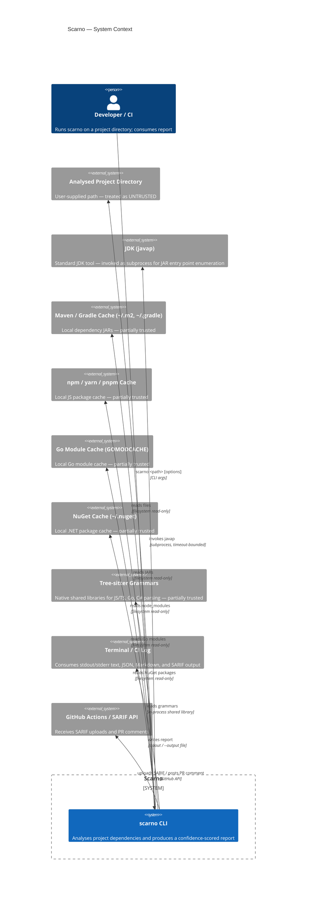
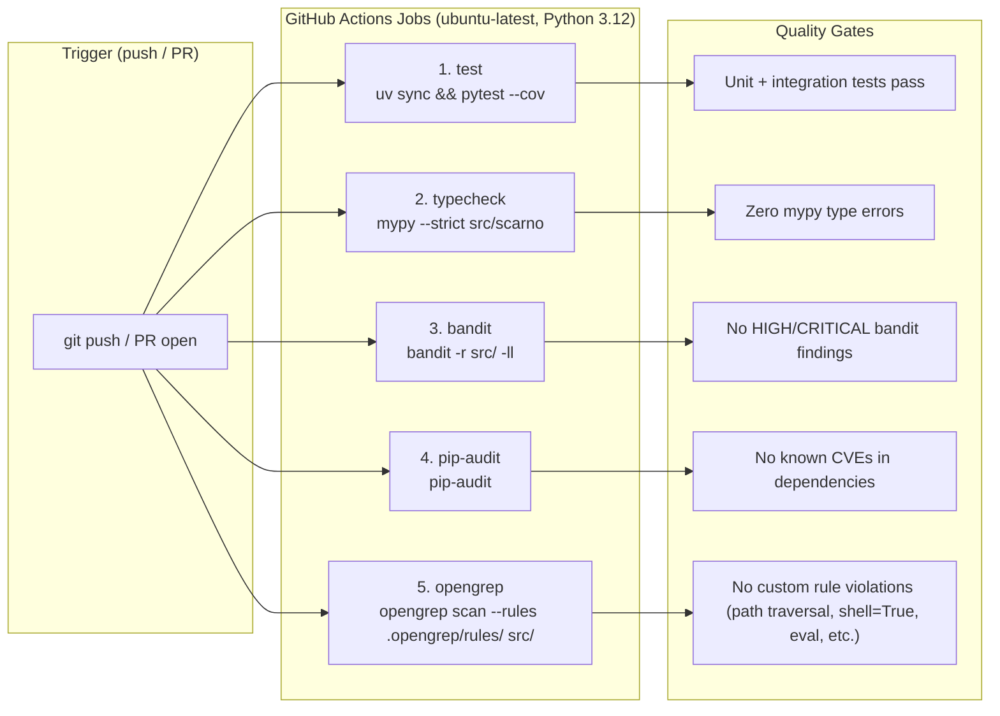
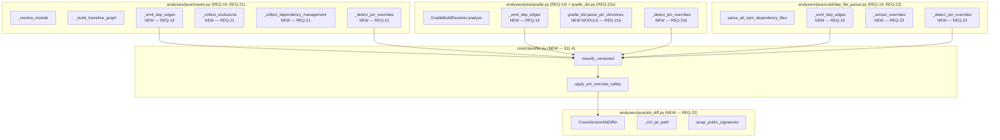

# Scarno — Security Architecture

Date: 2026-04-19
Version: 2.0
Input artifacts: scarno-security-privacy-analysis.md · REQ-1 through REQ-16 · Specification.md

---

## Executive Summary

This document defines the security architecture for Scarno — a Python CLI tool that performs static dependency analysis across seven language ecosystems (Python, Java/JVM, JavaScript/TypeScript/Node.js, CSS, Go, C#/.NET) plus a cross-cutting HTML/template scanner. It translates the classified requirements and threat surface from the secure-privacy-by-design analysis into concrete architectural decisions: trust zones, component security boundaries, layered controls, and secure coding patterns for each identified attack vector.

Scarno's architecture is dominated by three structural security challenges:

1. **Untrusted input at scale** — every file in the analysed project directory must be treated as adversarially crafted: manifests (pom.xml, package.json, go.mod, .csproj, etc.), source files, JARs, HTML templates, stylesheets, and the directory structure itself.
2. **Subprocess boundary** — the `javap` invocation is the only process spawn; this boundary must be strictly sandboxed. Tree-sitter grammars are loaded as native shared libraries but execute in-process.
3. **Output safety** — dependency metadata from untrusted files flows directly into reports (text, JSON, Markdown, SARIF) consumed by terminals, CI pipelines, and GitHub PR comments; injection at the output layer must be structurally prevented, not checked ad hoc.

The architecture addresses these through three principles applied at every layer: **parse, never execute**; **resolve then confine**; **sanitise at the boundary, trust inside**.

---

## 1. System Context (C4 Level 1)



**Trust assignments:**

| Actor / System | Trust Level | Rationale |
|---|---|---|
| Developer / CI operator | Trusted | Controls invocation arguments; owns the environment |
| Analysed project directory | **Untrusted** | May be adversarially crafted (supply-chain attack, malicious repo clone) |
| `javap` binary | Trusted after PATH verification | Standard JDK tool; PATH hijack is a separate threat |
| Maven / Gradle caches | Partially trusted | Controlled by package ecosystem; ZIP bomb risk from dependency JARs |
| npm / yarn / pnpm caches | Partially trusted | Controlled by JS package ecosystem; postinstall script risk |
| Go module cache | Partially trusted | Controlled by Go module proxy; read-only access |
| NuGet cache | Partially trusted | Controlled by NuGet ecosystem; read-only access |
| Tree-sitter grammars | Partially trusted | Native shared libraries loaded in-process; sourced from published packages |
| Terminal / CI log aggregator | Partially trusted | Output may be parsed downstream; ANSI injection risk |
| GitHub Actions / SARIF API | Partially trusted | Receives structured output; SARIF schema enforced before upload |

---

## 2. Component Decomposition (C4 Level 2)

```mermaid
C4Container
    title Scarno — Container / Component View

    Person(dev, "Developer / CI")

    System_Boundary(ts, "Scarno Process") {
        Container(cli, "CLI Layer", "cli.py (Typer)", "Argument validation, path resolution, root-privilege check, reporter dispatch")
        Container(detector, "Polyglot Detector / Registry", "core/detector.py + core/registry.py", "Registry pattern: identifies project languages from indicator files, multi-language detection, --language filter")

        Container_Boundary(py, "Python Analysis Pipeline") {
            Container(py_dep, "Dependency File Parser", "analysers/python/dep_file_parser.py", "Parses requirements.txt, pyproject.toml, setup.py, setup.cfg, Pipfile, poetry.lock, uv.lock")
            Container(py_src, "Source Analyser", "analysers/python/source_analyser.py", "AST-based import detection, alias resolution, dynamic import heuristics")
        }

        Container_Boundary(jvm, "JVM Analysis Pipeline") {
            Container(maven, "Maven POM Resolver", "analysers/java/maven.py", "POM hierarchy traversal, property resolution, BOM import")
            Container(gradle, "Gradle Build Resolver", "analysers/java/gradle.py", "build.gradle / build.gradle.kts parsing, version catalog resolution")
            Container(jvm_src, "JVM Source Analyser", "analysers/java/source_analyser.py", "Source + bytecode scanning, DI annotation detection, reflection heuristics, javap subprocess")
        }

        Container_Boundary(js, "JavaScript/TypeScript Analysis Pipeline") {
            Container(js_dep, "JS Dependency Parser", "analysers/javascript/dep_file_parser.py", "npm/yarn/pnpm/bun/Deno manifest parsing (package.json, yarn.lock, pnpm-lock.yaml, bun.lockb, deno.json), .npmrc scanning, postinstall detection")
            Container(js_src, "JS/TS Source Analyser", "analysers/javascript/source_analyser.py", "tree-sitter-javascript/typescript AST, node core module exclusion, tsconfig path resolution, ESM/CJS import detection")
        }

        Container_Boundary(go, "Go Analysis Pipeline") {
            Container(go_dep, "Go Dependency Parser", "analysers/go/dep_file_parser.py", "go.mod/go.sum/vendor/modules.txt parsing, replace/exclude/retract, vendor cross-check")
            Container(go_src, "Go Source Analyser", "analysers/go/source_analyser.py", "tree-sitter-go AST, stdlib exclusion, blank/dot import detection, vendor skip")
        }

        Container_Boundary(cs, "C#/.NET Analysis Pipeline") {
            Container(cs_dep, "C# Dependency Parser", "analysers/csharp/dep_file_parser.py", "MSBuild csproj/fsproj/vbproj XML parsing (DOCTYPE rejection), Directory.Packages.props CPM, packages.config, .sln discovery, nuget.config scanning")
            Container(cs_src, "C# Source Analyser", "analysers/csharp/source_analyser.py", "tree-sitter-c-sharp AST, shared-framework exclusion, Razor @using detection")
        }

        Container_Boundary(css_boundary, "CSS Analysis") {
            Container(css_analyser, "CSS Analyser", "analysers/css/analyser.py", "@import/url() extraction from .css/.scss/.sass/.less, remote URL finding, file:// URL finding, comment stripping")
        }

        Container_Boundary(html_boundary, "HTML/Template Scanner") {
            Container(html_scanner, "HTML/Template Scanner", "analysers/html/scanner.py", "Regex-based extraction of <script src>, <link stylesheet>, inline <style>@import, ESM imports, importmaps from 30+ template formats; CDN URL resolution; no execution")
        }

        Container_Boundary(findings_boundary, "Findings Engine") {
            Container(findings_engine, "Findings Engine", "core/findings.py", "Intra-procedural taint analysis, 30+ rule IDs across all languages, AST-only analysis, inline suppression support")
        }

        Container_Boundary(report, "Report Engine") {
            Container(text_rep, "Text Reporter", "reporters/text_reporter.py", "Pure function: AnalysisResult → sanitised text string")
            Container(json_rep, "JSON Reporter", "reporters/json_reporter.py", "Pure function: AnalysisResult → JSON string via json.dumps()")
            Container(md_rep, "Markdown Reporter", "reporters/markdown_reporter.py", "Pure function: AnalysisResult → actionable checklist Markdown")
            Container(sarif_rep, "SARIF Reporter", "reporters/sarif_reporter.py", "Pure function: AnalysisResult → SARIF 2.1.0 JSON, rule catalogue mapping")
        }
    }

    System_Ext(project, "Project Filesystem", "Untrusted")
    System_Ext(javap, "javap subprocess", "Trusted JDK tool")
    System_Ext(jarcache, "~/.m2 / ~/.gradle", "Partially trusted")
    System_Ext(ts_grammars_ext, "Tree-sitter Grammars", "Partially trusted native libraries")
    System_Ext(github_ext, "GitHub Actions / SARIF API", "Partially trusted")

    Rel(dev, cli, "CLI args")
    Rel(cli, detector, "resolved project path")
    Rel(detector, py_dep, "dispatches for python")
    Rel(detector, maven, "dispatches for java")
    Rel(detector, gradle, "dispatches for java")
    Rel(detector, js_dep, "dispatches for javascript/typescript")
    Rel(detector, go_dep, "dispatches for go")
    Rel(detector, cs_dep, "dispatches for csharp")
    Rel(detector, css_analyser, "dispatches for css")
    Rel(detector, html_scanner, "dispatches for html/templates")
    Rel(py_dep, project, "reads manifests")
    Rel(py_src, project, "reads .py files")
    Rel(maven, project, "reads pom.xml files")
    Rel(gradle, project, "reads build.gradle files")
    Rel(jvm_src, project, "reads .java/.kt/.class files")
    Rel(jvm_src, javap, "subprocess invocation")
    Rel(jvm_src, jarcache, "reads JARs")
    Rel(js_dep, project, "reads package.json / lockfiles")
    Rel(js_src, project, "reads .js/.ts/.jsx/.tsx files")
    Rel(js_src, ts_grammars_ext, "loads tree-sitter-javascript/typescript")
    Rel(go_dep, project, "reads go.mod / go.sum / vendor")
    Rel(go_src, project, "reads .go files")
    Rel(go_src, ts_grammars_ext, "loads tree-sitter-go")
    Rel(cs_dep, project, "reads .csproj / .sln / packages.config")
    Rel(cs_src, project, "reads .cs / .razor files")
    Rel(cs_src, ts_grammars_ext, "loads tree-sitter-c-sharp")
    Rel(css_analyser, project, "reads .css/.scss/.sass/.less files")
    Rel(html_scanner, project, "reads .html / template files")
    Rel(findings_engine, project, "reads source files via AST")
    Rel(cli, text_rep, "AnalysisResult")
    Rel(cli, json_rep, "AnalysisResult")
    Rel(cli, md_rep, "AnalysisResult")
    Rel(cli, sarif_rep, "AnalysisResult")
    Rel(sarif_rep, github_ext, "SARIF upload")
    Rel(cli, dev, "stdout / --output file")
```



---

## 3. Trust Zones and Data Flow

```mermaid
flowchart TB
    subgraph Z0["Zone 0 — Operator (Fully Trusted)"]
        DEV["Developer / CI operator\n(CLI invocation)"]
    end

    subgraph Z1["Zone 1 — Scarno Process (Controlled)"]
        CLI["CLI Layer\n(argument validation + path resolution)"]
        MODELS["Shared Data Models\n(AnalysisResult, Dependency)"]
        REPORTER["Report Engine\n(sanitise → render → emit)"]
    end

    subgraph Z2["Zone 2 — Analysis Engines (Isolation boundary)"]
        PYPARSE["Python Dep Parser"]
        PYSRC["Python Source Analyser"]
        MAVEN["Maven POM Resolver"]
        GRADLE["Gradle Build Resolver"]
        JVMSRC["JVM Source Analyser"]
        JSDEP["JS Dependency Parser"]
        JSSRC["JS/TS Source Analyser"]
        CSSDEP["CSS Analyser"]
        GODEP["Go Dependency Parser"]
        GOSRC["Go Source Analyser"]
        CSDEP["C# Dependency Parser"]
        CSSRC["C# Source Analyser"]
        HTMLSCAN["HTML/Template Scanner"]
        FINDINGS["Findings Engine"]
    end

    subgraph Z3["Zone 3 — Untrusted Filesystem (Adversarial)"]
        MANIFESTS["Dependency Manifests\n(pom.xml, pyproject.toml,\npackage.json, go.mod,\n.csproj, packages.config, ...)"]
        SOURCES["Source Files\n(.py, .java, .kt, .js, .ts,\n.go, .cs, .razor)"]
        BYTECODE[".class files"]
        STYLES["Stylesheets\n(.css, .scss, .sass, .less)"]
        TEMPLATES["HTML / Templates\n(.html, .jinja2, .ejs, .hbs,\n.vue, .svelte, 30+ formats)"]
    end

    subgraph Z4["Zone 4 — Partially Trusted External"]
        JARCACHE["JAR cache (~/.m2, ~/.gradle)"]
        JAVAP["javap subprocess"]
        TSGRAMMARS["Tree-sitter grammars\n(JS/TS, Go, C# native libs)"]
    end

    subgraph Z5["Zone 5 — Output Consumers (Partially Trusted)"]
        TERM["Terminal emulator"]
        CI["CI log / JSON consumer"]
    end

    DEV -->|"path, flags"| CLI
    CLI -->|"resolved + confined path"| PYPARSE & MAVEN & GRADLE & JSDEP & GODEP & CSDEP & CSSDEP & HTMLSCAN
    PYPARSE -->|"reads"| MANIFESTS
    PYSRC -->|"reads"| SOURCES
    MAVEN -->|"reads"| MANIFESTS
    GRADLE -->|"reads"| MANIFESTS
    JVMSRC -->|"reads"| SOURCES
    JVMSRC -->|"reads"| BYTECODE
    JVMSRC -->|"reads JARs"| JARCACHE
    JVMSRC -->|"subprocess"| JAVAP
    JSDEP -->|"reads"| MANIFESTS
    JSSRC -->|"reads"| SOURCES
    JSSRC -->|"loads grammar"| TSGRAMMARS
    CSSDEP -->|"reads"| STYLES
    GODEP -->|"reads"| MANIFESTS
    GOSRC -->|"reads"| SOURCES
    GOSRC -->|"loads grammar"| TSGRAMMARS
    CSDEP -->|"reads"| MANIFESTS
    CSSRC -->|"reads"| SOURCES
    CSSRC -->|"loads grammar"| TSGRAMMARS
    HTMLSCAN -->|"reads"| TEMPLATES
    FINDINGS -->|"reads AST"| SOURCES
    PYPARSE & PYSRC & MAVEN & GRADLE & JVMSRC & JSDEP & JSSRC & CSSDEP & GODEP & GOSRC & CSDEP & CSSRC & HTMLSCAN & FINDINGS -->|"Dependency objects\n(sanitised names)"| MODELS
    MODELS -->|"AnalysisResult"| REPORTER
    REPORTER -->|"sanitised string"| TERM & CI

    style Z3 fill:#ffdddd,stroke:#cc0000
    style Z4 fill:#fff3cd,stroke:#cc8800
    style Z5 fill:#fff3cd,stroke:#cc8800
    style Z1 fill:#d4edda,stroke:#155724
    style Z2 fill:#cce5ff,stroke:#004085
```



**Trust boundary crossings and controls:**

| Boundary | Direction | Control |
|---|---|---|
| B1: CLI args → Zone 1 | Z0 → Z1 | Path resolution (`Path.resolve()`), path confinement check, privilege check |
| B2: Zone 1 → Zone 3 (filesystem reads) | Z1/Z2 → Z3 | All paths resolved and verified against project root before `open()`; file size cap; symlink escape check |
| B3: Zone 2 → Zone 4 (javap subprocess) | Z2 → Z4 | `shell=False`, fixed arg list, 10s timeout, stdout/stderr captured and not re-executed |
| B4: Zone 2 → Zone 4 (JAR reads) | Z2 → Z4 | ZIP bomb guard (entry size cap 50 MB, entry count cap 10,000) |
| B5: Zone 1 → Zone 5 (output) | Z1 → Z5 | ANSI stripping before text render; `json.dumps()` for JSON; Markdown escaping for Markdown; SARIF 2.1.0 schema validation; control char sanitisation |
| B6: Zone 2 → Zone 3 (HTML/CDN URL scanning) | Z2 → Z3 | HTML scanner extracts URLs via regex only (no DOM parsing, no fetch); CDN URLs are resolved and reported but never fetched; `javascript:` and `data:` URIs flagged as findings |
| B7: Zone 2 → Zone 4 (tree-sitter grammar loading) | Z2 → Z4 | Tree-sitter grammars are loaded from pinned package versions; grammar files are native shared libraries loaded in-process; no grammar content from the analysed project is ever loaded as a grammar |

---

## 4. Component Security Specifications

### 4.1 CLI Layer (`cli.py`)

**Responsibility:** Single point of trust boundary enforcement for all operator-supplied input.

**Security controls:**

| Control | Implementation | Rationale |
|---|---|---|
| Path resolution | `resolved = Path(path).resolve()` immediately after argument parsing | Normalises `../` sequences, resolves symlinks |
| Path confinement | `--output` path: warn (not error) if outside CWD; `PATH` arg: no confinement check needed (analysis always reads inward) | T-06 mitigation |
| Privilege check | `_check_root()` called before analysis; warns to stderr if `os.getuid() == 0` (POSIX) or `ctypes.windll.shell32.IsUserAnAdmin()` (Windows) | SEC-005, GAP-06 |
| Exception sanitisation | Top-level `try/except` catches all unhandled exceptions; in non-verbose mode prints one-line message without traceback or path fragments | I-01 mitigation |
| Version stamp | `AnalysisResult` includes `scarno_version` and `analysis_timestamp` fields | R-01 mitigation |

```python
# Pattern: path resolution + privilege check at entry point
def _resolve_project_path(raw_path: str) -> Path:
    resolved = Path(raw_path).resolve()
    # No confinement check on input path — user may legitimately analyse any directory
    return resolved

def _check_root() -> None:
    try:
        if os.getuid() == 0:
            typer.echo("Warning: running as root is not recommended", err=True)
    except AttributeError:
        # Windows: no os.getuid()
        try:
            import ctypes
            if ctypes.windll.shell32.IsUserAnAdmin():  # type: ignore[attr-defined]
                typer.echo("Warning: running as administrator is not recommended", err=True)
        except Exception:
            pass  # Cannot determine privilege level — skip silently
```

---

### 4.2 Project Detector (`core/detector.py`)

**Responsibility:** Identify project type from indicator files. No parsing of file content.

**Security controls:**

| Control | Implementation |
|---|---|
| Read-only filesystem access | `Path.exists()` checks only; no file open |
| Input is a resolved path | Receives only the resolved `Path` from CLI layer; never re-resolves |

---

### 4.3 Python Dependency File Parser (`analysers/python/dep_file_parser.py`)

**Responsibility:** Parse declared dependencies from all eight Python manifest formats.

**Attack surface:** requirements.txt `-r` include chains; pyproject.toml TOML content; setup.py AST; Pipfile; poetry.lock; uv.lock.

**Security controls:**

| Threat | Control | Implementation |
|---|---|---|
| T-01: `-r` path traversal | Confine resolved include path to project root | After resolving each `-r` target with `Path.resolve()`, assert `resolved.is_relative_to(project_root)`. On failure: append error, skip include. |
| D-01: Circular `-r` chain | Cycle detection with depth cap | Track set of visited resolved paths; abort at depth 10; append error. |
| T-04: Malformed setup.py AST | Never eval/exec | Use `ast.parse()` only; catch `SyntaxError` and all `ast`-related exceptions; append error and return empty list. |
| GAP-04: Oversized source file | File size cap | Skip files > 10 MB with a stderr warning before opening. |
| pyproject.toml: TOML bombs | stdlib `tomllib` / `tomli` | These parsers do not support recursive structures that cause stack overflow; no special guard needed beyond the standard parser. |

```python
# Pattern: confine -r include paths to project root
def _resolve_include(current_file: Path, include_ref: str, project_root: Path) -> Path | None:
    candidate = (current_file.parent / include_ref).resolve()
    try:
        candidate.relative_to(project_root)
    except ValueError:
        return None  # Escapes project root — discard
    return candidate
```

---

### 4.4 Python Source Analyser (`analysers/python/source_analyser.py`)

**Responsibility:** AST-based import detection across all `.py` files.

**Security controls:**

| Threat | Control |
|---|---|
| Symlink escape | After `Path.resolve()`, check `resolved.is_relative_to(project_root)` before opening each `.py` file. |
| T-07: Directory traversal via symlinks | Same as above — symlinks resolved and confined before open. |
| Oversized files | Skip files > 10 MB (shared cap). |
| AST execution risk | Use `ast.parse()` + `ast.walk()` only; never `eval()`, `exec()`, or `compile()+exec`. |
| `UnicodeDecodeError` | Catch per-file; append warning; continue. |

**Non-execution guarantee (structural):** The Python source analyser never calls `compile()`, `eval()`, `exec()`, or `importlib.import_module()` on content from the analysed project. Entry point enumeration for `IN_USE` dependencies uses `importlib.import_module()` on the *installed package* (from the tool's own venv), not on project source.

---

### 4.5 Maven POM Resolver (`analysers/java/maven.py`)

**Responsibility:** Parse and resolve POM hierarchy. No network access.

**Attack surface:** XML content (XXE, billion laughs, deep nesting); parent POM path traversal; BOM resolution path traversal.

**Security controls:**

| Threat | Control | Implementation |
|---|---|---|
| T-02: XXE | Disable DTD and external entity resolution | See pattern below. |
| D-02: Billion laughs | Disable entity expansion | Same DTD disabling eliminates entity expansion. |
| T-03: Deep nesting / stack overflow | Use `xml.etree.ElementTree.iterparse` | `iterparse` is iterative, not recursive; avoids Python recursion limit exhaustion for deeply nested XML. |
| Parent POM path traversal | Confine resolved parent path to project root | After resolving `<relativePath>` or `../pom.xml`, assert `resolved.is_relative_to(project_root)`. |
| BOM path traversal | Same confinement | BOM pom.xml paths resolved and confined before open. |
| POM cycle | Cycle detection | Track set of visited POM paths; if a path appears twice, append error and stop traversal. |

```python
# Pattern: disable XXE in xml.etree.ElementTree
import xml.etree.ElementTree as ET

def _safe_parse_xml(file_path: Path) -> ET.Element:
    """Parse XML with DTD processing and external entity resolution disabled."""
    parser = ET.XMLParser()
    # Forbid DTD processing to prevent XXE and billion-laughs attacks.
    # xml.etree.ElementTree does not expand external entities by default in
    # CPython 3.8+, but explicit configuration is belt-and-suspenders.
    parser.parser.UseForeignDTD(False)  # type: ignore[attr-defined]
    try:
        tree = ET.parse(str(file_path), parser=parser)
    except ET.ParseError as exc:
        raise ValueError(f"Malformed XML in {file_path}: {exc}") from exc
    return tree.getroot()
```

> **Note on `iterparse` for deeply nested XML:** For files where nesting depth is the primary risk (T-03), prefer `iterparse` over `parse()`:
> ```python
> for event, elem in ET.iterparse(str(file_path), events=("start", "end")):
>     # process elem, then clear to free memory
>     elem.clear()
> ```

---

### 4.6 Gradle Build Resolver (`analysers/java/gradle.py`)

**Responsibility:** Regex/string-based parsing of Gradle build files. No Groovy/Kotlin interpreter.

**Security controls:**

| Threat | Control |
|---|---|
| T-08: Regex injection / ReDoS | Use anchored, non-backtracking regexes for dependency block parsing. Test regexes against pathological inputs in the test suite. |
| SEC-011: No subprocess for parsing | Gradle files are parsed by regex and string operations only — never passed to a Groovy or Kotlin interpreter. |
| `settings.gradle` submodule paths | Confine each resolved submodule path to project root after resolution. |
| `libs.versions.toml` | Parsed with `tomllib`/`tomli` — same parser safety as pyproject.toml. |

**ReDoS mitigation pattern:** Every regex applied to untrusted Gradle file content must be reviewed against the following checklist:
- No `.*` inside a group that is also quantified
- No nested quantifiers (`(a+)+`)
- Prefer `re.fullmatch()` over `re.search()` for structured patterns
- Apply a file size cap (10 MB) before regex processing

---

### 4.7 JVM Source Analyser (`analysers/java/source_analyser.py`)

**Responsibility:** Source + bytecode scanning and javap subprocess management.

**Attack surface:** The highest-risk component in the system — it manages the subprocess boundary, reads JARs from the cache, and processes bytecode.

**Security controls:**

| Threat | Control | Implementation |
|---|---|---|
| S-01: PATH hijack of javap | Absolute path or PATH verification | Resolve `javap` to an absolute path at startup using `shutil.which("javap")`; verify it is under a known JDK location if `JAVA_HOME` is set. |
| T-05: ZIP bomb in JAR | Entry size and count cap | When reading JAR via `zipfile`: assert each entry's `compress_size` ≤ 50 MB and total entry count ≤ 10,000. |
| Subprocess safety | `shell=False`, fixed arg list, timeout | `subprocess.run(["javap", "-public", "-classpath", str(jar_path), classname], shell=False, timeout=10, capture_output=True)` |
| Subprocess output injection | javap output is parsed for structure, never executed | Parse `javap` stdout line-by-line for method/field signatures only; treat all content as untrusted strings. |
| Symlink escape in source traversal | Confine per-file after resolve | Every `.java`/`.kt`/`.class` path resolved and checked against project root. |
| T-07: Symlinks in project tree | Check after `Path.resolve()` | `if not resolved_file.is_relative_to(project_root): continue` |

```python
# Pattern: safe javap invocation
import shutil, subprocess
from pathlib import Path

def _invoke_javap(jar_path: Path, classname: str) -> str | None:
    javap = shutil.which("javap")
    if javap is None:
        return None
    try:
        result = subprocess.run(
            [javap, "-public", "-classpath", str(jar_path), classname],
            shell=False,          # NEVER shell=True
            timeout=10,           # Hard timeout per class
            capture_output=True,
            text=True,
        )
    except subprocess.TimeoutExpired:
        return None
    except OSError:
        return None
    if result.returncode != 0:
        return None
    return result.stdout

# Pattern: ZIP bomb guard
import zipfile

def _safe_read_jar_entries(jar_path: Path) -> list[str]:
    MAX_ENTRIES = 10_000
    MAX_ENTRY_SIZE = 50 * 1024 * 1024  # 50 MB

    entries: list[str] = []
    with zipfile.ZipFile(jar_path, "r") as zf:
        infos = zf.infolist()
        if len(infos) > MAX_ENTRIES:
            raise ValueError(f"JAR has {len(infos)} entries (max {MAX_ENTRIES})")
        for info in infos:
            if info.file_size > MAX_ENTRY_SIZE:
                raise ValueError(f"JAR entry {info.filename} exceeds size limit")
            if info.filename.endswith(".class"):
                entries.append(info.filename)
    return entries
```

---

### 4.8 Report Engine (`reporters/`)

**Responsibility:** Pure transformation of `AnalysisResult` → safe output string. No I/O.

**Security controls:**

| Threat | Control | Implementation |
|---|---|---|
| SEC-003: ANSI injection in text | Strip before render | Apply `_strip_ansi(s)` to all string fields (name, version, reason, entry point symbols) before interpolation into text output. |
| GAP-03: Control chars in JSON | Sanitise before `json.dumps()` | Apply `_strip_control_chars(s)` to all string fields before passing to `json.dumps()`. `json.dumps()` handles JSON metacharacter escaping; the sanitiser only removes non-printable control characters. |
| SEC-004: JSON injection via f-strings | Structural: never use f-strings for JSON | `JsonReporter.render()` serialises `AnalysisResult` to a `dict` and calls `json.dumps(data, indent=2, ensure_ascii=True)`. No string interpolation. |
| PRV-003: Source code in output | Structural: `AnalysisResult` schema | `AnalysisResult`, `Dependency`, and `EntryPoint` dataclasses contain only metadata fields — no `source_text`, `file_content`, or similar. This is enforced at the model layer, not the reporter layer. |

```python
import re

# ANSI escape sequence pattern (covers CSI sequences and OSC)
_ANSI_RE = re.compile(r"\x1b(?:[@-Z\\-_]|\[[0-?]*[ -/]*[@-~])")

def _strip_ansi(s: str) -> str:
    return _ANSI_RE.sub("", s)

# Control character pattern (excludes tab and newline which are legitimate in reasons)
_CTRL_RE = re.compile(r"[\x00-\x08\x0b\x0c\x0e-\x1f\x7f]")

def _strip_control_chars(s: str) -> str:
    return _CTRL_RE.sub("", s)

def _sanitise(s: str) -> str:
    """Apply all sanitisation: ANSI stripping then control char removal."""
    return _strip_control_chars(_strip_ansi(s))
```

The `_sanitise()` function is called at a single defined point per reporter — once per string field extracted from `AnalysisResult` — rather than scattered across rendering logic. This makes it easy to audit that every field passes through sanitisation.

---

### 4.9 JavaScript Dependency Parser (`analysers/javascript/dep_file_parser.py`)

**Responsibility:** Parse declared dependencies from npm/yarn/pnpm/bun/Deno manifest formats (package.json, yarn.lock, pnpm-lock.yaml, bun.lockb, deno.json/deno.jsonc).

**Attack surface:** JSON depth bombs in package.json; YAML deserialization in pnpm-lock.yaml; .npmrc credential scanning; postinstall script detection.

**Security controls:**

| Threat | Control | Implementation |
|---|---|---|
| JSON depth bomb | JSON depth cap | Parse package.json with `json.loads()` and enforce a maximum nesting depth of 50 via iterative depth check after parse. |
| YAML deserialization attack | `yaml.safe_load()` only | pnpm-lock.yaml parsed with `yaml.safe_load()` — never `yaml.load()` or `yaml.unsafe_load()`. |
| .npmrc credential exposure | Scan but never emit values | .npmrc is scanned for `_authToken`, `_auth`, `_password` keys; presence is reported as a finding but the actual credential value is never stored in `AnalysisResult`. |
| Postinstall script execution | Detection, not execution | `scripts.postinstall`, `scripts.preinstall`, and `scripts.install` fields are detected and reported as findings. No script is ever executed. |
| Oversized files | File size cap | Skip files > 10 MB (shared cap). |

---

### 4.10 JavaScript/TypeScript Source Analyser (`analysers/javascript/source_analyser.py`)

**Responsibility:** Tree-sitter AST-based import/require detection across .js/.ts/.jsx/.tsx files.

**Security controls:**

| Threat | Control |
|---|---|
| Symlink escape | After `Path.resolve()`, check `resolved.is_relative_to(project_root)` before opening each source file. |
| Oversized files | Skip files > 10 MB (shared cap). |
| Non-execution guarantee | Uses tree-sitter AST parsing only — never `eval()`, `new Function()`, or Node.js `require()` on project code. |
| Node core module exclusion | Built-in Node.js modules (`fs`, `path`, `http`, etc.) are excluded from dependency matching using a hardcoded allowlist. |
| tsconfig path resolution | `tsconfig.json` `paths` and `baseUrl` are resolved to map aliased imports back to project-relative paths; resolution is confined to project root. |
| Tree-sitter grammar safety | tree-sitter-javascript and tree-sitter-typescript grammars loaded from pinned package versions; not from project content. |

---

### 4.11 CSS Analyser (`analysers/css/analyser.py`)

**Responsibility:** Extract `@import` and `url()` references from .css/.scss/.sass/.less files.

**Security controls:**

| Threat | Control | Implementation |
|---|---|---|
| Remote `@import` URL | Finding, not fetch | Remote URLs (http://, https://) in `@import` statements are reported as findings; they are never fetched or resolved over the network. |
| `file://` URL | Finding | `file://` URLs in `@import` or `url()` are flagged as findings; the referenced path is never opened. |
| Comment stripping | Pre-processing | CSS block comments (`/* */`) and SCSS/Less line comments (`//`) are stripped before `@import`/`url()` extraction to prevent false positives from commented-out references. |
| ReDoS | Anchored regexes | All regexes used for `@import`/`url()` extraction are anchored and tested against pathological inputs. File size cap (10 MB) applied before processing. |

---

### 4.12 Go Dependency Parser (`analysers/go/dep_file_parser.py`)

**Responsibility:** Parse go.mod, go.sum, vendor/modules.txt, and vendor directory structure.

**Attack surface:** Crafted go.mod with extremely long lines; replace directives pointing outside project root; vendor directory inconsistencies.

**Security controls:**

| Threat | Control | Implementation |
|---|---|---|
| Oversized lines | Line-length cap | Individual lines in go.mod and go.sum are capped at 8,192 characters; lines exceeding this are skipped with a warning. |
| `replace` path traversal | Path confinement | Local `replace` directives with filesystem paths are resolved and confined to project root via `resolve_and_confine()`. |
| `exclude` / `retract` directives | Parsed and applied | `exclude` and `retract` directives are parsed to accurately reflect the effective dependency set. |
| Vendor cross-check | Consistency verification | When a `vendor/` directory exists, `vendor/modules.txt` is parsed and cross-checked against go.mod to detect inconsistencies reported as warnings. |
| Oversized files | File size cap | Skip files > 10 MB (shared cap). |

---

### 4.13 Go Source Analyser (`analysers/go/source_analyser.py`)

**Responsibility:** Tree-sitter AST-based import detection across .go files.

**Security controls:**

| Threat | Control |
|---|---|
| Symlink escape | After `Path.resolve()`, check `resolved.is_relative_to(project_root)` before opening each .go file. |
| Oversized files | Skip files > 10 MB (shared cap). |
| Non-execution guarantee | Uses tree-sitter-go AST parsing only — never `go run`, `go build`, or any Go toolchain invocation on project code. |
| Stdlib exclusion | Go standard library packages are excluded from dependency matching using a hardcoded allowlist derived from the Go documentation. |
| Blank/dot imports | `import _ "pkg"` (blank) and `import . "pkg"` (dot) imports are detected and reported; dot imports are flagged as findings due to namespace pollution risk. |
| Vendor directory skip | Files under `vendor/` are not scanned for imports (vendor is handled by the dependency parser). |
| Tree-sitter grammar safety | tree-sitter-go grammar loaded from pinned package version; not from project content. |

---

### 4.14 C# Dependency Parser (`analysers/csharp/dep_file_parser.py`)

**Responsibility:** Parse MSBuild project files (.csproj/.fsproj/.vbproj), Directory.Packages.props (Central Package Management), packages.config, .sln files, and nuget.config.

**Attack surface:** XML content (XXE, billion laughs, DOCTYPE injection); .sln file cycle via project references; nuget.config feed manipulation.

**Security controls:**

| Threat | Control | Implementation |
|---|---|---|
| XXE / DOCTYPE injection | DOCTYPE rejection | All XML files (.csproj, .fsproj, .vbproj, .props, packages.config, nuget.config) are pre-scanned for `<!DOCTYPE` declarations; any file containing a DOCTYPE is rejected with an error before XML parsing begins. This is a stricter control than DTD disabling — it prevents all entity-based attacks including billion laughs. |
| Central Package Management | CPM resolution | `Directory.Packages.props` files are discovered by walking up the directory tree (confined to project root); `<PackageVersion>` entries are merged with `<PackageReference>` entries that omit explicit versions. |
| .sln cycle detection | Visited-set tracking | .sln files reference .csproj files which may reference other .csproj files via `<ProjectReference>`. Cycle detection uses a visited-path set; cycles are reported as errors and traversal stops. |
| nuget.config scanning | Feed URL extraction | `<packageSources>` and `<packageSourceCredentials>` are extracted; credential values are never stored in `AnalysisResult`; non-nuget.org feed URLs are reported as findings. |
| Path traversal in ProjectReference | Path confinement | `<ProjectReference Include="...">` paths are resolved and confined to project root via `resolve_and_confine()`. |
| Oversized files | File size cap | Skip files > 10 MB (shared cap). |

---

### 4.15 C# Source Analyser (`analysers/csharp/source_analyser.py`)

**Responsibility:** Tree-sitter AST-based `using` directive detection across .cs files, plus Razor `@using` detection.

**Security controls:**

| Threat | Control |
|---|---|
| Symlink escape | After `Path.resolve()`, check `resolved.is_relative_to(project_root)` before opening each .cs/.razor file. |
| Oversized files | Skip files > 10 MB (shared cap). |
| Non-execution guarantee | Uses tree-sitter-c-sharp AST parsing only — never `dotnet build`, `dotnet run`, or any .NET SDK invocation on project code. |
| Shared-framework exclusion | .NET shared framework assemblies (Microsoft.NETCore.App, Microsoft.AspNetCore.App, etc.) are excluded from dependency matching using a hardcoded allowlist. |
| Razor `@using` detection | Razor files (.cshtml, .razor) are scanned for `@using` directives via line-by-line regex; no Razor compilation or execution. |
| Tree-sitter grammar safety | tree-sitter-c-sharp grammar loaded from pinned package version; not from project content. |

---

### 4.16 HTML/Template Scanner (`analysers/html/scanner.py`)

**Responsibility:** Extract script sources, stylesheet links, inline style imports, ESM imports, and importmaps from HTML and 30+ template formats (.html, .htm, .jinja2, .ejs, .hbs, .pug, .vue, .svelte, .astro, .php, .erb, .razor, etc.).

**Security controls:**

| Threat | Control | Implementation |
|---|---|---|
| Template execution | Regex-based only | Extraction uses regex patterns, not a DOM parser or template engine. No template is ever rendered or executed. |
| CDN URL resolution | Report, not fetch | CDN URLs (e.g., `https://cdn.jsdelivr.net/...`) found in `<script src>` or `<link href>` are resolved to package name + version and reported; the URL is never fetched. |
| `javascript:` / `data:` URIs | Flagged as findings | `javascript:` and `data:` URIs in `src`/`href` attributes are flagged as security findings. |
| Importmap parsing | JSON parse with depth cap | `<script type="importmap">` content is parsed with `json.loads()` and depth-checked; imports are extracted but never resolved over the network. |
| Oversized files | File size cap | Skip files > 10 MB (shared cap). |

---

### 4.17 Findings Engine (`core/findings.py`)

**Responsibility:** Intra-procedural taint analysis and rule-based finding generation across all supported languages.

**Security controls:**

| Threat | Control | Implementation |
|---|---|---|
| Non-execution guarantee | AST-only analysis | All taint analysis operates on parsed ASTs (Python `ast`, tree-sitter); no code from the analysed project is ever executed, interpreted, or evaluated. |
| Rule catalogue | 30+ rule IDs | Each finding is mapped to a stable rule ID (e.g., `TS-R001` through `TS-R030+`); rules are defined in code, not loaded from external files in the analysed project. |
| Inline suppression | Comment-based suppression | `# scarno:ignore[RULE-ID]` comments in source files suppress specific findings; suppression is logged for audit trail; wildcard suppression (`ignore[*]`) is not supported. |
| False positive management | Confidence scoring | Each finding carries a confidence score; consumers can filter by threshold. |

---

### 4.18 SARIF Reporter (`reporters/sarif_reporter.py`)

**Responsibility:** Pure transformation of `AnalysisResult` and findings into a SARIF 2.1.0 JSON document.

**Security controls:**

| Threat | Control | Implementation |
|---|---|---|
| Schema conformance | SARIF 2.1.0 schema | Output is structured to conform to the SARIF 2.1.0 schema (OASIS standard); `$schema` and `version` fields are always emitted. |
| Rule catalogue mapping | Static rule definitions | Each rule ID is mapped to a SARIF `reportingDescriptor` with `id`, `shortDescription`, `helpUri`, and `defaultConfiguration.level`. Rule definitions are static — not derived from analysed project content. |
| String sanitisation | Same as JSON reporter | All string fields pass through `_sanitise()` before inclusion in the SARIF JSON. |
| No I/O | Reporter purity | Same as ADR-004: `SarifReporter.render()` returns a `str`; all I/O handled by CLI layer. |

---

### 4.19 Markdown Reporter (`reporters/markdown_reporter.py`)

**Responsibility:** Pure transformation of `AnalysisResult` into an actionable checklist-format Markdown document.

**Security controls:**

| Threat | Control | Implementation |
|---|---|---|
| Markdown injection | Pipe/bracket escaping | Dependency names and versions that contain Markdown metacharacters (`|`, `[`, `]`, `` ` ``, `*`, `_`) are escaped before interpolation into Markdown table cells and list items. |
| Link injection | No user-controlled links | The Markdown output does not include hyperlinks derived from analysed project content; all links (if any) are to Scarno documentation. |
| String sanitisation | Same as text reporter | All string fields pass through `_sanitise()` (ANSI stripping + control char removal) before Markdown rendering. |
| No I/O | Reporter purity | Same as ADR-004: `MarkdownReporter.render()` returns a `str`; all I/O handled by CLI layer. |

---

## 5. Defense-in-Depth Layering

Scarno applies controls at three layers. If an attacker bypasses a control in one layer, independent controls in the next layer reduce impact.

```
Layer 1 — Input Boundary
  ├─ Path resolution (Path.resolve())
  ├─ Path confinement (is_relative_to(project_root))
  ├─ File size cap (10 MB per file; 50 MB per JAR entry; 10k JAR entries)
  ├─ Line-length cap (8,192 chars for go.mod/go.sum)
  ├─ JSON depth cap (50 levels for package.json, importmaps)
  ├─ Cycle detection (requirements.txt -r; POM parent chain; .sln project references)
  ├─ XML entity/DTD disabling (Java POM) and DOCTYPE rejection (C# .csproj/.fsproj/.vbproj)
  └─ YAML safe_load only (pnpm-lock.yaml)

Layer 2 — Processing Safety
  ├─ Parse-only (ast.parse, tomllib, xml.etree, tree-sitter, regex — never eval/exec)
  ├─ Tree-sitter grammars from pinned packages (never from analysed project)
  ├─ Subprocess isolation (shell=False, fixed args, 10s timeout — javap only)
  ├─ Non-execution guarantee (no project code ever executed across all 7 language ecosystems)
  ├─ No network access (CDN URLs reported but never fetched)
  └─ Error isolation (all exceptions caught; appended to errors list; analysis continues)

Layer 3 — Output Safety
  ├─ ANSI stripping (_strip_ansi on all string fields before text/Markdown render)
  ├─ Control char removal (_strip_control_chars on all string fields before JSON/SARIF render)
  ├─ Markdown metacharacter escaping (pipe, bracket, backtick)
  ├─ Structural JSON serialisation (json.dumps only; no f-strings — JSON and SARIF)
  ├─ SARIF 2.1.0 schema conformance (static rule definitions)
  └─ Schema enforcement (AnalysisResult contains no source code content fields)
```

If Layer 1 confinement fails (e.g., a novel symlink attack), Layer 2's parse-only approach limits what an attacker can achieve — they can read files but cannot execute code. If Layer 2 processing produces a malicious string (e.g., a dependency name containing an ANSI escape), Layer 3 strips it before it reaches the terminal.

---

## 6. Shared Security Utility Module

The following security functions are used across multiple components and must live in a single shared module (`src/scarno/security.py`) to prevent duplicated implementations that can diverge:

```
src/scarno/
└── security.py     # Shared security utilities — imported by all analysers and reporters
```

Functions in `security.py`:

| Function | Used by | Purpose |
|---|---|---|
| `resolve_and_confine(path: str \| Path, root: Path) -> Path` | All analysers | `Path.resolve()` + `is_relative_to(root)` check; raises `PathEscapeError` on violation |
| `check_file_size(path: Path, max_bytes: int = 10_MB) -> None` | All source analysers (Python, JVM, JS/TS, Go, C#, CSS, HTML) | Raises `FileTooLargeError` on violation |
| `check_line_length(line: str, max_chars: int = 8192) -> bool` | Go dep parser | Returns False if line exceeds cap |
| `check_json_depth(obj, max_depth: int = 50) -> None` | JS dep parser, HTML scanner | Raises `JsonDepthError` if nesting exceeds cap |
| `reject_doctype(file_path: Path) -> None` | C# dep parser | Raises `DoctypeError` if file contains `<!DOCTYPE` |
| `strip_ansi(s: str) -> str` | TextReporter, MarkdownReporter | Strips ANSI escape sequences |
| `strip_control_chars(s: str) -> str` | JsonReporter, SarifReporter | Strips non-printable control characters |
| `sanitise(s: str) -> str` | All four reporters | Composes strip_ansi + strip_control_chars |
| `escape_markdown(s: str) -> str` | MarkdownReporter | Escapes Markdown metacharacters (`\|`, `[`, `]`, `` ` ``, `*`, `_`) |
| `check_root_privilege() -> None` | CLI Layer | Warns to stderr if running as root / admin |
| `safe_jar_entries(jar_path: Path) -> list[str]` | JVM Source Analyser | Reads JAR with entry count and size guards |

Having these in one place means:
- A security audit touches one file, not twenty
- A fix to the ANSI regex propagates automatically
- Tests for security utilities are co-located and easy to find

---

## 7. CI/CD Security Pipeline Architecture



### 7.1 Custom OpenGrep Rules (`.opengrep/rules/`)

The following custom rules must be implemented to enforce the security architecture at the code level:

| Rule ID | Pattern | Severity | Rationale |
|---|---|---|---|
| TS-001 | `shell=True` in any `subprocess.*` call | ERROR | SEC-012: javap must never use shell=True |
| TS-002 | `eval(` or `exec(` anywhere in `src/` | ERROR | SEC-001, SEC-008 |
| TS-003 | `open(` with a string not derived from `resolve_and_confine()` | WARNING | SEC-002: all opens must use resolved paths |
| TS-004 | `ET.parse(` without `parser=` argument | WARNING | GAP-01: XXE protection requires explicit parser |
| TS-005 | `f"...{dep` or `f"...{name` in reporters/ | ERROR | SEC-004: no f-string interpolation in JSON output |
| TS-006 | Import of `importlib` in `analysers/` without `# scarno: entry-point-enum` comment | WARNING | Flags accidental dynamic import of project code |

### 7.2 Dependency Pinning and Supply-Chain Controls

Per GAP-07, all CI tooling versions are pinned:

```yaml
# .github/workflows/ci.yml — pinning pattern
- uses: actions/checkout@v4          # pin to SHA for production
- uses: actions/setup-python@v5

- name: Install tools
  run: |
    pip install bandit==1.8.3 \
                pip-audit==2.8.0 \
                mypy==1.14.1
    # Tool versions pinned; update via Dependabot PRs only
```

Recommended additions (COMP-NEW-01 implementation):
- Enable Dependabot for `pip` dependencies and GitHub Actions versions
- Add `pip-audit` to the Dependabot update schedule to catch newly disclosed CVEs in pinned tools
- Use `uv lock` to produce a deterministic lockfile; CI installs from the lockfile

---

## 8. Architecture Decision Records

### ADR-001: Single Shared `security.py` Module

**Status:** Accepted

**Context:** Security functions (path confinement, ANSI stripping, JAR guards) are used by at least four different components. Duplicating them risks implementations diverging — e.g., one analyser using a different ANSI regex than the reporter.

**Decision:** All shared security primitives live in `src/scarno/security.py`. No component may implement its own path resolution, stripping, or JAR reading logic.

**Consequences:** Single point of maintenance for security controls. All security unit tests co-located. Slight coupling: components must import `security.py`. Acceptable trade-off — these primitives are stable.

**Security Implications:** Centralisation makes the security audit surface smaller and easier to reason about. A penetration tester reviewing the codebase needs to audit one file, not grep across the entire tree.

---

### ADR-002: Parse-Only Architecture (No Execution of Analysed Project Code)

**Status:** Accepted

**Context:** Scarno analyses arbitrary project directories. A naive approach could import Python packages from the analysed project or execute `setup.py` to discover dependencies. This would allow remote code execution by any project that Scarno analyses.

**Decision:** Scarno never executes code from the analysed project by any mechanism: no `eval()`, no `exec()`, no `subprocess` targeting project scripts, no `importlib.import_module()` on project packages, no `setup.py` execution.

**Consequences:** Some dynamic dependency declarations (e.g., programmatic `setup.py` that builds the dep list at runtime) may not be fully resolved. This is an intentional trade-off: correctness is bounded by the constraints of static analysis. The `errors` list communicates what was not parseable.

**Security Implications:** This is the single most important architectural decision for Scarno's security posture. It eliminates the entire class of code-execution attacks from untrusted project content.

---

### ADR-003: `javap` Invoked with `shell=False` and 10-Second Hard Timeout

**Status:** Accepted

**Context:** `javap` is the only subprocess spawned by Scarno. The subprocess boundary is a trust transition: Scarno passes a JAR path and class name to `javap` and reads its stdout. If this invocation used `shell=True`, a crafted class name or JAR path containing shell metacharacters could inject shell commands.

**Decision:** All `javap` invocations use `subprocess.run([...], shell=False, timeout=10)`. The argument list is constructed from pre-validated path strings and class names extracted from the JAR manifest — not from raw user input or raw file content.

**Consequences:** Shell metacharacter injection is eliminated. `timeout=10` bounds denial-of-service from malicious JARs that make `javap` hang. The 10-second limit may be too short for very large classes; the trade-off is acceptable since the timeout produces a warning and analysis continues.

**Security Implications:** This, combined with the ZIP bomb guard, closes the two primary attack vectors via the JAR/bytecode analysis path.

---

### ADR-004: Reporter Purity — No I/O Inside Reporter Classes

**Status:** Accepted

**Context:** If reporters had access to `sys.stdout`, `open()`, or the filesystem, a bug (or future change) could inadvertently write unsanitised content to unintended locations, or could read additional input from the project directory.

**Decision:** `TextReporter.render()` and `JsonReporter.render()` accept an `AnalysisResult` and return a `str`. All I/O (stdout write, file write, exit code) is handled exclusively by the CLI layer.

**Consequences:** Reporters are trivially unit-testable — no mocking of I/O. Sanitisation can be verified by inspecting `render()` output in tests without touching the filesystem. The CLI layer becomes the single point responsible for where output goes and with what permissions.

**Security Implications:** Separates the "what to say" (reporter) from "where to say it" (CLI), making output injection tests straightforward and ensuring that sanitisation applied in the reporter is the only sanitisation needed.

---

### ADR-005: `AnalysisResult` Schema Excludes Source Code Content

**Status:** Accepted

**Context:** Scarno reads source files as part of analysis. If source content (or fragments) were attached to `Dependency` or `AnalysisResult` objects, they would appear in JSON reports and could inadvertently disclose secrets embedded in source code (API keys, passwords in comments).

**Decision:** The `AnalysisResult`, `Dependency`, and `EntryPoint` dataclasses contain only metadata: names, versions, status enums, reason strings, and entry point symbols. No `source_text`, `matched_line`, `file_excerpt`, or similar field is permitted in the schema.

**Consequences:** Debugging complex false positives requires using `--verbose` (which goes to stderr, not the report). This is the correct trade-off for a tool that may be run against codebases containing secrets.

**Security Implications:** Closes I-03 (information disclosure via JSON report). Privacy requirement PRV-003 is satisfied structurally, not by documentation or convention.

---

## 9. New Requirements Surfaced by This Architecture

The following requirements were not explicitly present in REQ-1 through REQ-16 or the secure-privacy-by-design analysis. They have been identified by designing the architecture:

| NEW-REQ-ID | Description | Risk if missing | Recommended classification |
|---|---|---|---|
| ARCH-SEC-001 | A `src/scarno/security.py` shared module must exist and be the sole location for path confinement, ANSI stripping, JAR guards, and privilege check logic. | Divergent implementations create audit blind spots. | SEC (security requirement) |
| ARCH-SEC-002 | `AnalysisResult`, `Dependency`, and `EntryPoint` must not contain any fields that carry raw source file content. Field additions to these models must be reviewed against this constraint. | I-03: source content leaks into JSON reports. | SEC + PRV |
| ARCH-SEC-003 | `javap` binary must be resolved using `shutil.which("javap")` and optionally verified against `JAVA_HOME` at startup. If not found, JVM analysis is skipped with a clear warning. | S-01: PATH hijack enables running an attacker-controlled binary. | SEC |
| ARCH-SEC-004 | `AnalysisResult` must include `scarno_version: str` and `analysis_timestamp: str` (ISO-8601 UTC) fields. These must appear in JSON output. | R-01: no audit trail in CI. | SEC (repudiation) |
| ARCH-PERF-001 | All file-opening code paths must apply the 10 MB file size cap before reading content. This cap must be configurable via a module-level constant in `security.py`, not hardcoded in each analyser. | GAP-04: oversized files can exhaust memory. | PERF + SEC |

---

## 10. Next Steps

This architecture is ready for validation via threat modeling. The key inputs for the threat modeler are:

- **Section 3** (Trust Zones and Data Flow DFD) — direct input to STRIPED analysis
- **Section 4** (Component Security Specifications) — the controls claimed at each boundary; the threat model should verify each is sufficient and identify gaps
- **Section 6** (Shared Security Utilities) — verify the shared module pattern holds and no component bypasses it
- **Section 9** (New Requirements) — these should be fed back to secure-privacy-by-design for classification before threat modeling completes

---

## 11. Phase-9 Architecture Addendum (REQ-19 .. REQ-23)

This section captures the architectural deltas needed to land the
Phase-9 requirements set: per-edge version labels, per-version
classification, pinning detection (Maven / Gradle / npm), and the
opt-in cross-version ABI diff. The work is sequenced as multiple
PRs (see §11.9) and each PR carries its own SRTM markers.

### 11.1 Architectural goals

1. **Versioned graph as a first-class concern.** Today
   `AnalysisResult.dep_graph` is `dict[str, set[str]]` keyed on
   canonical names — the same library at two versions collapses
   onto one node. Phase 9 elevates `(canonical, declared_version)`
   to the primary graph identity while keeping the old map as a
   strict back-compat surface (§11.7).
2. **Single classifier across ecosystems.** Today
   `_resolve_transitive_statuses` lives **only** in the Python
   analyser (`analysers/python/source_analyser.py:1165`). Phase 9
   needs the same algorithm keyed on `(canonical, version)` and
   shared by Maven / Gradle / JS analysers. We extract it to a new
   `core/classifier.py` module — see §11.4 and ADR-006.
3. **Safety property is non-negotiable.** REQ-20 §SUC-42 (the
   pinning-deferral rule) is the load-bearing property that
   prevents silent vulnerability reintroduction. We codify it as a
   single function the classifier MUST call before promoting any
   declared-version node to SAFE — see §11.4.3 and ADR-007.
4. **Security primitives stay centralised.** New helpers
   (`sanitise_declared_version`, the m2-jar resolver) live alongside
   the existing primitives so ADR-001 holds. Where the Phase-1 spec
   misnamed the home of an existing helper, we correct the
   architecture — see §11.10 (Tensions) and ADR-008.
5. **Default fast path is preserved.** REQ-22's ABI diff is gated
   behind `JvmSourceAnalyser(deep_inspection=True)` and a CLI flag.
   The default behaviour spawns no `javap` for ABI purposes,
   honouring `feedback_javap_fast_path` — ADR-010.

### 11.2 Data model evolution (`src/scarno/models.py`)

The model gains four new types and one new optional field group on
`Dependency`. All additions are backwards-compatible: existing
consumers reading `Dependency.status` / `AnalysisResult.dep_graph`
keep working unchanged.

```python
# REQ-19
@dataclass(frozen=True)
class DepEdge:
    parent: str                       # canonical of the parent ("" for project root)
    child: str                        # canonical of the child
    declared_version: str | None      # post-sanitise, capped at 64 chars (SEC-NEW-38)
    scope: str = "runtime"            # "runtime" | "test" | "provided" | "compile" | "dev"

# REQ-20
@dataclass
class VersionedNode:
    canonical: str
    declared_version: str | None
    status: DependencyStatus
    is_resolved: bool = False
    removable: bool = False
    reason: str = ""

# REQ-22
@dataclass(frozen=True)
class JavaSignature:
    fqcn: str
    member_kind: str                  # "method" | "field" | "constructor" | "class"
    member_name: str
    descriptor: str                   # JVM type descriptor
    modifiers: frozenset[str]

@dataclass
class Dependency:
    # ... existing fields ...
    # REQ-21 / 21b / 23 — pin-override flags. Mutually exclusive with
    # ``manifest_redundant``; the invariant is enforced by an
    # assertion in core/classifier.py (see §11.4.4).
    pin_override: bool = False
    pin_override_kind: str | None = None    # see ADR-007 for the enum values
    pin_override_target: str | None = None

@dataclass
class AnalysisResult:
    # ... existing fields ...
    dep_edges: list[DepEdge] = field(default_factory=list)         # REQ-19
    versioned_nodes: list[VersionedNode] = field(default_factory=list)  # REQ-20
    multi_version_coords: list[str] = field(default_factory=list)       # REQ-20
```

#### 11.2.1 Frozen vs mutable choices (rationale)

| Type | Mutability | Rationale |
|---|---|---|
| `DepEdge` | **frozen** | Edges are pure facts about declared graph; never mutated post-emit. Frozen lets us hash + use as dict keys in the classifier (§11.4). |
| `VersionedNode` | **mutable** | The classifier writes `status`, `removable`, `reason` after construction. Keeping it mutable avoids a builder pattern for a single-pass fill. |
| `JavaSignature` | **frozen** | Diff sets are computed via `set(declared) - set(resolved)`. Hashing requires immutability. |
| `Dependency` (existing) | **mutable** | Already mutable today; keeps Phase 9 changes additive. |

#### 11.2.2 `dep_graph` derivation strategy

REQ-19 keeps the legacy `dep_graph` for backwards compatibility.
**Decision: lazy derivation via `__post_init__`** when only
`dep_edges` is supplied:

```python
def __post_init__(self) -> None:
    if self.dep_edges and not self.dep_graph:
        derived: dict[str, set[str]] = {}
        for e in self.dep_edges:
            if e.parent:                    # skip root edges
                derived.setdefault(e.parent, set()).add(e.child)
        self.dep_graph = derived
```

This is single-pass O(edges), and is a one-time cost on
construction. **Eager** would tempt callers to mutate `dep_edges`
later and forget to refresh `dep_graph`; **fully lazy via property**
breaks the dataclass contract that `dep_graph` is a normal field.
ADR-009 captures the trade-off.

#### 11.2.3 `VersionedNode` vs `Dependency` — primary entity choice

The Phase-1 spec asked the architecture to decide whether
`VersionedNode` becomes the primary graph node and `Dependency`
demotes to an "any-version-IN_USE" rollup, OR `Dependency` stays
primary and `versioned_nodes` is a secondary attached list.

**Decision: keep `Dependency` as the primary entity; attach
`versioned_nodes` as a secondary list on `AnalysisResult`.** ADR-006
captures the rationale. Summary:

- Every reporter (text, json, sarif, markdown checklist),
  CI integration, and SARIF rule binding is built on
  `Dependency` today. Promoting `VersionedNode` would force a
  migration of every reporter and every consumer.
- The user-visible primitive remains the dependency. "Multiple
  versions detected" is an *additional* report section, not a
  replacement for the existing checklist.
- `Dependency.status` is computed as the **any-version-IN_USE
  rollup** of `versioned_nodes` for that coordinate. The classifier
  (§11.4) writes both atomically.

### 11.3 Per-ecosystem extractor placement

Each ecosystem owns the extraction of edges from its own manifest
and lockfile formats. The classifier (§11.4) consumes the unified
edge list and writes back to `Dependency` + `versioned_nodes`.



#### 11.3.1 Maven (REQ-19 + REQ-21)

`_emit_dep_edges` runs **inside** `_build_transitive_graph` rather
than as a separate pass — the worklist traversal already visits
every parent POM and resolves placeholders against local properties
(REQ-17b §FR-165). Adding edge emission to the existing loop is
zero extra IO. The function signature change:

```python
def _build_transitive_graph(
    self,
    deps_by_key: dict[tuple[str, str], Dependency],
    errors: list[str],
) -> tuple[dict[str, set[str]], list[DepEdge]]:    # was: dict[str, set[str]]
    ...
```

`analyse()` wires both into the result:

```python
graph, edges = self._build_transitive_graph(deps_by_key, errors)
return AnalysisResult(
    project_type="java",
    project_path=str(root),
    dependencies=list(deps_by_key.values()),
    errors=errors,
    findings=[],
    dep_graph=graph,
    dep_edges=edges,
)
```

Property resolution must precede edge emission (REQ-17b
§"Maven property resolution") — the existing `_seed_project_properties`
+ `_resolve_placeholders` calls already handle this. The
`_emit_dep_edges` helper passes the already-resolved `child_v` into
`DepEdge.declared_version` after `sanitise_declared_version`.

`_collect_exclusions` and `_collect_dependency_management` are new
sibling functions called by `analyse()` after `_build_transitive_graph`:

```python
exclusions = self._collect_exclusions(deps_by_key, walked_poms)
dm_index = self._collect_dependency_management(root_pom, walked_poms)
self._detect_pin_overrides(deps_by_key, exclusions, dm_index, edges)
```

`_detect_pin_overrides` mutates `Dependency.pin_override` /
`pin_override_kind` / `pin_override_target` in place. SEC-NEW-40
caps (`_MAX_EXCLUSIONS_PER_DEP=128`, `_MAX_DM_ENTRIES=2048`) live
as module-level constants in `maven.py` next to the existing
`_MAX_TRANSITIVE_NODES`.

#### 11.3.2 Gradle (REQ-19 + REQ-21b)

**Decision: split the Gradle work into two modules.** ADR-011.

- `analysers/java/gradle.py` — REQ-19 edge emission. Reads `gradle
  dependencies` output (already invoked) plus `gradle.lockfile`.
  Adds `_emit_dep_edges` similar to Maven's pattern.
- `analysers/java/gradle_dsl.py` — **NEW MODULE** for REQ-21b. Owns
  the tree-sitter Groovy / Kotlin walker that finds
  `force()`, `strictly`, `constraints { }`,
  `resolutionStrategy.eachDependency`, and `exclude(group, module)`
  directives. Returns `list[GradleForceDirective]` and
  `list[GradleExclusion]`.

Why split? The existing `gradle.py` (607 lines) is a configuration
parser. REQ-21b adds a tree-sitter-based AST walker with its own
caps (SEC-NEW-41), timeout patterns, and dynamic-DSL fallback logic
(`SUC-48`). Co-locating that with `gradle.py` would push past the
single-responsibility line; splitting keeps the diff reviewable and
mirrors the existing `analysers/java/source_analyser.py` /
`analysers/java/maven.py` separation.

`gradle_dsl.parse_pin_directives(build_files)` is a pure function —
no analyser-state coupling. `GradleBuildResolver.analyse()` calls it
during `analyse()` and wires the results into `_detect_pin_overrides`
(local to `gradle.py`).

#### 11.3.3 npm (REQ-19 + REQ-23)

The npm parser already has a clean two-stage pipeline:
`parse_*_lockfile` → `_NpmParseResult` → `_deduplicate` →
`list[Dependency]`. We extend both stages:

- **Stage 1 (parse)**: each lockfile parser populates a new
  `_NpmParseResult.edges: list[DepEdge]` field. The existing
  `_RawDep` is unchanged — edges are a parallel structure.
- **Stage 1.5 (overrides)**: `_extract_overrides(package_json)`
  runs once, returns `list[NpmOverride]`. Caps from SEC-NEW-45 live
  in `dep_file_parser.py`.
- **Stage 2 (dedupe)**: `_deduplicate` is unchanged. After dedupe,
  `_detect_pin_overrides` (new local helper) walks the
  `Dependency` list against `NpmOverride` entries and flips
  `pin_override` flags.

Order matters: REQ-19's edge emission must run **before** REQ-23's
pin detector (the pin detector reads `dep_edges` to confirm a target
is reached transitively). Both run **before** the classifier
(`core/classifier.py`) is invoked.

### 11.4 Classifier extraction & re-keying (`core/classifier.py` — NEW)

#### 11.4.1 Extraction rationale

The current `_resolve_transitive_statuses` is a private helper of
`analysers/python/source_analyser.py`. Maven, Gradle, JS, Go, and
C# do **not** call it — they emit dependencies with their initial
status set (IN_USE / SAFE / UNCERTAIN) and never propagate transitive
status through the dep_graph. This means:

- REQ-20's per-version classification cannot be built on top of
  the current Python-private function without copy-paste-and-edit
  in every other analyser.
- The "Multiple versions detected" report would be Python-only, which
  defeats the point of a polyglot dep pruner.

**Decision: extract to `src/scarno/core/classifier.py`** as the
single shared classifier for every ecosystem. ADR-006.

#### 11.4.2 Public API

```python
# src/scarno/core/classifier.py

def classify_versioned(
    deps: list[Dependency],
    dep_edges: list[DepEdge],
    *,
    resolved_versions: dict[str, str] = {},   # canonical → resolved version
) -> tuple[list[Dependency], list[VersionedNode], list[str]]:
    """Run the per-version classifier.

    Returns (deps_with_updated_status, versioned_nodes, multi_version_coords).

    - deps[*].status is the any-version-IN_USE rollup.
    - versioned_nodes is one entry per (canonical, declared_version) pair,
      capped per coordinate at 64 (SEC-NEW-39).
    - multi_version_coords lists every coordinate present at >1 declared
      version.

    Calls apply_pin_override_safety (§11.4.3) before promoting any
    declared-version node to SAFE. Mutually-exclusive invariant on
    pin_override + manifest_redundant is asserted.
    """


def classify_canonical(
    deps: list[Dependency],
    dep_graph: dict[str, set[str]],
) -> list[Dependency]:
    """Legacy canonical-only classifier (extracted verbatim from the
    Python analyser). Kept for back-compat with REQ-17 acceptance
    criteria when an analyser supplies dep_graph but not dep_edges."""


def apply_pin_override_safety(
    dep: Dependency,
    versioned_node: VersionedNode,
) -> None:
    """SUC-42 enforcement.

    If dep.pin_override is True OR dep.manifest_redundant is True OR
    versioned_node.is_resolved is True, force versioned_node.status to
    IN_USE and versioned_node.removable to False with a reason naming
    the trigger. This is the load-bearing safety property.
    """
```

#### 11.4.3 Call-site sequencing

The classifier is invoked once per analyser at the end of `analyse()`,
after the analyser's own initial status assignment AND any pin-detection
the analyser performs. Each analyser is responsible for:

1. Producing initial `Dependency` objects with status from source-usage
   analysis.
2. Producing `dep_edges` (REQ-19).
3. Detecting and setting `pin_override` flags (REQ-21 / 21b / 23).
4. Producing the resolved-version map (REQ-20).
5. Calling `classify_versioned(deps, dep_edges, resolved_versions=...)`.

The classifier never makes I/O calls and never reads project
state — it operates purely on the inputs.

#### 11.4.4 Pin/redundant invariant enforcement

`Dependency.pin_override=True` and `Dependency.manifest_redundant=True`
are mutually exclusive. They mean opposite things — one says "this
direct dep is load-bearing because it substitutes for an excluded /
managed transitive", the other says "this direct dep is redundant
because the artifact stays alive transitively anyway". A dep cannot
be both.

Enforcement: `core/classifier.py` asserts the invariant on entry and
`Dependency.__post_init__` does the same:

```python
def __post_init__(self) -> None:
    if self.pin_override and self.manifest_redundant:
        raise ValueError(
            f"{self.name}: pin_override and manifest_redundant are mutually exclusive"
        )
```

The invariant is also tested directly by the SRTM (FR-211 /
FR-213 / FR-244 acceptance criteria).

### 11.5 REQ-22 ABI-diff module (`analysers/java/abi_diff.py` — NEW)

#### 11.5.1 Module layout

```python
# src/scarno/analysers/java/abi_diff.py
from __future__ import annotations

# Caps live alongside the existing Maven caps for discoverability
_JAVAP_PER_JAR_TIMEOUT_S = 30
_JAVAP_MAX_JARS_PER_RUN = 128
_JAVAP_MAX_SIGNATURES_PER_JAR = 50_000


@dataclass(frozen=True)
class AbiDiffResult:
    coord: str                              # "group:artifact"
    declared_version: str
    resolved_version: str
    added: frozenset[JavaSignature]
    removed: frozenset[JavaSignature]
    changed: frozenset[JavaSignature]


class CrossVersionAbiDiffer:
    """REQ-22 deep-inspection orchestrator.

    Constructed only when JvmSourceAnalyser(deep_inspection=True).
    Takes the analysed result + the source-symbol-call set and emits
    Findings for runtime-risk and ABI-drift cases.
    """

    def __init__(
        self,
        m2_root: Path,
        *,
        invoke_javap: Callable[[Path, str], str | None],   # injected
    ) -> None:
        self._m2_root = m2_root
        self._invoke_javap = invoke_javap
        self._inspected_jar_count = 0

    def diff_all(
        self,
        result: AnalysisResult,
        source_symbols: dict[str, set[str]],   # canonical → set of FQCN.member
    ) -> list[Finding]:
        ...

    # ── helpers ─────────────────────────────────────────────────────
    def _m2_jar_path(self, coord: Coordinate, version: str) -> Path | None:
        ...
    def _javap_public_signatures(self, jar: Path) -> set[JavaSignature]:
        ...
    def _signature_diff(
        self, declared: set[JavaSignature], resolved: set[JavaSignature]
    ) -> AbiDiffResult:
        ...
    def _emit_findings(
        self, diff: AbiDiffResult, source_symbols: set[str]
    ) -> list[Finding]:
        ...
```

#### 11.5.2 Wiring into `JvmSourceAnalyser`

```python
class JvmSourceAnalyser(BaseAnalyser):
    def __init__(self, *, deep_inspection: bool = False) -> None:
        self.deep_inspection = deep_inspection
        # ... existing init ...

    def analyse(self, project_path: str) -> AnalysisResult:
        result = self._run_existing_pipeline(project_path)
        if self.deep_inspection:
            differ = CrossVersionAbiDiffer(
                m2_root=_m2_repo_path(),
                invoke_javap=self._invoke_javap_safe,    # bound method
            )
            new_findings = differ.diff_all(result, self._collected_source_symbols)
            result.findings.extend(new_findings)
        return result
```

`_invoke_javap_safe` stays a method of `JvmSourceAnalyser` (its
current location at `java/source_analyser.py:642`) and is **passed
into** the differ as an injected callable. This avoids the differ
needing direct access to the analyser's internals while preserving
the existing hardening (argv-only, `shell=False`, JAVA_HOME pinning,
10s default timeout — extended to 30s for ABI-diff jars per
SEC-NEW-42 by the differ wrapping each call with a budget).

#### 11.5.3 Source-symbol cross-reference interface

`JvmSourceAnalyser` already accumulates per-package symbol-call data
in its existing `_collected_source_symbols` map (used today for
`usage_count`). REQ-22 reads this map directly — no new collection
pass. The map is exposed as a read-only attribute so the differ
can consume it without coupling to the rest of the analyser.

#### 11.5.4 Control point enumeration

| Control | Where enforced |
|---|---|
| **SUC-50** (javap timeout + argv) | `_invoke_javap_safe` (existing); differ wraps with 30s timeout per SEC-NEW-42. |
| **SUC-51** (m2 path confinement) | `_m2_jar_path` calls `resolve_and_confine(jar_path, root=self._m2_root)` AND `_validate_gav` before any FS access. |
| **SUC-52** (coord-restricted reads) | `diff_all` iterates ONLY `result.versioned_nodes` and `result.dep_edges`; never enumerates `~/.m2` independently. Test asserts no `os.scandir(m2_root)` call. |
| **SUC-53** (per-run cap) | `self._inspected_jar_count` increments; `diff_all` returns early once cap reached, recording a sanitised note. |
| **PUC-12** (sanitised errors) | All error paths use `errors.append(sanitise(f"abi-diff: {coord} v{ver}: {reason}"))` — never include the raw path attempted. |

#### 11.5.5 Finding kind: reuse vs new

`FindingKind` (models.py) currently has 23 entries spanning
Python / Go / C# / shell concerns. **None map onto runtime-ABI
risk.** Adding two new kinds:

```python
class FindingKind(str, Enum):
    # ... existing 23 entries ...
    ABI_RUNTIME_RISK = "ABI_RUNTIME_RISK"     # REQ-22, severity HIGH
    ABI_DRIFT = "ABI_DRIFT"                   # REQ-22, severity MEDIUM
```

These map to SARIF rules `TS-ABI-RUNTIME-RISK` and `TS-ABI-DRIFT`
respectively (§11.6.2).

### 11.6 Reporter integration

#### 11.6.1 Markdown reporter — section ordering

`MarkdownReporter.render` (current order at
`markdown_reporter.py:557`) renders header → ASCII tree → SAFE
checklist → UNDECLARED → UNCERTAIN → IN_USE-promote / redundant /
regular → findings → warnings.

Phase-9 insertions:

```
header
ASCII tree                                       (REQ-19: now version-keyed nodes)
"Multiple versions detected"     ← NEW REQ-20    (only when multi_version_coords non-empty)
"Pinning overrides"              ← NEW REQ-21/21b/23 (only when any pin_override exists)
SAFE checklist                                   (REQ-20: respects per-version removability)
UNDECLARED checklist
UNCERTAIN checklist
IN_USE — promote / redundant / regular
"Cross-version ABI risks"        ← NEW REQ-22    (only when --deep-inspection ran)
findings
warnings
```

The new sections are conditional — they emit nothing when their
input data is empty, preserving the existing report layout for
projects that don't trigger the new conditions.

#### 11.6.2 SARIF rules

Six new rules under the existing `TS-` namespace, matching the
existing `TS-DEP-INUSE` / `TS-FIND-*` style:

| Rule ID | Severity (SARIF) | Origin REQ | Mapped FindingKind |
|---|---|---|---|
| `TS-DEP-MULTI-VERSION` | note | REQ-20 | (per-coordinate; not a Finding — emitted as a SARIF result on a synthetic location) |
| `TS-DEP-PIN-OVERRIDE-MAVEN` | note | REQ-21 | (per-Dependency; same synthetic-location pattern) |
| `TS-DEP-PIN-OVERRIDE-GRADLE` | note | REQ-21b | same |
| `TS-DEP-PIN-OVERRIDE-NPM` | note | REQ-23 | same |
| `TS-ABI-RUNTIME-RISK` | error | REQ-22 | `ABI_RUNTIME_RISK` (HIGH) |
| `TS-ABI-DRIFT` | note | REQ-22 | `ABI_DRIFT` (MEDIUM) |

Note: the four DEP rules are **not** Finding-kinds because they're
per-Dependency assertions, not source-line discoveries. SARIF
allows results without a physical file location via the
`logicalLocations` mechanism — we use that for the four DEP rules
(matching the existing `TS-DEP-INUSE` pattern). The two ABI rules
ARE backed by `Finding` objects because they reference a specific
source-call site.

#### 11.6.3 JSON reporter

The JSON reporter is a dataclass dump (`asdict`) — Phase-9 fields
appear automatically. No code changes beyond ensuring the new
dataclasses round-trip through `asdict` (frozen + `__post_init__`
already do).

### 11.7 Backwards-compatibility contract

The explicit promise to existing consumers:

> Any consumer that reads only `AnalysisResult.dep_graph` and
> `Dependency.status` continues to work unchanged. The new fields
> (`dep_edges`, `versioned_nodes`, `multi_version_coords`,
> `pin_override*`) are additive and default to empty / False.
> Reporters fall back to `dep_graph`-only rendering when
> `dep_edges` is empty.

Field-by-field semantics:

| Field | Pre-Phase-9 | Post-Phase-9 |
|---|---|---|
| `Dependency.status` | source-usage classification | unchanged for direct deps; for transitives, becomes the **any-version-IN_USE rollup** of `versioned_nodes` (semantically equivalent when only one version exists per coordinate, which is the common case) |
| `Dependency.is_transitive` | unchanged | unchanged |
| `Dependency.imported_directly` | unchanged | unchanged |
| `Dependency.manifest_redundant` | unchanged | unchanged; mutually exclusive with new `pin_override` |
| `Dependency.pin_override*` | n/a | NEW; defaults False / None |
| `AnalysisResult.dep_graph` | canonical→canonical edges | derived from `dep_edges` when only the new field is supplied; populated by analysers that haven't migrated yet |
| `AnalysisResult.dep_edges` | n/a | NEW; empty for ecosystems not yet migrated (PyPI / Go / NuGet / CSS) |
| `AnalysisResult.versioned_nodes` | n/a | NEW; empty when classifier wasn't run with `dep_edges` |
| `AnalysisResult.multi_version_coords` | n/a | NEW; empty when no diamond detected |

The contract is enforced by `tests/integration/test_back_compat.py`
which loads a pre-Phase-9 fixture and asserts every reporter still
produces equivalent output shape (json keys, sarif rule ids, text
counts).

### 11.8 Concurrency & batching (REQ-22)

REQ-22 invokes `javap` up to 64 times per analysis. Sequential
worst case (30s × 64) = 32 min — too slow for CI.

**Decision: parallelise via `ThreadPoolExecutor` with a worker count
of `min(8, os.cpu_count())`.** ADR-010.

Thread-safety analysis:

| Resource | Thread-safe? | Note |
|---|---|---|
| `subprocess.run` (used by `_invoke_javap_safe`) | yes | each call gets its own process |
| `safe_jar_entries` (zipfile) | yes | each call opens its own ZipFile |
| `resolve_and_confine` / `_validate_gav` | yes | pure functions |
| `self._inspected_jar_count` (cap counter) | needs lock | atomic increment via `threading.Lock` |
| `result.findings.extend(...)` | needs lock | classic list-append race |

Pattern:

```python
def diff_all(self, result, source_symbols):
    findings: list[Finding] = []
    findings_lock = threading.Lock()
    cap_lock = threading.Lock()

    def _process_one(coord, declared_v, resolved_v):
        with cap_lock:
            if self._inspected_jar_count >= _JAVAP_MAX_JARS_PER_RUN:
                return
            self._inspected_jar_count += 2  # one declared + one resolved
        # ... do diff ...
        with findings_lock:
            findings.extend(produced)

    with ThreadPoolExecutor(max_workers=min(8, os.cpu_count())) as pool:
        list(pool.map(lambda c: _process_one(*c), work_items))
    return findings
```

The cap check + increment is a single critical section so the cap
is exact, not approximate. The findings append is also locked so
ordering is non-deterministic but the list is consistent.

### 11.9 PR sequencing & interface contracts

User-requested sequence: REQ-19 → REQ-20 → REQ-21 → REQ-22 → REQ-23
→ REQ-21b. Per-PR landing contract:

| PR | Lands | Public surface added | Depends on |
|---|---|---|---|
| **PR-1 (REQ-19)** | `DepEdge`, `AnalysisResult.dep_edges`, `sanitise_declared_version`, per-ecosystem edge emitters (Maven / Gradle / npm). Markdown reporter renders distinct (canonical, version) nodes. | `DepEdge`, `dep_edges` field | nothing |
| **PR-2 (REQ-20)** | `VersionedNode`, `versioned_nodes` + `multi_version_coords`, `core/classifier.py` extraction (lifts `_resolve_transitive_statuses` from Python analyser), per-ecosystem classifier wiring. Resolved-version detector. | `VersionedNode`, `versioned_nodes`, `core/classifier.py` API | PR-1 (needs `dep_edges`) |
| **PR-3 (REQ-21)** | Maven `_collect_exclusions`, `_collect_dependency_management`, `_detect_pin_overrides`. New `Dependency.pin_override*` fields. SARIF `TS-DEP-PIN-OVERRIDE-MAVEN`. | `Dependency.pin_override*` | PR-2 (classifier defers to pin flags) |
| **PR-4 (REQ-22)** | `JvmSourceAnalyser(deep_inspection=True)`, `--deep-inspection` CLI flag, `analysers/java/abi_diff.py`, `JavaSignature`, `AbiDiffResult`, FindingKind extensions, SARIF `TS-ABI-*` rules. | `--deep-inspection` flag, `abi_diff.py` module | PR-2 (needs resolved-version map) |
| **PR-5 (REQ-23)** | npm `_extract_overrides`, `NpmOverride`, `_detect_pin_overrides`. SARIF `TS-DEP-PIN-OVERRIDE-NPM`. | (reuses `Dependency.pin_override*` from PR-3) | PR-3 (the field set) |
| **PR-6 (REQ-21b)** | New `analysers/java/gradle_dsl.py` module, Gradle `_detect_pin_overrides`. SARIF `TS-DEP-PIN-OVERRIDE-GRADLE`. | `gradle_dsl.py` module | PR-3 (the field set) |

Critical: PR-2 cannot land without PR-1's `dep_edges`. PR-3..6 all
share a single `Dependency.pin_override*` field set introduced in
PR-3. Landing PR-3 first means PR-5 and PR-6 are pure additions.

### 11.10 Tensions with Phase 1 requirements

The Phase-1 specs were written before reading the current code
surface in detail. Three places need correction; we capture them
here so the threat-modeling and software-test-engineer phases
inherit accurate references.

#### 11.10.1 `_invoke_javap_safe` location

REQ-22 spec §"Implementation" says `_invoke_javap_safe` lives in
`src/scarno/security.py`. **It does not.** It is a method of
`JvmSourceAnalyser` at `java/source_analyser.py:642`.

**Architectural decision: keep it where it is.** Rationale (ADR-008):

- Moving it would require lifting `_resolve_javap_binary`,
  `_is_valid_java_identifier`, and `_JAVAP_TIMEOUT_SEC` along with
  it — a substantial Java-specific API leaking into `security.py`.
- ADR-001 says `security.py` holds *generic* primitives; javap is
  Java-specific.
- REQ-22 imports it via dependency injection (§11.5.2) so the
  `abi_diff.py` module never needs a direct module-path reference.

**Update needed (Phase 1 follow-up):** REQ-22 §SUC-50
"Implementation" line should be corrected from
`src/scarno/security.py:_invoke_javap_safe` to
`src/scarno/analysers/java/source_analyser.py:JvmSourceAnalyser._invoke_javap_safe`.
Threat-modeling phase should treat the JVM analyser as the
javap subprocess owner, NOT `security.py`.

#### 11.10.2 `_resolve_transitive_statuses` ownership

REQ-20 §"SUC-42 Implementation" says
`src/scarno/core/detector.py (status resolver)`. **Today
`core/detector.py` is the project-type detector** (Java vs Python
vs JS etc) — it does not contain a status resolver. The actual
classifier lives at `analysers/python/source_analyser.py:1165` and
is **Python-only** in scope.

**Architectural decision: extract to a NEW
`src/scarno/core/classifier.py` module** rather than retrofitting
`core/detector.py`. Rationale: project-type detection and dependency
classification are unrelated responsibilities; co-locating them would
violate single-responsibility for the sake of name preservation.

**Update needed (Phase 1 follow-up):** REQ-20 §SUC-42 implementation
reference, and any cross-references in the SRTM, should point to
`src/scarno/core/classifier.py` (the new module). The
software-test-engineer phase should plan tests against the new
module's public API (`classify_versioned`, `apply_pin_override_safety`).

#### 11.10.3 REQ-21 `manifest_redundant` mutual exclusion

REQ-21 §"Acceptance Criteria" asserts
`pin_override` and `manifest_redundant` are mutually exclusive but
doesn't specify where the assertion lives. We resolve this in
§11.4.4 above: enforced in `Dependency.__post_init__` AND in
`core/classifier.py`. This isn't a tension as such — just an
under-specified detail being resolved in the architecture.

### 11.11 Architecture Decision Records (Phase 9)

#### ADR-006: `VersionedNode` is secondary to `Dependency`

**Status:** Accepted

**Context:** REQ-20 introduces per-version classification. The
question is whether `VersionedNode` becomes the primary graph
identity (and `Dependency.status` demotes to a derived rollup) or
stays a secondary attached list while `Dependency` remains primary.

**Decision:** `Dependency` stays primary; `VersionedNode` is a
secondary list on `AnalysisResult.versioned_nodes`. The classifier
(`core/classifier.py`) writes both atomically: `versioned_nodes`
gets per-version detail, and `Dependency.status` is the
any-version-IN_USE rollup.

**Consequences:** Existing reporters, SARIF rule bindings, and CI
consumers continue to read `Dependency` as before. New "Multiple
versions detected" reporting is additive. Cost: callers wanting
per-version data must read `versioned_nodes` explicitly.

**Security Implications:** SUC-42 (the pin-deferral safety property)
is enforced at the per-version layer. The rollup to
`Dependency.status` happens **after** SUC-42 has flipped any
removable-but-pinned versions to IN_USE, so legacy consumers reading
`Dependency.status` cannot misinterpret a pinned dep as removable.

---

#### ADR-007: Pin-override safety is the load-bearing classifier property

**Status:** Accepted

**Context:** REQ-21 / 21b / 23 each detect pinning patterns in their
ecosystem. The single highest-impact safety property in Phase 9 is
that the classifier defers to these flags before recommending any
removal — without this, Scarno can recommend deleting a direct
dep that substitutes for an excluded vulnerable transitive,
silently re-introducing the vulnerability on the next install.

**Decision:** A single function
`apply_pin_override_safety(dep, versioned_node)` in
`core/classifier.py` is the canonical enforcement point. Every
classification path MUST call it before promoting a node to SAFE.
The pin-override-kind enum is closed:

```
EXCLUSION (REQ-21 Maven)
DEPENDENCY_MANAGEMENT (REQ-21 Maven)
GRADLE_FORCE / GRADLE_STRICTLY / GRADLE_CONSTRAINTS / GRADLE_EXCLUSION (REQ-21b)
GRADLE_DYNAMIC_PIN (REQ-21b — UNCERTAIN downgrade rather than IN_USE force)
NPM_OVERRIDES / YARN_RESOLUTIONS / PNPM_OVERRIDES (REQ-23)
```

**Consequences:** Adding a new pin mechanism requires adding an
enum value AND updating the safety function — both changes are in
the same module so reviews stay coherent. Default-deny: any
classification path that forgets to call the safety function will
fail an assertion in CI.

**Security Implications:** This is the structural prevention of
silent vulnerability reintroduction. The single-function
enforcement point mirrors ADR-001's "one place to audit" principle.

---

#### ADR-008: `_invoke_javap_safe` stays a method of `JvmSourceAnalyser`

**Status:** Accepted

**Context:** Phase-1 specs assumed this helper lives in
`security.py`. It is in fact at `java/source_analyser.py:642`.
Moving it would lift Java-specific helpers (`_resolve_javap_binary`,
`_is_valid_java_identifier`, `_JAVAP_TIMEOUT_SEC`) into a generic
security module.

**Decision:** Leave it in place. REQ-22's `abi_diff.py` module
receives it via dependency injection, never via direct import. The
hardening properties (argv-only, shell=False, JAVA_HOME pinning)
travel with the function regardless of caller.

**Consequences:** ADR-001 ("generic primitives in security.py")
holds. The threat-model section should treat the JVM analyser as
the subprocess owner.

**Security Implications:** None new — the existing controls (T-22)
continue to apply identically.

---

#### ADR-009: `dep_graph` lazy derivation in `__post_init__`

**Status:** Accepted

**Context:** REQ-19 keeps `AnalysisResult.dep_graph` for back-compat
while introducing `dep_edges` as the new source of truth.
Derivation can be eager (computed during analyser pipeline), lazy
via property (computed on read), or one-shot in `__post_init__`.

**Decision:** One-shot in `__post_init__`. When `dep_edges` is
populated and `dep_graph` is empty, compute `dep_graph` once at
construction time.

**Consequences:** Single O(edges) cost on construction. Field
shape unchanged for callers. Callers that mutate `dep_edges`
post-construction will not see `dep_graph` refresh — but this is
a non-pattern in the existing codebase (analysers build the result
once and return it).

**Security Implications:** None — derivation is pure computation
on already-sanitised inputs.

---

#### ADR-010: REQ-22 parallelism via bounded `ThreadPoolExecutor`

**Status:** Accepted

**Context:** Worst-case sequential `javap` execution for 128 jars at
30s each = 64 min. This blocks CI. Parallelism is needed.

**Decision:** `ThreadPoolExecutor(max_workers=min(8, os.cpu_count()))`.
The cap counter and findings list are protected by `threading.Lock`.
The injected `_invoke_javap_safe` is thread-safe (each call spawns
its own process).

**Consequences:** Worst-case wall-clock drops to ~4 min on an
8-core CI runner. Memory cost is bounded by the same per-jar
signature cap (50 000 sigs × 8 workers = 400 000 sigs in flight).

**Security Implications:** Cap counter is locked → cap is exact.
Worker bound prevents fork bomb under adversarial input.

---

#### ADR-011: Gradle work splits across two modules

**Status:** Accepted

**Context:** REQ-19 (Gradle edge emission) is configuration parsing.
REQ-21b (Gradle pin detection) is tree-sitter AST walking with
dynamic-DSL fallback.

**Decision:** `analysers/java/gradle.py` keeps REQ-19 work and the
Gradle dispatch glue. `analysers/java/gradle_dsl.py` is a NEW module
owning the tree-sitter Groovy / Kotlin walker for REQ-21b.

**Consequences:** Each PR has a smaller diff. SEC-NEW-41 caps and
the dynamic-DSL fallback live next to the AST walker rather than
co-mingled with config parsing.

**Security Implications:** AST walker is the higher-risk surface
(adversarial DSL can stall tree-sitter). Isolating it makes the
parse-timeout enforcement easier to audit.

### 11.12 New requirements surfaced by this architecture

Per the workflow's feedback-to-Phase-1 expectation, the following
requirements were surfaced during architecture work and should be
fed back through `secure-privacy-by-design` for classification and
SRTM addition before Phase 4 (test engineering) begins:

| ID | Description | Risk if missing | Recommended classification |
|---|---|---|---|
| **NEW-ARCH-006** | A `core/classifier.py` module must exist as the single shared classifier for every ecosystem; analysers must invoke it rather than implementing transitive-status propagation locally. | Divergent per-ecosystem behaviour; SUC-42 enforcement gaps. | SEC + FR |
| **NEW-ARCH-007** | `Dependency.__post_init__` must enforce mutual exclusion of `pin_override` and `manifest_redundant`. | Misclassification + audit blind spot. | SEC |
| **NEW-ARCH-008** | `Dependency.pin_override_kind` is a closed enum; values listed in ADR-007. New mechanisms require enum + safety-function updates in the same PR. | Pin-mechanism additions silently bypass SUC-42. | SEC |
| **NEW-ARCH-009** | `tests/integration/test_back_compat.py` asserts pre-Phase-9 fixtures continue to render equivalent output shape under all reporters. | Silent breaking changes for downstream consumers (SARIF / JSON). | SEC + FR |
| **NEW-ARCH-010** | REQ-22 thread-pool size cap of 8 workers MUST be enforced; the cap counter MUST be locked. | Fork bomb under adversarial input; over-count cap drift. | SEC + PERF |
| **NEW-ARCH-011** | The injected `_invoke_javap_safe` callable into `CrossVersionAbiDiffer` must remain a method of `JvmSourceAnalyser`; the differ must NEVER spawn subprocesses directly. | Hardening (argv, JAVA_HOME, shell=False) bypassed if differ recreates the call. | SEC |

These six items are SEC-leaning and should be captured as SEC-NEW or
COMP entries in the SRTM during the Phase-1 follow-up.

### 11.13 Updated component diagram

Phase-9 additions overlaid on the existing Section-3 component view:

```mermaid
flowchart LR
    CLI[cli.py<br/>+--deep-inspection]
    Detector[core/detector.py<br/>(unchanged)]
    Registry[core/registry.py<br/>(unchanged)]
    Classifier[core/classifier.py<br/>NEW — shared classifier]

    subgraph JavaA["analysers/java/"]
        Maven[maven.py<br/>+_emit_dep_edges<br/>+_collect_exclusions<br/>+_collect_dependency_management<br/>+_detect_pin_overrides]
        Gradle[gradle.py<br/>+_emit_dep_edges<br/>+_detect_pin_overrides]
        GradleDsl[gradle_dsl.py<br/>NEW — tree-sitter pin walker]
        JvmSrc[source_analyser.py<br/>+deep_inspection flag]
        AbiDiff[abi_diff.py<br/>NEW — ABI diff orchestrator]
    end

    subgraph PyA["analysers/python/"]
        PySrc[source_analyser.py<br/>delegates to core/classifier.py]
    end

    subgraph JsA["analysers/javascript/"]
        Npm[dep_file_parser.py<br/>+_emit_dep_edges<br/>+_extract_overrides<br/>+_detect_pin_overrides]
    end

    subgraph Reporters["reporters/"]
        Md[markdown_reporter.py<br/>+Multiple versions section<br/>+Pinning overrides section<br/>+ABI risks section]
        Json[json_reporter.py<br/>(automatic via dataclass dump)]
        Sarif[sarif_reporter.py<br/>+TS-DEP-MULTI-VERSION<br/>+TS-DEP-PIN-OVERRIDE-* (×3)<br/>+TS-ABI-* (×2)]
    end

    Sec[security.py<br/>+sanitise_declared_version<br/>(SEC-NEW-38)]

    CLI --> Detector --> Registry
    Registry --> Maven & Gradle & JvmSrc & PySrc & Npm
    Gradle --> GradleDsl
    Maven --> Classifier
    Gradle --> Classifier
    Npm --> Classifier
    PySrc --> Classifier
    JvmSrc --> AbiDiff
    AbiDiff -.->|injected callable| JvmSrc
    Classifier --> Md & Json & Sarif
    Maven & Gradle & Npm --> Sec
```

### 11.14 Workflow next steps

This architecture is ready for **Phase 3 (threat-modeling)** with
the following primary inputs:

- §11.3 (per-ecosystem extractor placement) — STRIDE the new
  parser surfaces (lockfile, overrides, Gradle DSL).
- §11.5 (REQ-22 ABI-diff module) — STRIDE the new subprocess
  callsites and ~/.m2 reads.
- §11.8 (concurrency) — STRIDE the threadpool / lock pattern.
- §11.10 (tensions with Phase 1) — confirm the corrections don't
  open new threat surfaces.
- §11.12 (newly surfaced requirements) — feed back to Phase 1 if
  they imply classification updates.

After Phase 3 lands, **Phase 4 (software-test-engineer)** consumes
the SRTM (REQ-19..23 + NEW-ARCH-006..011) and produces the
red/green test plans, ordered by PR sequence (§11.9).

If Phase 3 surfaces any Critical / High design-flaw findings against
this architecture, this section is revised and Phase 3 re-runs
against the updated design before Phase 4 begins.

---

## 11.15 Phase-9 Architecture Revisions (Post Threat-Model)

Phase 3 (`docs/THREAT-MODEL.md` §9) validated the Phase-9 design and
returned five items that require architectural answers before Phase
4 plans tests. This section applies those answers in-place. The
threat model is then re-validated against this updated section
without rerunning Phase 3 wholesale.

Recap of the five items being addressed:

| Origin (Phase-3) | Concern | Fix in this section |
|---|---|---|
| §9.7 #1 / X-Phase9-02 | PR-3 → PR-5 partial-population window | §11.15.1 — pin-detector registry (Option C, ADR-012) |
| §9.7 #2 / R-Phase9-01 | Concurrent finding non-determinism | §11.15.2 — stable-sort step in `diff_all` |
| §9.7 #4 / R-Phase9-02 | UNCERTAIN-fall-through user misread for Gradle dynamic pin | §11.15.3 — dedicated reporter section + SARIF severity bump |
| §9.7 #3 / D-Phase9-01 | `cpu_count()` test-case enumeration | §11.15.4 — explicit acceptance bullets |
| §9.8 SEC-NEW-55 / T-Phase9-04 (HIGH) | `mvn` / `gradle` subprocess hardening parity | §11.15.5 + ADR-013 — generic primitive + per-binary wrappers |

### 11.15.1 Pin-detector registry (X-Phase9-02 fix)

Three options were on the table (Phase 3 §9.6, §9.7). **Decision:
Option C — a small registry the classifier consults, populated by
each ecosystem at module-import time, plus moving the
`Dependency.pin_override*` field allocation forward to PR-2.** This
combines the mechanical cleanliness of Option B with a structural
fix for the partial-population window.

Mechanism:

```python
# src/scarno/core/classifier.py — additions

# Set by ecosystems whose pin-detector has shipped. Populated at
# module-import time alongside core/registry.py registrations.
_PIN_DETECTOR_REGISTRY: set[str] = set()


def register_pin_detector(ecosystem: str) -> None:
    """Mark an ecosystem as having a pin-detector implementation."""
    _PIN_DETECTOR_REGISTRY.add(ecosystem)


def has_pin_detector(ecosystem: str) -> bool:
    return ecosystem in _PIN_DETECTOR_REGISTRY
```

Classifier behaviour change:

```
For each direct dep D with no source-level usage:
    if has_pin_detector(D.ecosystem):
        # Detector ran; pin_override is authoritative.
        proceed with normal classification (SAFE / IN_USE per existing rules)
    else:
        # No detector for this ecosystem yet — fail-closed.
        D.status = UNCERTAIN
        D.reason = (
            f"no pin-detector for ecosystem {D.ecosystem!r} yet; "
            f"direct deps not classified SAFE until the detector lands. "
            f"Tracked under REQ-21 (Maven), REQ-23 (npm), REQ-21b (Gradle)."
        )
        # Emit one aggregate warning per ecosystem in result.errors[].
```

Per-PR registration milestones:

| PR | Registers | Effect |
|---|---|---|
| PR-2 (REQ-20) | nothing | All ecosystems classified UNCERTAIN for direct-dep removal candidates (fail-closed default). |
| PR-3 (REQ-21) | `register_pin_detector("maven")` | Maven flips from UNCERTAIN-default to authoritative classification. |
| PR-5 (REQ-23) | `register_pin_detector("npm")` | npm flips. |
| PR-6 (REQ-21b) | `register_pin_detector("gradle")` | Gradle flips. |

Other ecosystems (`pypi`, `go`, `nuget`, `css`) never register
because they don't yet have pin-detectors. They keep working: their
direct-dep classification stays UNCERTAIN by default for any dep
with no source-level usage. **This is a behavioural change from
pre-Phase-9** — pre-Phase-9, a pypi direct dep with no source
usage would be SAFE.

To preserve REQ-17 acceptance, ecosystems with no pin-mechanism in
their packaging system (`pypi`, `go`, `nuget`, `css`) register at
module-import as "no-pin-mechanism" rather than via
`register_pin_detector`. The classifier treats them as
SAFE-eligible because there's no analogue of `<exclusions>` /
`overrides` to substitute for:

```python
def register_no_pin_mechanism(ecosystem: str) -> None:
    """Mark an ecosystem as having no pin mechanism to detect.

    Used by ecosystems whose packaging system doesn't support
    transitive-version overrides at all (Python wheels / Go modules
    / NuGet packages / CSS imports). The classifier treats these as
    SAFE-eligible without requiring a pin-detector.
    """
    _NO_PIN_MECHANISM_REGISTRY.add(ecosystem)
```

Classifier semantics become:

| Ecosystem state | Direct-dep no-source-use classification |
|---|---|
| Has pin-detector (PR-3 / 5 / 6 onwards) | SAFE per existing rules; SUC-42 enforcement applies |
| No-pin-mechanism (registered explicitly) | SAFE per existing rules (no pinning to defer to) |
| Neither (unknown ecosystem) | UNCERTAIN with explicit reason |

This closes X-Phase9-02 structurally: any ecosystem that ships with
a pin mechanism in its packaging system but no detector yet
fails-closed at the classifier rather than risking a silent
SAFE recommendation.

#### 11.15.1.1 Field allocation move

`Dependency.pin_override`, `pin_override_kind`, `pin_override_target`
move from PR-3 (their original allocation in §11.9) to **PR-2**.
PR-3 then introduces only the Maven detector + `register_pin_detector("maven")`
call. PR-5 / PR-6 each introduce one ecosystem's detector +
registration. No PR depends on another's field shape.

### 11.15.2 Deterministic finding order (R-Phase9-01 fix)

`CrossVersionAbiDiffer.diff_all` mutates the architecture from
§11.5.1. Add a final sort step:

```python
def diff_all(
    self,
    result: AnalysisResult,
    source_symbols: dict[str, set[str]],
) -> list[Finding]:
    findings: list[Finding] = []
    findings_lock = threading.Lock()
    cap_lock = threading.Lock()

    def _process_one(...): ...

    with ThreadPoolExecutor(max_workers=min(8, os.cpu_count() or 1)) as pool:
        list(pool.map(lambda c: _process_one(*c), work_items))

    # R-Phase9-01 fix — deterministic order across runs.
    findings.sort(key=_finding_sort_key)
    return findings


_SEVERITY_ORDER = {
    FindingSeverity.CRITICAL: 0,
    FindingSeverity.HIGH:     1,
    FindingSeverity.MEDIUM:   2,
    FindingSeverity.LOW:      3,
}

def _finding_sort_key(f: Finding) -> tuple:
    """Stable sort: severity DESC, then identity-bearing fields ASC."""
    return (
        _SEVERITY_ORDER.get(f.severity, 99),
        f.kind.value,
        f.package_hint or "",
        f.file_path,
        f.line,
        f.rule_id,
        # message last as a final tiebreaker; rarely needed.
        f.message,
    )
```

Cost: O(n log n) on a list bounded by the per-jar signature cap
(50 000) × inspected jar cap (128). Trivially cheap relative to the
wall-clock budget.

The `_finding_sort_key` helper lives next to `CrossVersionAbiDiffer`
in `analysers/java/abi_diff.py` so it ships with the same PR. If
other analysers later want stable Finding ordering, the helper
moves to `core/findings.py` (existing module) — but that's
out-of-scope for Phase 9.

### 11.15.3 Reporter integration — GRADLE_DYNAMIC_PIN dedicated section (R-Phase9-02 fix)

`§11.6.1 Section ordering` is updated. Insert a new subsection
between "Pinning overrides" and "SAFE checklist":

```
header
ASCII tree
"Multiple versions detected"           (REQ-20)
"Pinning overrides"                    (REQ-21 / 21b non-dynamic / 23)
"DO NOT REMOVE — dynamic Gradle pin"   ← NEW (REQ-21b dynamic only)
SAFE checklist
UNDECLARED checklist
UNCERTAIN checklist                    (Gradle dynamic-pin deps NOT listed here)
IN_USE — promote / redundant / regular
"Cross-version ABI risks"              (REQ-22)
findings
warnings
```

Selection rule:

- Deps with `pin_override_kind == GRADLE_DYNAMIC_PIN` go in the
  dedicated section, **not** in the generic UNCERTAIN list.
- Deps with `pin_override_kind in {GRADLE_FORCE, GRADLE_STRICTLY,
  GRADLE_CONSTRAINTS, GRADLE_EXCLUSION}` go in the generic
  "Pinning overrides" Gradle sub-table (existing behaviour from
  §11.6.1).

Markdown rendering for the dedicated section uses bold-warning
text:

```markdown
## ⚠ DO NOT REMOVE — dynamic Gradle pin

These dependencies are kept on the classpath by a Gradle
resolution-strategy directive whose target version is computed
dynamically (e.g. read from a properties file). Scarno's
static analysis cannot confirm the target; **removing these will
silently re-introduce whatever transitive version Gradle would
otherwise resolve**.

- `com.lib:dynamic-x` — dynamic pin in `build.gradle.kts:42`
  (resolutionStrategy.eachDependency.useVersion(...))
```

`§11.6.2 SARIF rules` — update the severity column:

| Rule ID | Severity | Selector |
|---|---|---|
| `TS-DEP-PIN-OVERRIDE-GRADLE` | **note** for static kinds (FORCE/STRICTLY/CONSTRAINTS/EXCLUSION) |
| `TS-DEP-PIN-OVERRIDE-GRADLE` | **warning** for `GRADLE_DYNAMIC_PIN` |

The SARIF reporter inspects `dep.pin_override_kind` and emits the
appropriate severity. This is a single-rule, two-severity pattern
already used elsewhere in the codebase (see existing `TS-FIND-*`
rules). No new rule ID is added.

### 11.15.4 cpu_count() acceptance bullets (D-Phase9-01)

§11.8 (Concurrency & batching) and the NEW-ARCH-010 acceptance
test list grow these explicit bullets:

- [ ] Given `os.cpu_count()` returns `None`, when the differ
  constructs its `ThreadPoolExecutor`, then `max_workers == 1`
  (degrades to sequential; never raises).
- [ ] Given `os.cpu_count()` returns `1`, when the differ runs,
  then `max_workers == 1` and the cap counter is still locked
  (single-worker code path exercises the lock).
- [ ] Given `os.cpu_count()` returns `4`, then `max_workers == 4`.
- [ ] Given `os.cpu_count()` returns `16`, then `max_workers == 8`
  (capped).
- [ ] Given `os.cpu_count()` raises (some platforms), then the
  differ catches and falls through to `max_workers == 1` (the
  expression `os.cpu_count() or 1` does not catch exceptions —
  wrap defensively).

The last bullet is a small refinement to the architecture text:
the canonical expression becomes:

```python
def _safe_cpu_count(default: int = 1) -> int:
    try:
        n = os.cpu_count()
    except Exception:
        return default
    return n or default

max_workers = min(8, _safe_cpu_count(default=1))
```

`_safe_cpu_count` lives in `core/classifier.py` (it's the natural
shared utility location; one-liner used at most by REQ-22 today
but trivially reusable).

### 11.15.5 mvn / gradle subprocess hardening parity (T-Phase9-04 fix)

#### Existing-code review

A short clarification before the architectural answer: Phase 3's
T-Phase9-04 was *partly* over-stated. Reading the codebase:

- `_resolve_mvn_binary` (`maven.py:141`) **already enforces MAVEN_HOME
  / M2_HOME pinning** mirroring `_resolve_javap_binary`. Cited as
  SEC-NEW-28 in the existing source.
- `_fetch_pom_via_maven` (`maven.py:163`) **already uses
  `shell=False`** with a fixed argv: `["dependency:get",
  f"-Dartifact={artifact}", "-Dtransitive=false"]`. The `artifact`
  string is project-derived (group:artifact:version) but is
  validated by `_validate_gav` before use.
- **No `_resolve_gradle_binary` exists.** No equivalent of
  SEC-NEW-28 / SEC-NEW-12 enforces GRADLE_HOME pinning.
- **No verbose-mode warning** is emitted when MAVEN_HOME is unset
  and `mvn` is resolved via PATH.

So the gap is narrower but still real:

1. Gradle has no binary-resolution hardening at all.
2. PATH fallback is silent for both Maven and Gradle.
3. REQ-20's new `mvn dependency:tree` and `gradle dependencies`
   invocations need to follow the same pattern, not implement it
   ad-hoc.

#### Architectural answer (ADR-013)

Three layers:

**Layer 1 — generic primitive in `security.py`.** Mirrors the
existing `safe_jar_entries` / `resolve_and_confine` pattern: small,
pure, no caller-specific knowledge.

```python
# src/scarno/security.py — additions

class BinaryNotConfinedError(ValueError):
    """A resolved binary path lies outside its declared home tree."""


def safe_subprocess_run(
    argv: list[str],
    *,
    timeout_s: float,
    binary_root: Path | None = None,
) -> subprocess.CompletedProcess[str]:
    """Run a subprocess with Scarno's mandatory hardening.

    Always uses ``shell=False``, ``check=False``, ``capture_output=True``,
    ``text=True``. ``timeout_s`` is mandatory. When ``binary_root`` is
    supplied, ``argv[0]`` MUST resolve inside that tree or the call
    raises BinaryNotConfinedError before spawning.

    Returns the CompletedProcess. Caller is responsible for inspecting
    returncode / stdout / stderr and recording sanitised errors.

    Note: this is the canonical low-level wrapper. Per-binary helpers
    (``_invoke_javap_safe``, ``_invoke_mvn_safe``, ``_invoke_gradle_safe``)
    compose this with binary-specific resolution and argv allowlists.
    """
    if binary_root is not None:
        binary_path = Path(argv[0]).resolve()
        try:
            binary_path.relative_to(Path(binary_root).resolve())
        except ValueError as exc:
            raise BinaryNotConfinedError(
                f"Binary {argv[0]!s} resolves to {binary_path!s} "
                f"outside declared root {binary_root!s}"
            ) from exc
    return subprocess.run(  # noqa: S603 — shell=False + caller-validated argv
        argv,
        capture_output=True,
        timeout=timeout_s,
        shell=False,
        check=False,
        text=True,
    )
```

This is a *primitive*, not a per-binary wrapper. ADR-008 still
holds: javap-specific knowledge stays in `JvmSourceAnalyser`.

**Layer 2 — per-binary helpers.** Each ecosystem owns its own
binary-resolution + argv-allowlist + timeout:

```python
# src/scarno/analysers/java/maven.py — new helper alongside
# the existing _resolve_mvn_binary + _fetch_pom_via_maven.

_MVN_TIMEOUT_SEC = 60   # existing constant

def _invoke_mvn_safe(
    argv_tail: list[str],
    *,
    timeout_s: float = _MVN_TIMEOUT_SEC,
) -> subprocess.CompletedProcess[str] | None:
    """Run ``mvn <argv_tail>`` under SEC-NEW-28 + SEC-NEW-55 hardening.

    argv_tail MUST be a fixed sequence supplied by Scarno code —
    no values derived from project files except those already
    validated (e.g. GAVs through _validate_gav).

    Returns None on binary-missing / timeout / OS error; logs nothing
    (caller surfaces sanitised errors).
    """
    mvn = _resolve_mvn_binary()
    if mvn is None:
        return None
    binary_root = _maven_home_or_none()    # see below
    try:
        return safe_subprocess_run(
            [mvn, *argv_tail],
            timeout_s=timeout_s,
            binary_root=binary_root,
        )
    except (subprocess.TimeoutExpired, FileNotFoundError, OSError,
            BinaryNotConfinedError):
        return None


def _maven_home_or_none() -> Path | None:
    """Return MAVEN_HOME or M2_HOME as Path, or None when neither set."""
    for env_var in ("MAVEN_HOME", "M2_HOME"):
        v = os.environ.get(env_var)
        if v:
            return Path(v)
    # PATH fallback — emit verbose-mode warning per SEC-NEW-52 + log once.
    _warn_path_fallback_once("mvn")
    return None
```

Existing `_fetch_pom_via_maven` is refactored to call
`_invoke_mvn_safe(["dependency:get", f"-Dartifact={artifact}",
"-Dtransitive=false"])` rather than spawning `subprocess.run`
directly. Behavioural change: zero. Refactor is mechanical.

`_invoke_gradle_safe` is added in `analysers/java/gradle.py`
analogously, with a new `_resolve_gradle_binary` modelled on
`_resolve_mvn_binary` (SEC-NEW-52 fulfilment).

**Layer 3 — REQ-20 fixed-argv contract.** REQ-20's resolved-version
detection invokes both binaries with a *fixed* argv: no project-
derived flags reach argv beyond what's already validated.

```python
# REQ-20 resolved-version detection — fixed argv

# Maven: mvn dependency:tree -DoutputType=text -DoutputFile=<safe-tempfile>
#        --batch-mode --no-transfer-progress
# (plus -f <pom-path> resolved through resolve_and_confine.)

# Gradle: gradle dependencies --configuration <fixed-config-name>
#         --console=plain --no-daemon --quiet
# (configuration name is one of {"runtimeClasspath", "default"} —
# allowlist-validated.)
```

No `-P` profile flags, no `-D` system properties from project
config, no plugin invocations. Project-derived input is bounded to
the working directory (the project root, already confined) and the
configuration-name allowlist.

#### Existing javap helper — what changes?

`_invoke_javap_safe` (`java/source_analyser.py:642`) is a candidate
for refactor onto `safe_subprocess_run`, but the change is
**deferred to a follow-up PR after Phase 9** because:

- The existing helper's logic is correct; refactor risk > benefit.
- ADR-008 says javap stays a method of `JvmSourceAnalyser`; the
  refactor would either change that (lift the method to a
  module-level function) or leave the method calling the new
  primitive — both fine, neither urgent.
- Phase 9's hardening parity gap is for `gradle` (no helper at
  all) and `mvn dependency:tree` (new code path). Fixing those
  achieves T-Phase9-04 closure without disturbing javap.

Documented as residual cleanup; not in Phase 9 scope.

### 11.15.6 ADR-012 — Pin-detector registry, fail-closed default

**Status:** Accepted.

**Context:** Phase 3 X-Phase9-02 — the partial-population window
between PR-3 (Maven detector lands) and PR-5 / PR-6 (npm / Gradle
detectors land). During this window, npm / Gradle direct deps with
no source usage would classify SAFE because their detector hasn't
flipped any pin_override flag — silent vulnerability reintroduction
risk for those ecosystems.

**Decision:** Introduce a registry in `core/classifier.py` that
each ecosystem populates at module-import time
(`register_pin_detector(ecosystem)`). Ecosystems with no pin
mechanism in their packaging system register via
`register_no_pin_mechanism(ecosystem)`. The classifier defaults
to UNCERTAIN with an explicit reason for any ecosystem registered
in neither set. Field allocation
(`Dependency.pin_override*`) moves from PR-3 to PR-2 so each
detector PR is independent.

**Consequences:**

- *Positive*: Fail-closed default. New ecosystems added in the
  future that require pin-detection will land in a state where
  their direct deps classify UNCERTAIN until a detector ships —
  a structural reminder rather than a documentation note.
- *Positive*: Each detector PR (PR-3, PR-5, PR-6) is independent
  of the others.
- *Negative*: Behavioural change for `pypi` / `go` / `nuget` /
  `css` — they must now explicitly register as "no-pin-mechanism"
  to preserve REQ-17 SAFE-classification behaviour. Acceptable
  because the registration is one line per ecosystem at
  module-import time.
- *Trade-off*: The registry is a small piece of mutable global
  state. We accept this as analogous to `core/registry.py`'s
  analyser registry (also globally mutable, also populated at
  import time, also tested by `clear()` for unit tests).

**Security Implications:** Closes X-Phase9-02 structurally. Future
pin-mechanism additions cannot ship without the contributor
either implementing a detector or explicitly opting their
ecosystem out — either choice is a code change reviewable in PR.

### 11.15.7 ADR-013 — Per-binary subprocess wrappers composed of a generic primitive

**Status:** Accepted.

**Context:** Phase 3 T-Phase9-04 — `mvn` invocation is partially
hardened (binary pinning + shell=False), `gradle` invocation has
no hardening helper at all, and REQ-20's new resolved-version
detection invokes both with fresh code paths. Two options were
identified in Phase 3:
- (A) Extract a shared subprocess helper into `security.py`.
- (B) Per-binary helpers alongside `_invoke_javap_safe`.

**Decision:** Three layers:
- `security.py` gains a *generic primitive* `safe_subprocess_run`
  enforcing `shell=False` + mandatory timeout + optional
  binary-root confinement. No binary-specific knowledge.
- Per-binary helpers (`_invoke_mvn_safe`, `_invoke_gradle_safe`,
  retained `_invoke_javap_safe`) compose the primitive with
  binary-specific resolution and argv allowlists. Each helper
  lives next to its analyser, preserving ADR-001 (generic
  primitives in security.py) and ADR-008 (Java-specific helpers
  stay in `JvmSourceAnalyser`).
- REQ-20's resolved-version detection uses fixed argv: no
  project-derived flags reach argv beyond allowlist-validated
  configuration names.

**Consequences:**

- *Positive*: Single point of audit for "are we actually running
  subprocess safely" — the primitive. Per-binary nuance lives
  with the analyser that knows the binary.
- *Positive*: Existing `_fetch_pom_via_maven` becomes a one-line
  call into `_invoke_mvn_safe`; mechanical refactor with zero
  behaviour change.
- *Negative*: One more module-level abstraction. Kept small (~30
  lines including the BinaryNotConfinedError class) to not
  dilute `security.py`.
- *Deferred*: `_invoke_javap_safe` refactor onto
  `safe_subprocess_run` is a post-Phase-9 cleanup, not part of
  PR-2/PR-4 scope.

**Security Implications:** Brings `gradle` and REQ-20's new
invocation sites up to the same hardening posture as the existing
`mvn` and `javap` paths. The PATH-fallback verbose-warning
addresses Phase-3 S-Phase9-01.

### 11.15.8 Updated PR sequencing and contract

`§11.9` is amended:

| PR | Lands | New / changed in this section |
|---|---|---|
| **PR-1 (REQ-19)** | DepEdge + dep_edges + per-ecosystem edge emitters + reporter version-keyed nodes. **Resolved-version marker rendering deferred to PR-2** (Phase-3 §9.6 PR-1 note). | unchanged |
| **PR-2 (REQ-20)** | + `core/classifier.py` (with pin-detector registry, ADR-012). **+ Dependency.pin_override* fields (moved from PR-3).** + `safe_subprocess_run` in security.py (ADR-013). + `_invoke_mvn_safe` + `_invoke_gradle_safe` + `_resolve_gradle_binary` (SEC-NEW-52). + Resolved-version detection using fixed argv (SEC-NEW-55). + `_safe_cpu_count` helper. + `register_no_pin_mechanism` calls in pypi / go / nuget / css analysers. | **Substantially expanded** |
| **PR-3 (REQ-21 Maven)** | Maven `_collect_exclusions` + `_collect_dependency_management` + `_detect_pin_overrides` + `register_pin_detector("maven")`. SARIF rule TS-DEP-PIN-OVERRIDE-MAVEN. | smaller (fields moved out) |
| **PR-4 (REQ-22)** | `--deep-inspection` flag, `analysers/java/abi_diff.py` (with deterministic finding sort, ADR-012/R-Phase9-01). FindingKind extensions. SARIF TS-ABI-* rules. | + finding-sort step |
| **PR-5 (REQ-23 npm)** | npm `_extract_overrides` + `_detect_pin_overrides` + `register_pin_detector("npm")`. SARIF TS-DEP-PIN-OVERRIDE-NPM. | smaller (fields moved out) |
| **PR-6 (REQ-21b Gradle)** | `gradle_dsl.py` + Gradle `_detect_pin_overrides` + `register_pin_detector("gradle")`. SARIF TS-DEP-PIN-OVERRIDE-GRADLE with two severities (note for static, warning for GRADLE_DYNAMIC_PIN). + dedicated "DO NOT REMOVE — dynamic Gradle pin" reporter section. | + dedicated reporter section + dual-severity SARIF |

Each PR remains independently mergeable; the registry provides the
fail-closed semantic. Original user-stated PR order is preserved.

### 11.15.9 Threat-model re-validation note

The §11.15 revisions address every Phase-3 §9.7 item plus the
T-Phase9-04 §9.8 SEC-NEW-55 requirement. Phase 3 should be
re-validated **in place** (no full re-run) by:

1. Re-checking each row of `docs/THREAT-MODEL.md` §9.5
   (residual-risk register) where the "Status" column references
   X-Phase9-02 (now closed by ADR-012), R-Phase9-01 (closed by
   §11.15.2), R-Phase9-02 (closed by §11.15.3), D-Phase9-01
   (closed by §11.15.4), or T-Phase9-04 (closed by ADR-013) —
   update each to "Closed" and reduce the residual-risk rating
   to its post-fix value.
2. Re-confirming the §9.6 per-PR landing analysis: PR-2's scope
   expanded substantially (it now owns the registry + fields +
   subprocess primitive); the threat surface within PR-2 grows
   correspondingly. **No new design-flaw findings are expected**
   because the additions follow patterns Phase 3 already
   validated (registry analogous to `core/registry.py`,
   subprocess primitive analogous to existing `safe_jar_entries`).
3. Confirming Phase-1 follow-up still has SEC-NEW-52..56 +
   SEC-NEW-54 to classify and the T-34 collision to re-allocate.
   ADR-012 / ADR-013 add no new SEC-NEW; they implement the
   already-allocated SEC-NEW-52 and SEC-NEW-55.

If Phase-3 re-validation surfaces additional design issues, those
return here for revision. Otherwise, **Phase 4 (software-test-
engineer) is unblocked** with the §9.9 hand-off table as its
authoritative scope.

### 11.15.10 New requirements surfaced by this revision

The pin-detector registry (ADR-012) and the subprocess-hardening
primitive (ADR-013) implement requirements already enumerated by
Phase 3 (SEC-NEW-52 / SEC-NEW-55 / X-Phase9-02). They do not
surface *new* requirements — every architectural addition above
maps onto an existing Phase-1 or Phase-3 SEC-NEW / SUC.

One small follow-up is flagged for Phase 1's next pass:

| ID | Description | Origin |
|---|---|---|
| **NEW-ARCH-012** | Pin-detector registry contract: every ecosystem analyser MUST call exactly one of `register_pin_detector(eco)` or `register_no_pin_mechanism(eco)` at module-import time. A test asserts the registered set equals the registered-language set. | ADR-012 |
| **NEW-ARCH-013** | `safe_subprocess_run` is the only `subprocess.run` call site permitted in the codebase outside `_invoke_javap_safe` (legacy, deferred-refactor). An import-graph test rejects new direct `subprocess.run` calls in PRs. | ADR-013 |

Both should be classified as SEC + FR alongside NEW-ARCH-006..011
in the next Phase-1 follow-up pass.

> **Recommended action:** Run `threat-modeling` against this architecture document and the secure-privacy-by-design analysis. Any Critical or High findings that identify design-level flaws (insufficient isolation, missing trust boundary controls, inadequate subprocess sandboxing) will require revisions to this document before the risk register can be accepted.